[Deep Learning [5](#deep-learning)](#deep-learning)

[Data, features and embeddings
[5](#data-features-and-embeddings)](#data-features-and-embeddings)

[Models for describing data
[7](#models-for-describing-data)](#models-for-describing-data)

[explaining the data [8](#explaining-the-data)](#explaining-the-data)

[The curse of dimensionality
[13](#the-curse-of-dimensionality)](#the-curse-of-dimensionality)

[Features [15](#features)](#features)

[Latent features [17](#latent-features)](#latent-features)

[Linear algebra [20](#linear-algebra)](#linear-algebra)

[Vector spaces [20](#vector-spaces)](#vector-spaces)

[Basis [23](#basis)](#basis)

[Dimension [25](#dimension)](#dimension)

[Linear Maps [25](#linear-maps)](#linear-maps)

[Linear maps as a vector space
[26](#linear-maps-as-a-vector-space)](#linear-maps-as-a-vector-space)

[Matrices [27](#matrices)](#matrices)

[Matrix of a vector [28](#matrix-of-a-vector)](#matrix-of-a-vector)

[Linear regression, convexity, and gradients
[28](#linear-regression-convexity-and-gradients)](#linear-regression-convexity-and-gradients)

[Parametrized models [30](#parametrized-models)](#parametrized-models)

[Linear regression [31](#linear-regression)](#linear-regression)

[Optimization [33](#optimization)](#optimization)

[Convex functions [33](#convex-functions)](#convex-functions)

[Convex functions in $\mathbb{R}n$
[34](#convex-functions-in-mathbbrn)](#convex-functions-in-mathbbrn)

[Gradient [35](#gradient)](#gradient)

[Vector length [37](#vector-length)](#vector-length)

[$Lp$ distance in $\mathbb{R}k$ [37](#_Toc107358413)](#_Toc107358413)

[Linear regression: finding a solution
[38](#linear-regression-finding-a-solution)](#linear-regression-finding-a-solution)

[Linear regression: Matrix notation
[39](#linear-regression-matrix-notation)](#linear-regression-matrix-notation)

[Linear regression: Higher dimensions
[41](#linear-regression-higher-dimensions)](#linear-regression-higher-dimensions)

[Wrap up [42](#wrap-up)](#wrap-up)

[Overfitting and going nonlinear
[43](#overfitting-and-going-nonlinear)](#overfitting-and-going-nonlinear)

[Polynomial fitting [44](#polynomial-fitting)](#polynomial-fitting)

[Regularization [47](#regularization)](#regularization)

[Regularization penalties
[47](#regularization-penalties)](#regularization-penalties)

[Classification [49](#classification)](#classification)

[Logistic regression [49](#logistic-regression)](#logistic-regression)

[Gradient descent [54](#gradient-descent)](#gradient-descent)

[Intuition [54](#intuition)](#intuition)

[Differentiability [60](#differentiability)](#differentiability)

[Stationary point [61](#stationary-point)](#stationary-point)

[Learning rate [62](#learning-rate)](#learning-rate)

[Decay and momentum [62](#decay-and-momentum)](#decay-and-momentum)

[Stochastic gradient descent
[65](#stochastic-gradient-descent)](#stochastic-gradient-descent)

[Mini-batches [66](#mini-batches)](#mini-batches)

[Multi-layer perceptron and back-propagation
[67](#multi-layer-perceptron-and-back-propagation)](#multi-layer-perceptron-and-back-propagation)

[A glimpse into neural networks
[67](#a-glimpse-into-neural-networks)](#a-glimpse-into-neural-networks)

[Deep composition [68](#deep-composition)](#deep-composition)

[Multi-layer perceptron
[69](#multi-layer-perceptron)](#multi-layer-perceptron)

[Hidden units [70](#hidden-units)](#hidden-units)

[Single layer illustration
[70](#single-layer-illustration)](#single-layer-illustration)

[The output layer [72](#the-output-layer)](#the-output-layer)

[Deep ReLU networks [73](#deep-relu-networks)](#deep-relu-networks)

[Universality [74](#universality)](#universality)

[Training [74](#training)](#training)

[Computational graphs
[75](#computational-graphs)](#computational-graphs)

[Automatic differentiation: Forward mode
[78](#automatic-differentiation-forward-mode)](#automatic-differentiation-forward-mode)

[Automatic differentiation: Reverse mode
[79](#automatic-differentiation-reverse-mode)](#automatic-differentiation-reverse-mode)

[Back-propagation [80](#back-propagation)](#back-propagation)

[Convolutional neural networks
[82](#convolutional-neural-networks)](#convolutional-neural-networks)

[Neural networks [83](#neural-networks)](#neural-networks)

[The need for priors [86](#the-need-for-priors)](#the-need-for-priors)

[Structure as a strong prior
[86](#structure-as-a-strong-prior)](#structure-as-a-strong-prior)

[Self-similarity [89](#self-similarity)](#self-similarity)

[Translation invariant
[90](#translation-invariant)](#translation-invariant)

[Deformation invariance
[91](#deformation-invariance)](#deformation-invariance)

[Hierarchy and compositionality
[92](#hierarchy-and-compositionality)](#hierarchy-and-compositionality)

[Convolution [93](#convolution)](#convolution)

[Convolution: commutativity
[94](#convolution-commutativity)](#convolution-commutativity)

[Convolution: shift-equivariance
[95](#convolution-shift-equivariance)](#convolution-shift-equivariance)

[Convolution: Linearity
[96](#convolution-linearity)](#convolution-linearity)

[Discrete convolution
[97](#discrete-convolution)](#discrete-convolution)

[Boundary conditions and stride
[100](#boundary-conditions-and-stride)](#boundary-conditions-and-stride)

[CNN [102](#cnn)](#cnn)

[CNN vs. MLP [103](#cnn-vs.-mlp)](#cnn-vs.-mlp)

[Sparse interactions [105](#sparse-interactions)](#sparse-interactions)

[Pooling [106](#pooling)](#pooling)

[Learned features [107](#learned-features)](#learned-features)

[Regularization, batch norm and dropout
[108](#regularization-batch-norm-and-dropout)](#regularization-batch-norm-and-dropout)

[Regularization [108](#regularization-1)](#regularization-1)

[Weight penalties [109](#weight-penalties)](#weight-penalties)

[$L1$vs $L2$ penalties [110](#_Toc107358468)](#_Toc107358468)

[Detecting overfitting: early stopping
[111](#detecting-overfitting-early-stopping)](#detecting-overfitting-early-stopping)

[Many parameters $\neq$ overfitting
[113](#many-parameters-neq-overfitting)](#many-parameters-neq-overfitting)

[Double descent [115](#double-descent)](#double-descent)

[Epoch wise double descent
[116](#epoch-wise-double-descent)](#epoch-wise-double-descent)

[Early stopping [118](#early-stopping)](#early-stopping)

[Batch normalization [119](#batch-normalization)](#batch-normalization)

[Batch norm: using mini-batches
[120](#batch-norm-using-mini-batches)](#batch-norm-using-mini-batches)

[Batch normalization: Using mini batches
[120](#batch-normalization-using-mini-batches)](#batch-normalization-using-mini-batches)

[Normalization variants
[121](#normalization-variants)](#normalization-variants)

[Ensemble deep learning?
[122](#ensemble-deep-learning)](#ensemble-deep-learning)

[Dropout [122](#dropout)](#dropout)

[Dropout as an ensemble method
[125](#dropout-as-an-ensemble-method)](#dropout-as-an-ensemble-method)

[Proprieties [125](#proprieties)](#proprieties)

[Deep generative models
[127](#deep-generative-models)](#deep-generative-models)

[Generative models [127](#generative-models)](#generative-models)

[Dimensionality reduction
[131](#dimensionality-reduction)](#dimensionality-reduction)

[Principal component analysis (PCA)
[132](#principal-component-analysis-pca)](#principal-component-analysis-pca)

[PCA is not linear regression
[137](#pca-is-not-linear-regression)](#pca-is-not-linear-regression)

[Codes [138](#codes)](#codes)

[Autoencoders (AE) [139](#autoencoders-ae)](#autoencoders-ae)

[Manifold hypothesis [141](#manifold-hypothesis)](#manifold-hypothesis)

[Manifolds [142](#manifolds)](#manifolds)

[2D manifolds (surfaces)
[144](#d-manifolds-surfaces)](#d-manifolds-surfaces)

[K-Manifolds [145](#k-manifolds)](#k-manifolds)

[Manifolds and generative model
[147](#manifolds-and-generative-model)](#manifolds-and-generative-model)

[Limitations of autoencoders
[147](#limitations-of-autoencoders)](#limitations-of-autoencoders)

[Variational autoencoders (VAE)
[149](#variational-autoencoders-vae)](#variational-autoencoders-vae)

[Entropy and divergence
[149](#entropy-and-divergence)](#entropy-and-divergence)

[Variational inference
[150](#variational-inference)](#variational-inference)

[Guest lecture [168](#guest-lecture)](#guest-lecture)

[AI as Automatic Science
[169](#ai-as-automatic-science)](#ai-as-automatic-science)

[Connect [169](#connect)](#connect)

[Geometric deep learning
[170](#geometric-deep-learning)](#geometric-deep-learning)

[Domain structure vs Data on domain
[175](#domain-structure-vs-data-on-domain)](#domain-structure-vs-data-on-domain)

[3D Shapenets [176](#d-shapenets)](#d-shapenets)

[Challenges of geometric deep learning
[178](#challenges-of-geometric-deep-learning)](#challenges-of-geometric-deep-learning)

[Local ambiguity [179](#local-ambiguity)](#local-ambiguity)

[Non-Euclidean convolution
[179](#non-euclidean-convolution)](#non-euclidean-convolution)

[Self-attention and transformers
[180](#self-attention-and-transformers)](#self-attention-and-transformers)

[Sequential data [180](#sequential-data)](#sequential-data)

[Sequence-to-sequence model
[182](#sequence-to-sequence-model)](#sequence-to-sequence-model)

[Casual vs non-causal layers
[183](#casual-vs-non-causal-layers)](#casual-vs-non-causal-layers)

[Autoregressive modelling
[184](#autoregressive-modelling)](#autoregressive-modelling)

[Sequence-to-sequence layers
[186](#sequence-to-sequence-layers)](#sequence-to-sequence-layers)

[Self-attention [187](#self-attention)](#self-attention)

[Key, value, query [191](#key-value-query)](#key-value-query)

[Causal self-attention
[192](#causal-self-attention)](#causal-self-attention)

[Position information
[192](#position-information)](#position-information)

[Transformers [193](#transformers)](#transformers)

[Encoder-decoder model
[193](#encoder-decoder-model)](#encoder-decoder-model)

[Adversarial training
[194](#adversarial-training)](#adversarial-training)

[Generative adversarial networks (GANs)
[194](#generative-adversarial-networks-gans)](#generative-adversarial-networks-gans)

[Adversarial training
[200](#adversarial-training-1)](#adversarial-training-1)

[Adversarial attacks [200](#adversarial-attacks)](#adversarial-attacks)

[Types of attacks [202](#types-of-attacks)](#types-of-attacks)

[Targeted attacks [202](#targeted-attacks)](#targeted-attacks)

[Untargeted attack [205](#untargeted-attack)](#untargeted-attack)

[Example: Targeted attack for adversarial training
[206](#example-targeted-attack-for-adversarial-training)](#example-targeted-attack-for-adversarial-training)

[Universal perturbations
[208](#universal-perturbations)](#universal-perturbations)

[Non-Euclidean domains
[208](#non-euclidean-domains)](#non-euclidean-domains)

[Universal perturbations on 3D data
[209](#universal-perturbations-on-3d-data)](#universal-perturbations-on-3d-data)

# Deep Learning

## Data, features and embeddings

**Look at the data**! Machine learning involves dealing with data. The
first thing to do when facing a problem involving data is to look at the
data. In Anscombe’s Quartet, each dataset has the same summary
statistics (mean, standard deviation, correlation) and the datasets are
clearly different, and visually distinct. (They have the same number of
points):

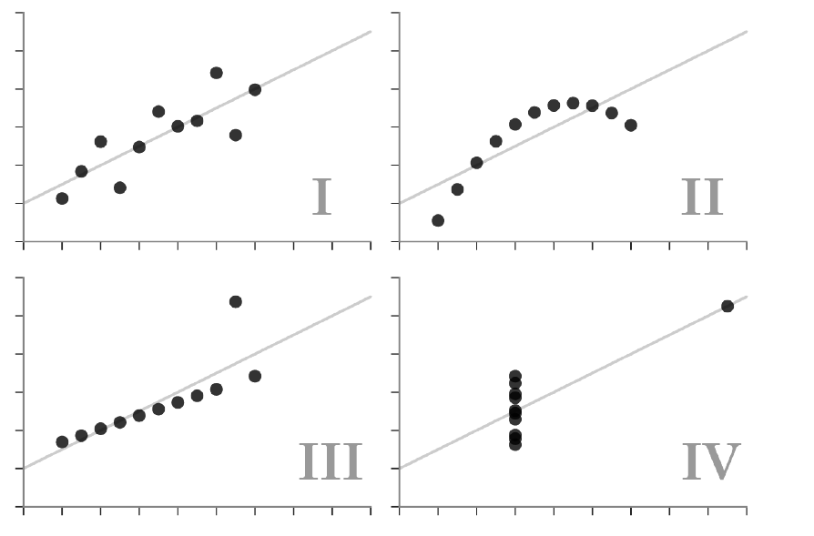

We can see a structure in these datasets ( for example the second is
quadratic ). But also if they don’t have a structure and they look not
clearly different or visually distinct they can share the same summary
statistics:

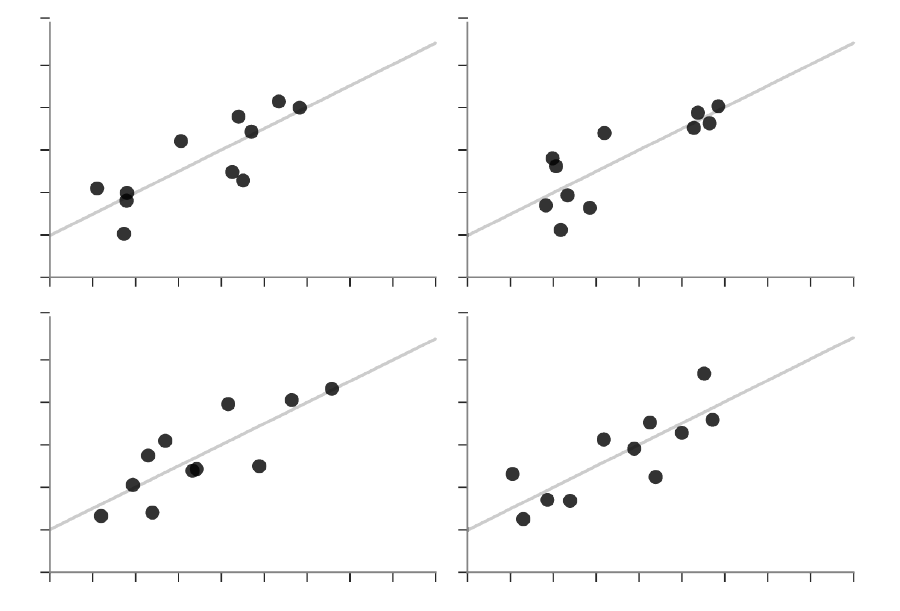

Another example is the datasarus dozen, they share the same stats (same
avg point, mean etc) to 2 decimal places:

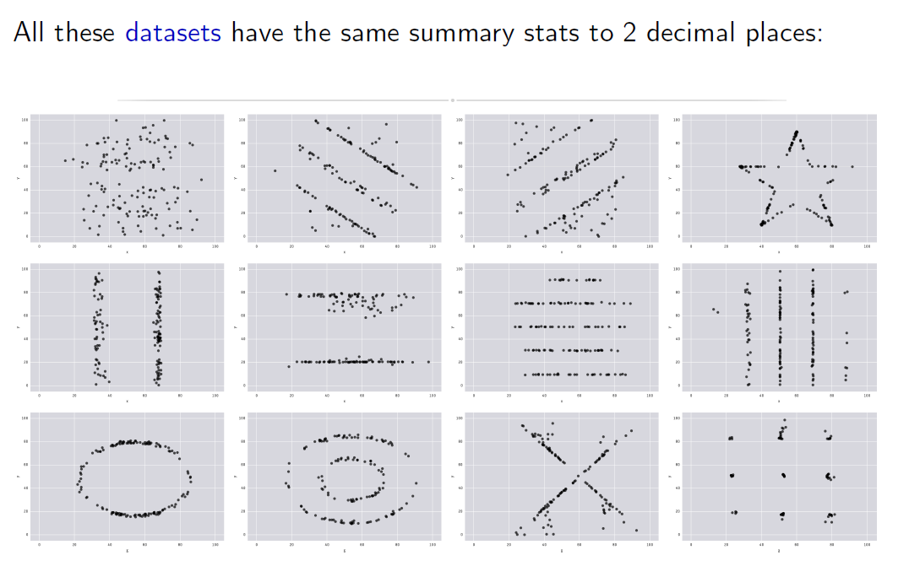

The dataset has this name because they found that this dataset has the
same statistics too as them:

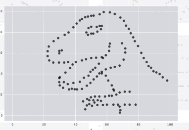

Again, working with these datasets without a proper visualization would
result in missing the underlying structures. Deep learning is mainly
focused on catching this structure.

So look a the data!! Visualize it, if there is a higher dimension then
use some function to reduce the features (PCA)

Difficult cases that you can’t visualize it: high-dimensional data, no
physical access to data, implicit access to data (e.g. latent spaces).

## Models for describing data

Learning is about describing data or more specifically describing the
process or model, that yields a given output from a given input.

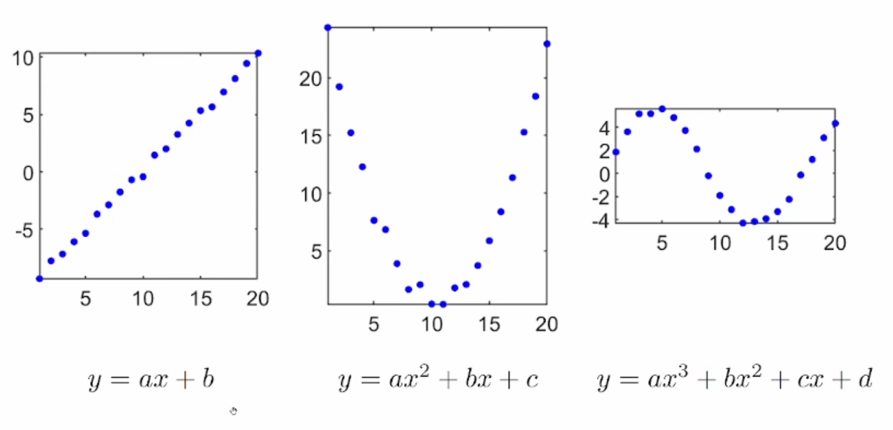

Three different datasets, these dataset has three different patterns.

First model:

y = ax + b

If x is the input and it’s 10, then the output should be 0 for some a
and b. So there are two parameters that you have to choose to get 0.

Similarly for the other models. More things get complex, more parameters
we need.

Explaining the third model is not possible only in this way, but we can
use **prior knowledge on the data**, we might know a priori that the
data comes from a periodic process:

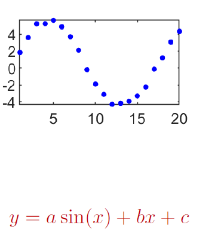

Introducing a prior on the data we can get less parameters, more prior
knowledge more easy. So usually we use this function that explain the
data to make future predictions, so we assume that our function explain
the dataset and when new examples come, we use the function y to predict
the output. In general, one should look at the world, identify what
knowledge he has about it, and use this knowledge to construct his
model.

Some forms of **prior knowledge**:

- Data distribution: e.g. we know that the data come from an
    oscillatory process, thus they must follow a periodic distribution;

<!-- -->

- Energy function: e.g. we know that the data come from an
    energy-minimizing process;

- Constraints: for example the maximum value of the parabola is 42.
    Another example: we know that all the data come from a fixed camera,
    of which we know all the intrinsic parameters;

- Invariances: e.g. we work on pictures of snowakes, which are
    rotationally symmetric;

- Input-output examples (data prior) (the dots in the dataset
    (training set))

So the prior knowledge is to encode some expected behaviour.

We have to be aware deciding on what data we are using for our problem,
because the data can introduce unwanted bias by humans and it’s not easy
to know that the dataset is biased.

AI is objective only in the sense of learning what humans teach. The
data provided by human can be highly biased.

Bias in the training dataset is still an open research problem! Some
possible causes:

- **Skewed sample**: a tiny initial bias grows over time, since future
    observations confirm prediction. Example: Police intercept crime
    more densely in areas they watch.

- **Tainted examples**: data produced by a human decision can be
    biased, and the bias is replicated by the system.

- **Sample size disparity:** training data for a minority group is
    much less than the majority group.

In general, assessing **data and prior reliability** is crucial for any
learning-based system.

## Explaining the data

We said that learning is about discovering a map from input to output.
“Finding a model explaining the data” means determining the map. The key
assumption that we are going to use is that data has an underlying
structure; however, it is very infrequent that this structure can be
captured by a simple expression.

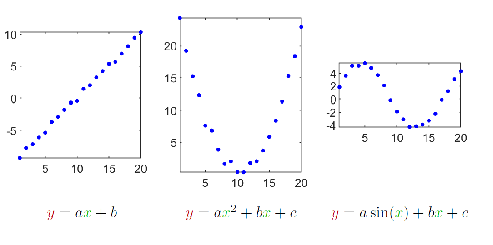

The uncolor ones are the parameters of the model and we have to discover it cause they are
unknown. Training means finding the unknow parameters of the model
(values).

We find these models because we assume that our data has an **underlying
structure**, this is the assumption of machine learning, if the data has
no structure there is nothing to learn. The structure we are referring
about is the manifold, that is a surface of many dimensions.

This structure is almost never captured by a simple expression:

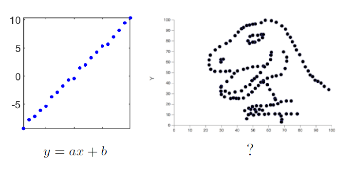

Clearly, data is not always one-dimensional like y = ax + b, data is one
dimensional (1D) because x have one dimension. We can express y = ax + b
in a parametric function in 2D in this way:

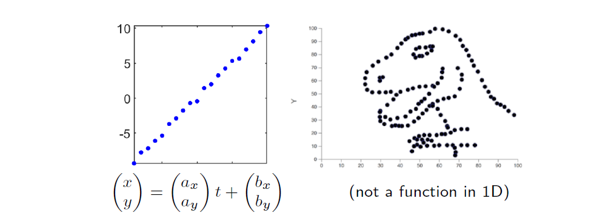

I am describing the variation in the x coordinate as a linear function
$a_{x}t\  + b_{x}$ and the variation of y we are describing it as a
linear function $a_{y}t\  + b_{y}$ and t is the parameter. So the
message here is that there is not a single way to describe a dataset.

“””

each point is modeled as a pair of numbers (x,y) linked to a variable t
with a linear model over x and a linear model over y. In general, a
parametric curve is a normal curve where we choose to define the curve's
x and y values in terms of another variable. In this example, ax = 1; bx
= 0 so the value for x is completely determined by the value of t, while
the values of ay and by are those of a, b of the previous formula.

“””

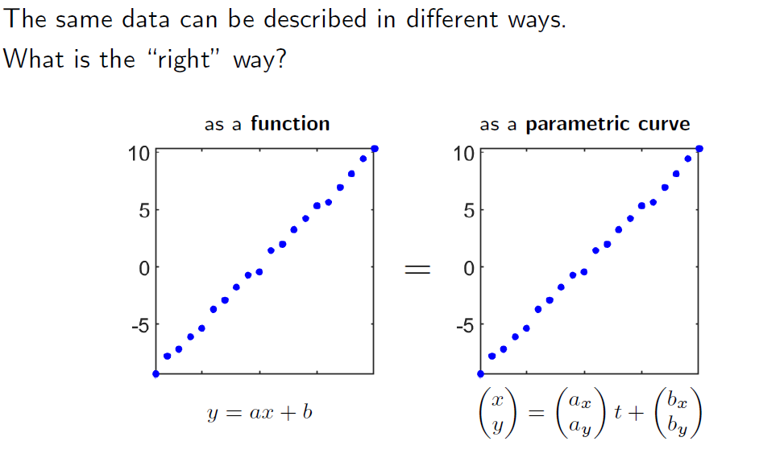

There is no right decision, we can observe that:

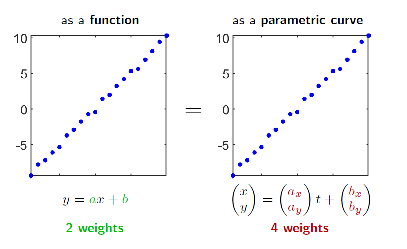

Another example:

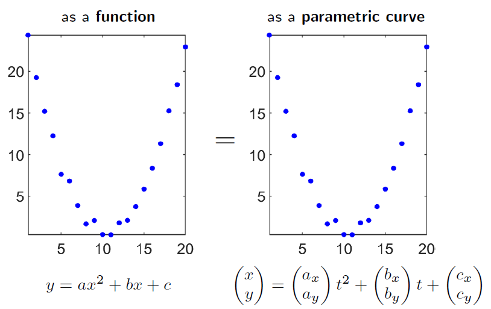

In the figure above it seems that there is no way to describe the given
dataset with a function,

but we can easily do it with a parametric curve:

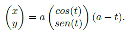

We can also describe it in this way and it’s linear.

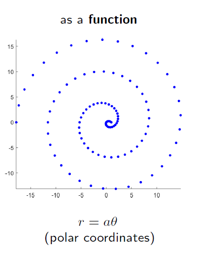

So the message here is that we have a freedom of choice of the
representation to adopt for the data in machine learning. It’s always
possible to have a structure of the data because of the manifold
assumption we said earlier. The choice of the representation is a
trade-off between weights and simplicity of the model.

## The curse of dimensionality

Until now we have seen examples in 1 or 2 dimensions but in practice we
will often deal with higher dimensional cases, like images.

Consider a greyscale image (each pixel value is
$\in \lbrack 0,1\rbrack$), of width w and height h, it will have a total
of wh dimensions; this image can be considered a point in a
wh-dimensional space. A dataset of such images is a point cloud in
$\mathbb{R}^{wh}$

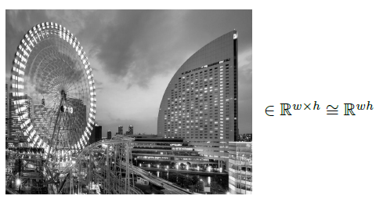

If we choose to represent a w x h image with coloured pixels, we have wh
dimensions. For example, a $\backsim 1$ megapixel photo (grayscale) has
$\backsim 10^{6}$ dimensions. Often, the question to ask is whether all
these dimensions are significant. Let's now delve into an explanation of
the so-called curse of dimensionality; for simplicity, consider 1x1
images consisting of one single pixel. Since there is only one
dimension, we can put all these images along the real axis, sorting them
by value.

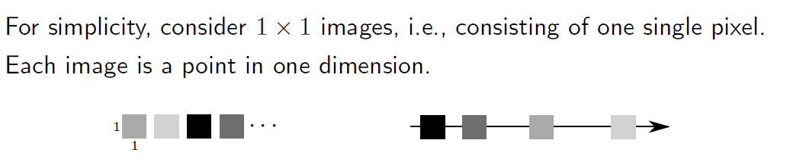

Each image can be represented as a point in 1D real line.

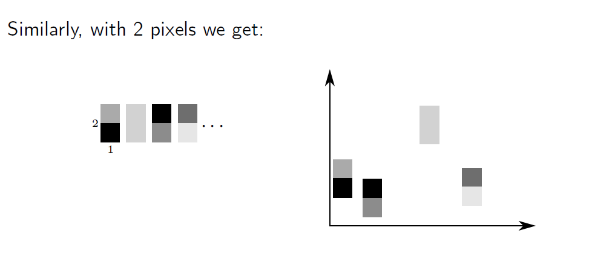

We can define two dimensions pixel one and pixel two and then each image
is one point of the 2D Plane, the coordinates depend on the values of
the pixel.

If we do this for 3x1 images, we can see that as the dimensionality
grows, the points in the space become more and more sparse; increasing
dimension increases the sparsity of the point cloud.

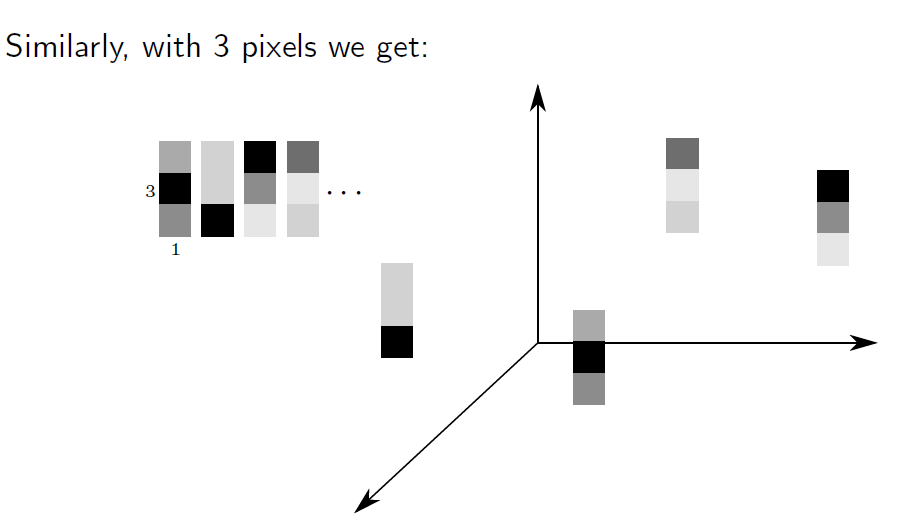

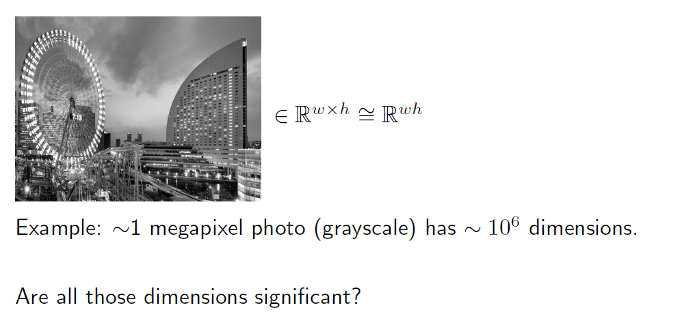

We will see it.

A dataset of natural images will be extremely sparse (sparse means that
there are really few points compared to all possible points) in
$R^{wxh}$, since each region of space is observed very infrequently (you
can think of it as taking a snapshot of the 1000000000 dimensional space
but you observe a vey tiny portion.

New samples are less likely to fall close to the previous ones. If we
want to discover that there is a pattern we need a lot of points. It can
be proved that as we increase dimensionalities all points (each point is
an image of the dataset) will eventually become equally spaced from the
others.

To discover a pattern, we need exponentially many observations as we
have dimensions!

If n data points cover well the space of 1-dimensional images, then
${n\ }^{d}$ data points are required for d-dimensional images.

More examples are good, you can discover a better structure of the data.

So you have two options:

- Increase the dataset

- Decrease the dimensions

Occam's razor: Among competing hypotheses, select the one with the
fewest assumptions. Also: when feasible, add more data!

## Features

Assume each data point $x\  \in D\  \subset \mathbb{R}^{n}$ (for example
one image in some n-dimensional representation) we can assume that this
data point is the result of a synthesis process (or generation process:
me taking a picture, me taking an electronic measurement):

$$\sigma:\ F\  \longmapsto \ x$$

$$
$$

We need to discover sigma and F from examples of x:

- We need to choose a representation

- We need a to add a prior: for example, Images are self-similar,
    images are smooth

CNN will rely on specific prior and they work because of this, for
example they exploit the fact that some portions of the images are
similar.

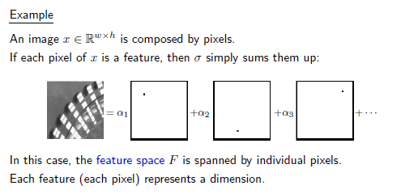

This is a linear combination of pixels values and this makes the sigma a
linear map. F is a set of 1 pixel images. We use the lambda to scale the
pixel (make it gray for example).

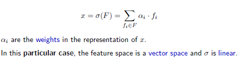

Having one feature per pixel is extremely wasteful! In cases like this,
we may want to find a different representation which doesn't fall in the
curse of dimensionality, so we are basically asking what really
characterizes our image.

Curse of dimensionality: features \>\> observations we have 1 milion
features and one observation, we want to have 5 features and 10
observations, more or less we want to have the same.

**Exam question**: If you take two randomly uniformly across all
dimensions points in a 1 million space they have much in common or is
more likely that they have almost nothing? It’s very likely that they
have not in common. We can capture this with linear algebra, and we can
say that these two points are orthogonal.

Another example:

The following image may be represented as a nonlinear combination of
these three features:

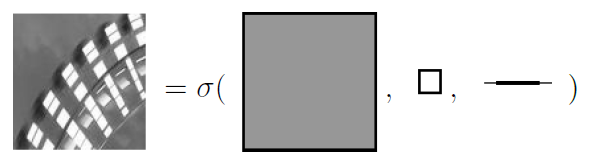

or we may try to use even fewer features: the image may be represented
using the first square, representing the white square as a modified
version of the black box with different size and color and the black
line as a degenere case.

Sigma is probably going to be nonlinear because some operations that we
need to reconstruct the image is nonlinear, for example rotating is
linear and translating is not linear. Think of sigma that, in this case,
this is not a weighting sum of these three features, so is more complex.
Remember sigma will be our neural network or model. Sigma will be more
complex (harder to model and learn the parameters) but in the other hand
we have these features and it’s very compact and efficient
representation. Our goal is that we want to discover F and sigma.

**Intrinsic invariances:** In general, a given data point admits many
possible embeddings.

In general, the transformation $\sigma$ acts nonlinearly on the
features. The output of $\sigma$ (the image) is called an embedding of
the data point(\*). For the data point
$x \in D\  \subset \mathbb{R}^{n}$, the embedding space is
$\mathbb{R}^{n}$. What we are actually doing is not getting rid of the
complexity but hiding it in $\sigma$. In deep learning, $\sigma$ will be
a deep neural network and the features will be the intermediate
representation of the image; a trade-off between the number of features
and the complexity of $\sigma$ must be decided.

Example: A sheet lives naturally in $\mathbb{R}^{2}$, but is usually
embedded in $\mathbb{R}^{3}$. (In general, a given data point admits
many possible embeddings\*).

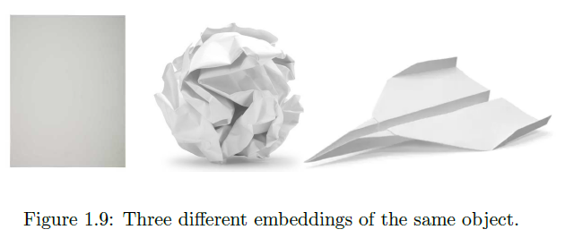

Even if the embeddings look totally different, distances are preserved
in all of them (distance metric invariance). In general, the challenge
will be to discover what intrinsic properties are preserved; these
properties characterize the data.

## Latent features

In the general case, the features that we want to discover are latent
features (the 3 features we described before), the problem is that:

- features are not necessarily localized in space, and

- features are not necessarily evident in the embedding.

We thus talk about latent features, which are characterizing properties
of the image that are hidden; more examples may be necessary to extract
this kind of features. The problem is that we only have direct access to
the embedding.

Example:

It is obvious for an human that the only difference among the various
images in the under figure is that the light source is moving around the
face. However, this is may not be obvious for a learning model. Let's
say we want to design a model which, taken an image, relights it from
different positions. The model can be parametrized with only 4
parameters, (x; y; z) for the light position and maybe another parameter
for the intensity. 3 params for light source position + 1 parm for light
intensity

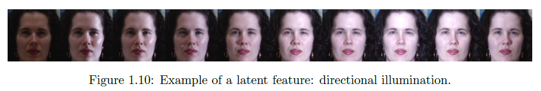

In general, discovering latent features involves discovering:

- the “true" embedding space for the data, and

- the transformation between the two spaces.

We would like to discard the non-informative dimensions from the data.

**Dimensionality**

Even just discovering the intrinsic dimensionality is a challenge by
itself. (called manifold learning)

Usually, it is specified by hand by whoever designs the learning model,
finding the optimal one is unknow as for today. In figure above we can
see a representation of the Hughes phenomenon; in the original
experiment, a classification model was trained with different intrinsic
dimensionalities (x axis) and the accuracy was recorded for each of
these (y axis); each curve in the plot represents a dataset. As you can
see, every curve reaches a local maximum with a certain dimensionality
and then sees its accuracy decrease as the dimensionality gets bigger
and bigger.

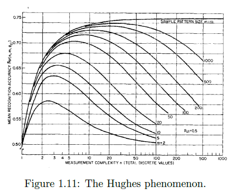

Finding a lower-dimensional embedding for some given data is a
dimensionality reduction problem. Usually, this is done by nonlinear
dimensionality reduction techniques.

This class of problems is also called manifold learning. However it must
not be confused with deep learning; the former only finds a
lower-dimensional embedding for the data, while the latter finds
patterns in the data, and also determines a map.

In deep learning **the manifold hypothesis** is assumed to hold; that
is, the input data is assumed to live on some underlying non-Euclidean
structure called a manifold.

**Definition** A manifold is a topological space that locally resembles
Euclidean space near each point. More precisely, an n-dimensional
manifold is a topological space with the property that each point has a
neighborhood that is homeomorphic to the Euclidean space of dimension n.

**Task-driven features** Speaking about features only makes sense if we
are given a task to solve, for example, color in a deck of french cards
is important only in some card games. We are now ready to give a more
comprehensive definition of deep learning.

**Definition (Deep learning).** Deep learning is a task-driven paradigm
to extract patterns and latent features from given observations. It must
be said nevertheless that features are not always the focus of deep
learning; rather, they are usually instrumental for the given task.

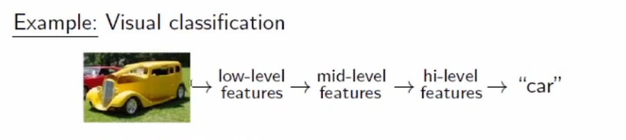

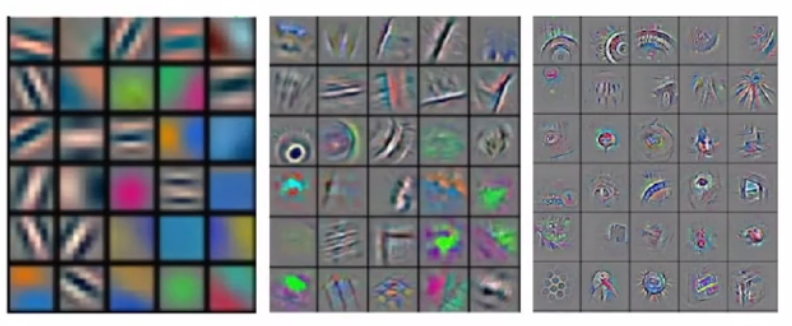

We want to define sigma (complex non linear function) that given this
image in some embedded space extract some latent features, so it
extracts wheels, windows etc and it compose non linearly these features
and see that it’s a car. (maybe because the wheel is used a lot, the
window is used a lot etc). The features drives to the final answer.

# Linear algebra

Linear Algebra is the study of **linear maps** (in italian: applicazione
lineare, mappa lineare, trasformazione lineare) on finite dimensional
**vector spaces**.

Matrices are just a tool for working in linear algebra.

## Vector spaces

The motivation for the definition of a vector space comes from the
classical proprieties of addition and scalar multiplication.

A **vector space** V over a field F is a set (can be a set of numbers, a
set of lists, a set of student, a set of videogames etc) equipped with
two operations, $+ \ :\ V\  \rightarrow \ V$ and
$*\ :\ \ F\ \ x\ V\  \rightarrow \ V$ , often referred to as addition
and scalar multiplication such that satisfies the following properties:

- **commutativity**: $u\  + \ v\  = \ v\  + \ u$ for all
    $u,\ v\  \in \ V$; further, $u + v\  \in V$

- **associativity**: $(u + v) + w = u + (v + w)$ and $(ab)v = a(bv)$
    for all $u,\ v,\ w\  \in V$ and all $a,\ b\  \in \mathbb{R}$;
    further $av\  \in V$\*

- **additive identity**: there exists an element $0\  \in V$ (that is
    unique) such that $v + 0\  = \ v$ for all $v\  \in V$

- **additive inverse**: for every $v\  \in V$, there exist $w\  \in V$
    such that $v + \ w\  = \ 0$

- **multiplicative identity**: $1v\  = \ v$ for all $v\  \in V$

- **distributive proprieties**: $a(u + v) = au + av$ and
    $(a + b)v = av + bv$ for all $a,b\  \in \mathbb{R}$ and all
    $u,v\  \in V
    $

The elements of a vector space are called **vectors**.

$(ab)v = a(bv)$ is the multiplication by a scalar, If you multiply a
vector for a scaler it remains in the vector space defined\*.

If we imagine the vector space of real numbers, the additive identity is
number 0 and the additive inverse is the negative number.

Example: Lists of Numbers

$\mathbb{R}^{n}$ is defined to be the set of all n-long sequences of
numbers in $\mathbb{R}$.

$$\mathbb{R}^{n} = \{\left( x_{1},x_{2},\ldots.,x_{n} \right)\ :x_{j} \in \mathbb{R\ }for\ j = 1,2,\ldots.,n\}
$$

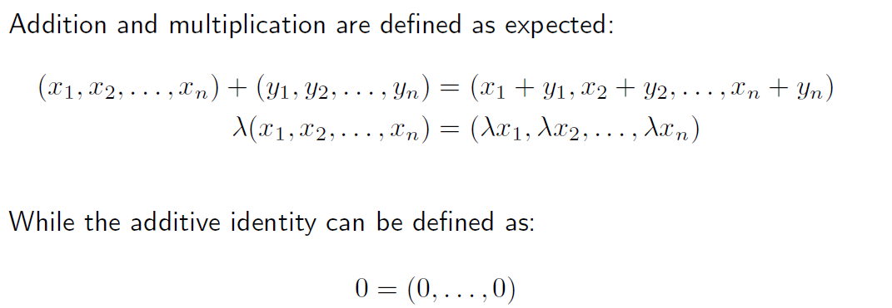

The additive inverse for a list is the negative of all the numbers in
the list. With these definitions, $\mathbb{R}^{n}$ is a vector space,
usually defined over the scalar field $\mathbb{R}$.

Another example: Functions

Consider the set of all functions
$f\ :\ \lbrack 0,\ 1\rbrack\  \rightarrow \ \mathbb{R}\ $ (each element
is a function) with the standard definitions for sum and scalar
products:

$${(f + g)(x) = f(x) + g(x)
}{(\lambda f)(x) = \lambda f(x)
}$$

So the first is the definition of a function called f + g, that take as
input x ( x is the domain, so takes \[0,1\]). Same as the second, there
is a new function named $\lambda f$ that takes as input x and gives as
output $\lambda f(x)
$

And with additive identity and inverse defined as:

$${0(x) = 0
}{( - f)(x) = - f(x)}$$

For all $x \in \lbrack 0,1\rbrack$ and $\lambda\  \in \mathbb{R}
$The above forms a vector space. In fact, any set of functions
$f:\ S\mathbb{\  \rightarrow \ R}$ with $S\  \neq \ \varnothing$ and the
definitions above forms a vector space. Remember: we are defining
function called 0(x) that should give us 0, we are not including the 0
of the domain, but we include it on the codomain. Note: we can choose
any domain and make sure to satisfy these proprieties.

Example: Curved surfaces

Do surfaces form a vector space?

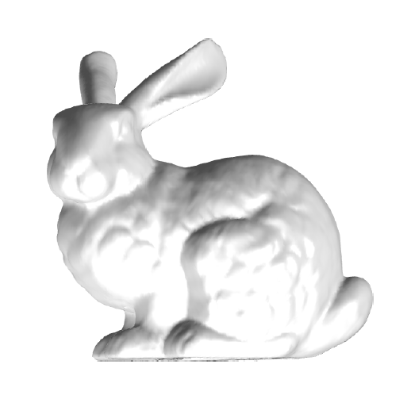

Not always, because in this case if you sum two points in the figure you
can get a point outside the vector space. For example, imagine you have
a point (0,-1,-1) and (0,1,1) and sum them up you can go outside the
vector space (outside the bunny).

Surfaces can be studied using **differential geometry**. (we will study
it), which is a mathematical discipline that uses the techniques of
differential calculus, integral calculus, linear algebra and multilinear
algebra to study problems in geometry;we'll need it for studying the
manifold hypothesis and geometric deep learning.

In the other hand, we can still use linear algebra to manipulate
functions on surfaces. We can define a set of functions that are defined
on the bunny $F:\ Bunny\mathbb{\  \rightarrow \ R}$ , so for example in
each point of the bunny we associate a value, for example a scalar \*
point, this is a vector space.

The Bunny is the domain of the function.

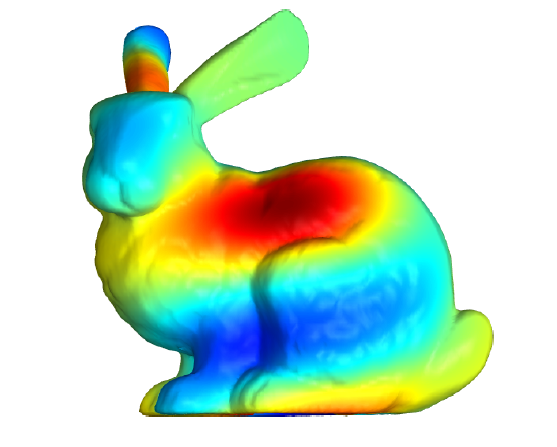

This is going to be a vector space, so every function defined in this
way is a vector space.

## Basis

A **Basis** of V is a collection of vectors in V that is **linearly
independent** and **spans** V.

- $span\left( v_{1},\ldots,v_{n} \right) = {\{\ a}_{1}v_{1} + \ldots + a_{n}v_{n}:a_{1},\ldots,a_{n} \in \mathbb{R\}}$

Given a set of vectors $v_{1},\ldots,v_{n}$ (for example a set of
functions:the functions of red bunny, blue bunny etc) we construct a
linear combination of those vectors (functions in this case), so you
weight these vectors and you sum them up, so it’s all the possible
linear combinations of vectors.

A span of one vector is the set of all possible vectors obtained by
multiplying the one vector with all possible scalars. It’s like you have
a line and you want to scale it, you can scale it in different ways, and
this is the span and you can say the span covers all the 1-dimensional
space, there is only the scalar that change.

For example, in 2D you can have two vectors non-colinear in
$\mathbb{R}^{2}$ and the span convers the entire $\mathbb{R}^{2}$ space.
If it covers all the space defined, it’s called a **basis**.

If I take two co-linear vectors in $\mathbb{R}^{2}$ so for example
$v_{1},\ 2v_{1}$. What is the span? Just a line, so they don’t cover the
entire $\mathbb{R}^{2}$ space. Why not? We can define the propriety of
**linearly independent**:

- $v_{1},\ \ldots,\ v_{n}\  \in V$ are **linearly independent** if and
    only if each $v \in span\left( v_{1},\ldots,v_{n} \right)$ has only
    one representation as a linear combination of $v_{1},\ldots,v_{n}$

So every vector $v\  \in V$ can be expressed uniquely as a linear
combination:

$$v\  = \ \sum_{i = 1}^{n}{{\ \alpha}_{i}\ v_{i}}
$$

You can think of a basis as the minimal set of vectors that generates
the entire space. So as we said if you take two colinear vectors you can
express them not in a unique way, so they are not a basis.

Example: Bases

- (1, 0, …, 0), (0, 1, 0, …., 0), (0, …, 0, 1) is a basis of
    $\mathbb{R}^{n}$ called **the standard basis**; its vectors are
    called the **indicator vectors**.

In deep learning, also called **one-hot** representation.

- (1, 2), (3, 5.07) is a basis of $\mathbb{R}^{2}$

You can construct infinite basis.

-

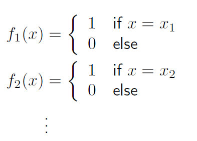

Is the standard basis for the set of functions
$f\mathbb{:\ R\  \rightarrow \ R}$; the basis vectors are also called
**indicator functions.**

Example:

An image expressed in the standard basis:

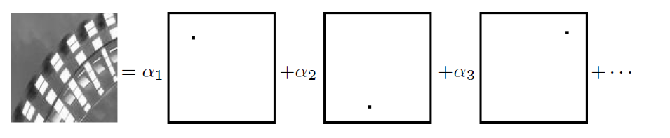

This is a linear combination of indicators image pixels, we have only
one pixel and 0 the rest per image. We can say that the full image is in
the span of the indicator image pixels.

The same image, expressed in terms of a nonlinear map $\sigma$:

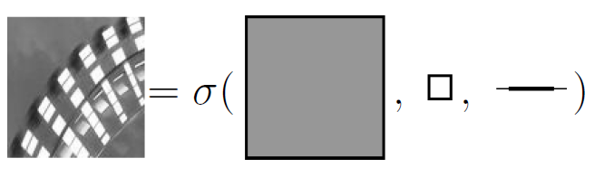

The image is not in the span of the three features.

## Dimension

If you have a basis, the number of vectors in that basis is the
dimension of the vector space. In $\mathbb{R}^{2}$ for example we have
two vectors for the basis. For $\mathbb{R}^{n}$, the dimension of the
vector space (base) is n

A vector space may have different bases; any two bases have the **same
number of vectors.**

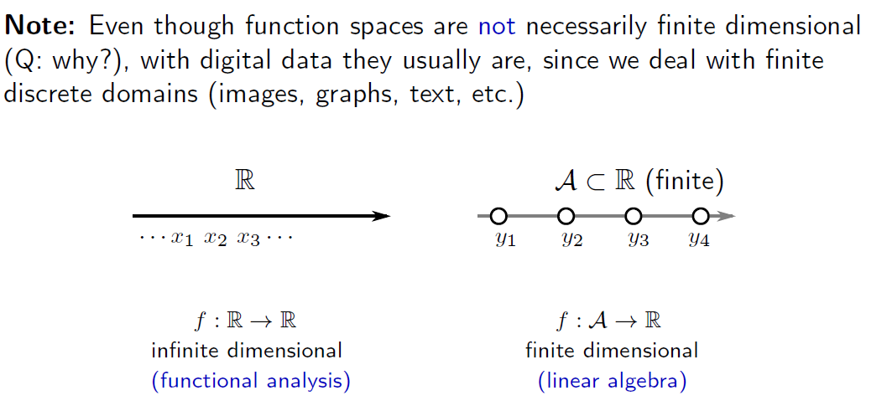

The dimension of the space on the right is 4, cause we have 4 indicator
functions. The indicator functions are also the basis. The space is
finite because I can define functions only to those 4 indicator
functions.

## Linear Maps

A linear map is a function: $T\ :\ V\  \rightarrow W$ from a vector
space V to a vector space W, for example V can be a vector space of
$\mathbb{R}^{3}$ and W can be a vector space of functions. To call it
linear map we have to satisfy two proprieties:

- **Additivity**: The linear map applied to the sum of two vectors
    it’s the same as the sum of the two vectors after the application of
    the linear map $T(u + v) = T(u) + T(v)$ for all $u,v\  \in V$. For
    example the derivate of the sum is the sum of the derivates, so it
    can be seen as a linear map or at least it satisfy this propriety.

- **Homogeneity**: The linear map applied to a scalar time a vector is
    equal the scalar times the linear map applied to the vector.
    $T(\lambda v) = \lambda\left( T(v) \right)$ for all
    $\lambda\  \in \mathbb{R}$ and all $v\  \in V$. For example, the
    derivate of constant times function is equal to constant times the
    derivate of the function, then the derivative is a linear map.

Example:

- Identity: $I\ :\ V\  \rightarrow \ V$, defined as $I(v)\  = \ v$, so
    to check the additivity $I(u + v) = I(u) + I(v)$ and the homogeneity
    $I(\lambda v) = \lambda\left( I(v) \right)$

- Differentiation: $D:\ F\mathbb{(R)\  \rightarrow \ }F\mathbb{(R)}$,
    defined as $D(f)\  = \ f^{'}$

- Integration: $T:\ F\mathbb{(R)\  \rightarrow R}$, defined as
    $T(f)\  = \ \int_{0}^{1}{f(x)dx}$

- A map $T:\ \mathbb{R}^{3}\  \rightarrow \ \mathbb{R}^{2}$ defined
    as:

$$T(x,y,z)\  = \ (2x\  - \ y\  + \ 3z,\ 7x\  + \ 5y\  - 6z)$$

- A map $T:\ \mathbb{R}^{n}\  \rightarrow \ \mathbb{R}^{m}$ defined
    as:

$$T(x_{1},\ ...,\ x_{n})\  = \ (A_{1.1}x_{1} + \ ....\  + \ A_{1.n}x_{n},\ ....,A_{m.1}x_{1} + \ ....\  + \ A_{m.n}x_{n})$$

> If is constructed by a linear combination, it’s a linear map.
> ${A\ }_{1,1}$ etc are scalars.

Example:

$$y\  = \ ax\  + \ b$$

Is it a linear map? Only if you remove the b, we can see b as a
translation (we make the line up and down).

In deep learning, the term b is also called **bias**. So this equation
is not a linear map.

This other equation:

$$y\  = \ zsinx(x)\  + \ z^{2}sin(x)$$

We must pay attention what is the function defined, for example the
first equation often is called linear because seen as a function of a
and b, in the second equation if we take a function from sin(x) to y,
then it’s a linear map.

Reflection operation on an image is a linear map:

$$T:\ \mathbb{R}^{2}\  \rightarrow \mathbb{R}^{2}\ ,\ T(x,y)\  = \ ( - x,y)$$

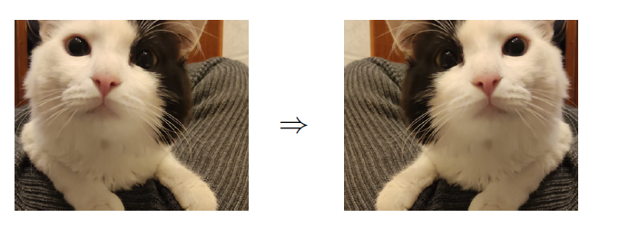

## Linear maps as a vector space

Linear maps $T:\ V\  \rightarrow \ W$ form a vector space of linear
maps, with addition and multiplication defined as:

$${(S + T)(v) = S(v) + T(v)
}{(\lambda T)(v) = \lambda\left( T(v) \right)\ }$$

The additive identity is a function take gives W 0.

We also have a useful definition of product between linear maps:

If $T:\ U\  \rightarrow \ V$ and $S:\ V\  \rightarrow \ W$, their
product $ST\ :\ U\  \rightarrow \ W$ is defined by:

$$(ST)(u)\  = \ S(T(u))$$

In other words, ST is just the usual composition $SοT$

Algebraic proprieties of product of linear maps:

- **Associativity**: $(T_{1}T_{2})T_{3}\  = \ T_{1}(T_{2}T_{3})$

- **Identity:** $TI\  = \ IT\  = \ T$

- **Distributive proprieties**:
    ${(S}_{1} + \ S_{2})T\  = \ S_{1}T\  + \ S_{2}T\ $and
    $S\left( T_{1} + T_{2} \right) = ST_{1} + {ST}_{2}$

Keep in mind that composition of linear maps **is not commutative**,
i.e. $ST\  \neq \ TS$ in general (there are special cases)

Example: Take $Sf\ \  = \ f'$ and $(Tf)(x)\  = \ x^{2}f(x)$

## Matrices

Consider a linear map $T\ :\ V\  \rightarrow \ W$ ,a basis
$v_{1},\ldots,\ v_{n}\  \in V$ and a basis
$w_{1},\ldots,\ w_{m}\  \in W$

$$T{(v}_{j})\  = \ T_{1,j}w_{1} + \ ....\  + T_{m,j}w_{m}\ $$

$v_{j}$ is a basis vector of V. I apply the linear map T to $v_{j}$ and
I get a vector in the space of $W$. I don’t know if I get a basis of W,
it depends on T. Whatever I get a vector I can represent that vector I
get as a linear combination of the basis on the second vector space W,
by definition of a basis. The red writes are coefficients and I have as
many as the dimension of the basis. In that case I have m coefficients
because the dimension of the base of W is m. I take these coefficients
and I put it as a column of the matrix. So for $T(v_{1})$ I obtain the
coefficients for the first column of the matrix, for the second basis
vector of V the second column of the matrix and so on.

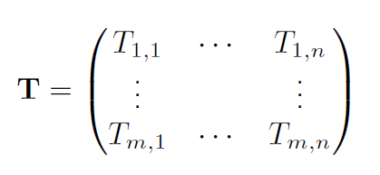

This is the definition of a matrix, it’s a tool to represent linear
maps.

A formal definition is that each column T contains the linear
combination coefficients for the image via T of a basis vector from V.

In other words, the matrix encodes how basis vectors are mapped, and
this is enough to map all other vectors in the span since:

$$T(v)\  = \ T(\sum_{j}^{}{\alpha_{j}v_{j}) = \ \ \sum_{j}^{}{{T(\alpha}_{j}v_{j}) = \ \sum_{j}^{}{\alpha_{j}T{(v}_{j})\ \ \ \ }\ \ \ }\ \ }$$

So I take an arbitrary vector of V and apply T. v can be also write as a
linear combination. T is linear, it means that it respect additivity, so
I can bring T inside the summation and also satisfy homogeneity, so I
can bring the alfa outside. So the final expression I see that in order
to know how to map v, I just map the basis vectors and I take a linear
combination and these coefficients are from v.

We see that matrix is a **representation** for a linear map, and it
**depends on the choice of bases**

## Matrix of a vector

Suppose $v\  \in V$ is an arbitrary vector (an element of a vector
space), while $v_{1},\ ...,\ v_{n\ }$is a basis of V (so we have also
the base of the vector space). The matrix of v wrt this basis is the
$n\ x\ 1$ matrix:

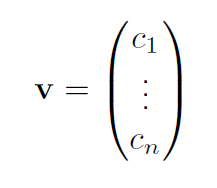

So that $v\  = \ c_{1}v_{1}\  + \ ...\  + \ c_{n}v_{n}\ $

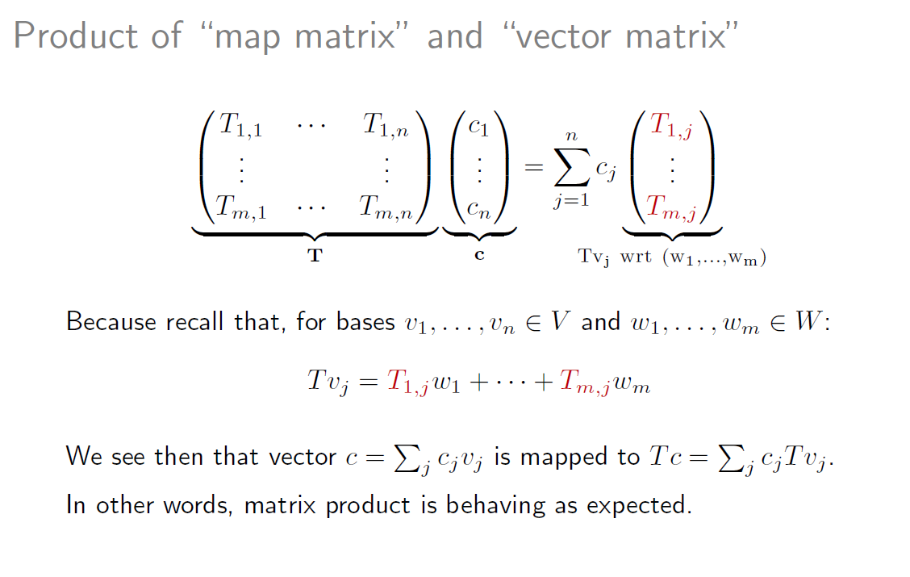

Sections 1.A 3.D of the textbook: S. Axler, Linear algebra done right
3rd edition". Springer, 2015

# Linear regression, convexity, and gradients

Let us recap briefly what is the general setting: in deep learning, we
deal with highly parametrized models, usually in the order of millions
or even hundreds of millions of parameters, and these models are called
**deep neural networks**.

Let’s consider a deep neural network as a function f, possibly
non-linear, that takes some input and then gives some output. For
example, if I have an image of a cat as input, the output is the string
“cat”. It’s just an input to some output, the input is called the data
space.

The function is parametric, it’s fully defined by a set of parameters
called theta, so we will call the function $f_{\theta}$

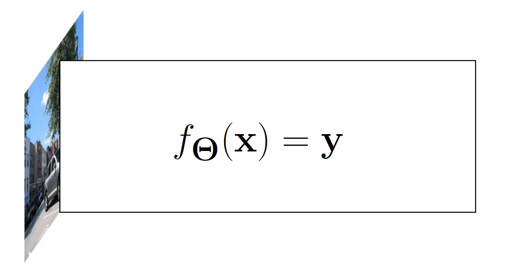

If we open the box, we will see that this box is composed of several
simpler parametric functions that we compose all together. Each of this
simpler parametric function we represent it as a block.

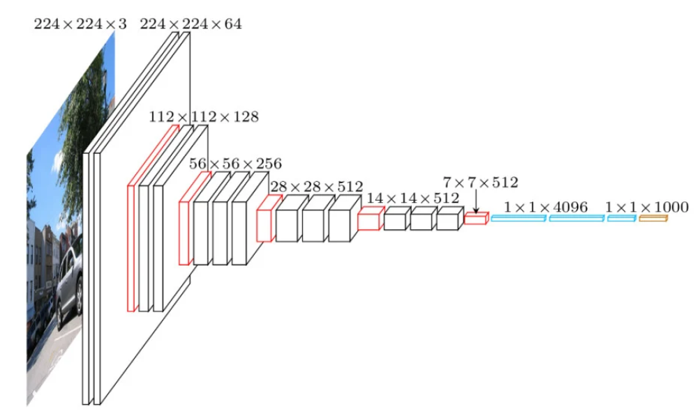

A neural network takes the form of a composition of multiple simpler
blocks each of which has a predefined structure (e.g. one block might be
modelling a linear map). The structure is chosen by who designs the
neural network, so this is not something that we solve for, but is fixed
during the design of the neural network.

Each block is defined in terms of unknown parameters $\theta$ and the
collection of the parameters of all the blocks are the parameters of the
entire network.

Each block:

- Has predefined structure (e.g., a **linear map**).

- Is defined in terms of **unknow parameters** $\theta$.

- Finding the parameter values is called **training**, which is done
    by minimizing a function called **loss.**

- Minimization requires computing gradients, called
    **backpropagation**.

To do this, we need to define some criterion with which we can say that
the **learned function** $\mathbf{f}_{\mathbf{\theta}}$ is more or less
likely to represent **true function** $\mathbf{f}_{\mathbf{\theta}}$.
This is usually done by defining some energy function that depends on
the produced output $Y = f_{\theta}(x)$ and so indirectly on the
parameters $\theta$(since this influence the learned function
$f_{\theta}$), that we usually call **loss function**, which we want to
minimize. Finding the parameters that minimize the loss function will be
done using an optimization procedure that requires computing gradients,
so it involves what we call backpropagation, i.e. the process of
computing derivatives of all the functions involved in the network.

## Parametrized models

The parameters determine the network’s behaviour and must be solved for.

For example, consider these three models:

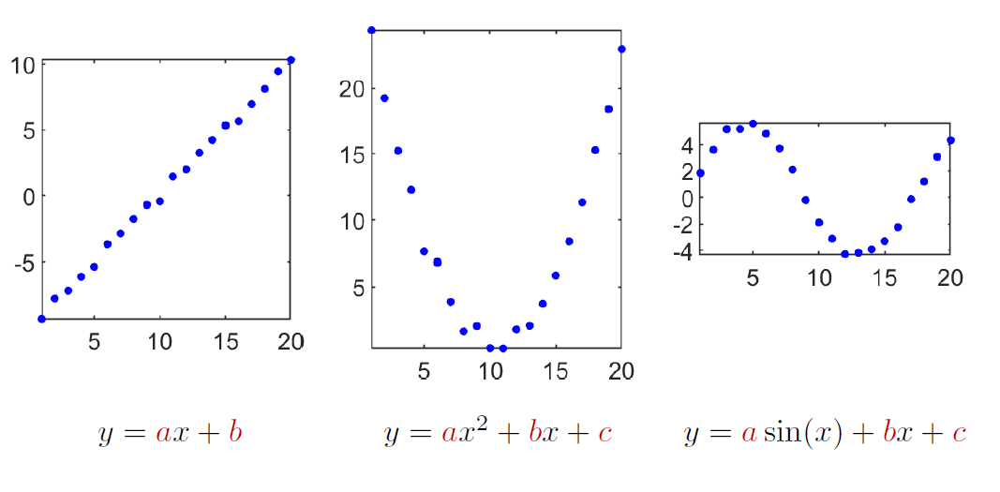

For each model we have a different dataset and we are choosing the
learning model. For the first one we have a linear model, the second a
quadratic model, the third a non linear model that depends on some
oscillatory functions. In red you can see the parameters, we can see it
as the thetas we mentioned before.

Let’s give some notation:

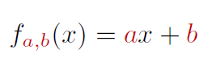

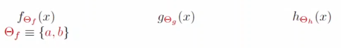

Our task is to find the parameters $\theta$

## Linear regression

We start from the simplest non-trivial case for a learning model, in
general the simplest one is the one that follow a linear distribution:

Given some data points we assume that these data points come from a
linear process, e.g.

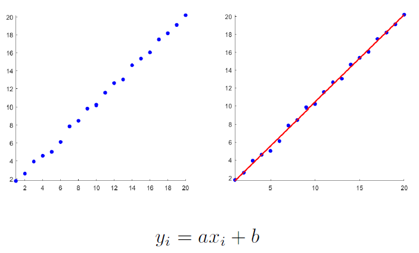

a and b will be the same for each point and we have the coordinates
$x_{i}$ and $y_{i}$ that is given to us.

(note that this is not the only possible choice) and we want to look for
the values of the parameters a and b. We have to consider an additive
correction, that we call noise, since we don't expect the line to fit
exactly every datapoint.

$$y_{i}\  = \ ax_{i}\  + \ b\  + \ noise$$

In the linear regression setting this is ignored, as fitting the line
perfectly to every datapoint would lead us to ovefitting, i.e. poor
generalization. We will see these concepts more in depth in the
following chapter.

**Model**: linear + bias (ignores the noise)

**Parameters**: $\theta\  = \ \{ a,\ b\}$

**Data**: n pairs $(x_{i},\ y_{i});$ the $x_{i}$ are called the
**regressors**

Given a and b, we have a **mapping** that gives new output from new
input.

We can write the model with this equation:

$$f_{\theta}(x_{i})\  = \ y_{i}$$

Must **approximately** hold for all $i = 1,....,n$.

Once we are given values for a and b we can construct a mapping such
that given some new input we can apply the function learned and get some
new output. But who gives us these values? As we have mentioned
previously, this is achieved by an optimization process of a proper loss
function, so we need to define one. Often a loss function encodes some
notion of error, measuring the distance between the true value $y_{i}$
from what our $f_{\theta}$ predicts for the value $x_{i}$, and we want
that difference to be close to 0. Usually the notion of error that we
use for the linear regression setting is the Mean Squared Error (MSE).

**Problem**: choose a and b that minimize **the mean squared error
(MSE)** between input and output:

$$\epsilon = \ \min_{a,b\  \in \mathbb{R}}{\frac{1}{n}\sum_{i = 1}^{n}\left( y_{i}\  - \ f_{\theta}(x_{i})\  \right)^{2}}\  = \ \min_{a,b\  \in \mathbb{R}}\ \sum_{i = 1}^{n}\left( y_{i}\  - \ f_{\theta}(x_{i})\  \right)^{2}\ $$

Where $\theta$ = {a, b}

When $f_{\theta}$ is linear, this is called a **least-squares
approximation** problem.

We can rewrite the formula in this way:

$$\epsilon\  = \ \min_{\theta}{l_{\theta}\left( \{ x_{i},\ y_{i}\} \right)}$$

The error criterion w.r.t. the parameters is also called a **loss**
function, usually denoted by l

$$l_{\theta}\left( \{ x_{i},\ y_{i}\} \right)\  = \ \sum_{i = 1}^{n}\left( y_{i}\  - \ f_{\theta}(x_{i})\  \right)^{2}$$

**Remark:** We minimize the loss w.r.t. the parameters $\theta$, and not
w.r.t the data $(x_{i},\ y_{i})$. Also, the loss is defined on the
entire dataset, not on just one data point.

In summary, we have access to examples $x_{i}$ and $y_{i}$, we fix the
structure of the function f and we need to solve for the parameters
$\theta$. To solve for $\theta$, we define a loss function $l_{\theta}$
that depends on the examples $\left( x_{i},y_{i} \right)$ and the
parameters, and we minimize it, i.e. we find the parameters $\theta*$
that make it minimum.

We are considering the following case:

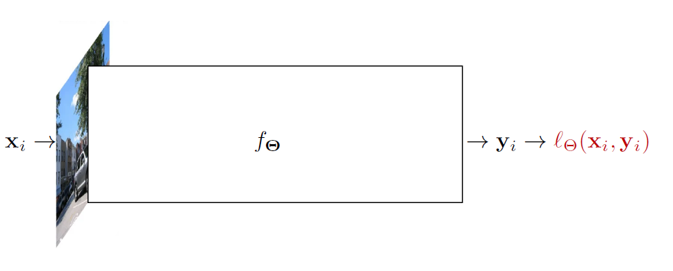

We have a deep neural network, if we open the box, we will find only one
linear block, so this linear regression problem. So, f ($f_{\theta})$ is
linear plus bias and the loss $l_{\theta}$ is quadratic.

## Optimization

We need to solve the general **minimization** problem:

$$\epsilon\  = \ \min_{\theta}{l(\theta)}$$

In particular, we are interested in the minimizer $\theta$.

Finding minimizers for general l is an open problem. The research area
is broadly called **optimization**.

In general, the optimization method depends on the proprieties of l.
When we are training deep neural networks we will not look for the
global minimum solution because it will lead to overfitting, same as
local.

There is no real solution to find the minimum, it’s still an open
problem.

We will mostly deal with **unconstrained** problems.

Let’s see what optimizations problems we can solve **easly**!

## Convex functions

There are some classes of functions that are easier to minimize (or
maximize) and the easiest set of functions is the set of convex
functions, defined by Jensen's inequality:

$$f\left( \alpha x + (1 - \alpha)y \right) \leq \alpha f(x) + (1 - \alpha)f(y)
$$

In the first expression, if we take $\alpha\  = \ 1$ we identify x, if
we take $\alpha = \ 0$ we identify y. For all the values of $\alpha$
within 0 and 1, we are identifying all the points in between. You can
identify x and y, as a point in a line. This kind of linear combination
is called a convex combination of x and y. The absolute function is
convex, the sign is not convex, because it’s concave

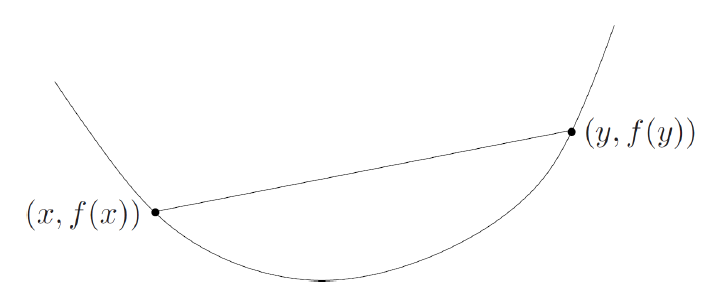

If this entire curve is my f, I am only looking, if x is in that point
and y in that point, in the portion between them.

In the right side expression of equality, I am taking the value of
$f(x)$, which is in the black dot, the other value f(y) which is in the
black dot in the right and I am taking a convex combination of these two
values, so I am taking all the values between the segment, joining f(x)
and f(y).

I am defining a convex function to be a function f that satisfy that
equality. So with that expression I am saying that the convex
combination of the portion of the curve (the portion is given by the
first expression) is always below of the convex combination of the
segment (second expression). If this is true for any x and y and alfa
between 0 and 1 this is a convex function.

Let us further assume that $f$ is a differentiable function, so that we
can compute its derivative $\frac{df}{dx}$ at all points $x$. So $f$ is
differentiable in all points, so we can compute the derivative at all
points.

In particular, I want to claim that whenever I take the derivative and I
look for the points where the derivative is 0, that’s going to be a
global minimum for the function, this claim works only for convex
functions.

If the function is convex there is no local minimum, there is only
global minimums ( one convex function can have more than 1 global
minimum)

**Theorem**: the global minimizer $x$ is where
$\frac{df(x)}{dx}\  = \ 0$

In general, if we want to find a minimizer for a convex function f we
just need to compute its derivative $\frac{df}{dx}$, set it to zero and
solve for x; then as we have shown the point x will satisfy eq.
$f(x) \leq f(y)\ \forall y$ and hence will be the global minimizer of
the function.

### Convex functions in $\mathbb{R}^{n}$

In deep learning we deal with **loss functions** with $n\  \gg \ 1$
parameters because we deal with high dimensional data:

$$f\ :\ \mathbb{R}^{n}\mathbb{\  \rightarrow \ R\ \ }$$

For example, $\mathbb{R}^{n}$ could be an image and the output could be
a number.

Usually in deep learning we don't deal with univariable, scalar-valued
functions like we have seen before, i.e. functions
$f\ \mathbb{:\ R\  \rightarrow \ R}$, but with multivariable, often
vector-valued functions, i.e. functions
$f\ :\ \mathbb{R}^{n}\mathbb{\  \rightarrow \ R}$, often called scalar
fields or
functions$\ f\ :\ \mathbb{R}^{n}\  \rightarrow \mathbb{R}^{n}$, often
called vector fields.

Let us concentrate on scalar fields, since the more troubling part of
moving from $\mathbb{R}$ to $\mathbb{R}^{n}$ is when this happens in the
domain of the functions, not in its codomain, i.e. when we have
functions with multiple arguments. In fact, vector-valued functions are
simply vectors whose components are scalar-valued functions, i.e. a
stack of scalar fields. However, when a function involves multiple
variables things are not so simple. This is the case for the notion of
derivative: for functions of a single variable, derivatives are
straight-forward, since there is only one variable that can cause a
change in the function variable; that is not true in the multivariable
case.

For this reason, the notion of derivative is replaced by the notion of
**gradient**:

$$\nabla_{x}f(x)\  = \ \begin{pmatrix}
\frac{\partial f}{\partial x_{1}} \\
... \\
\frac{\partial f}{\partial x_{n}} \\
\end{pmatrix}$$

Which is the vector of **partial derivates** of $f$, where x is a
high-dimensional vector whose components are the multiple variables of
the function.

For example, if we take as input a point in a plane $(x,y)$ the output
will be a two-dimensional vector with the derivative in respect of $x$
and the derivative in respect of $y$

Convexity is defined as before:

$$f\left( \alpha x + (1 - \alpha)y \right) \leq \alpha f(x) + (1 - \alpha)f(y)$$

And we also have the global optimality condition:

$$\nabla_{x}f(x) = 0 \Rightarrow f(x) \leq f(y)\ for\ all\ y \in \mathbb{R}^{n}$$

If the gradient of $f(x)$ is 0 then x is the global minimum for the
function. The gradient is a vector and 0 is the zero vector, so we call
it additive identity, if you remember the linear algebra lesson.

## Gradient

We know that the gradient is a vector, so we can represent also as the
direction in a n-dimensional space and this direction is pointing where
$f$ grows the steepest way or in a quickly way.

The gradient $\nabla_{x}f(x)$ encodes the **direction** of **steepest
ascent** of $f$ at point $x$. In the simple 1D case:

**Rate of change** (rapporto incrementale): you take a function $f$ and
a point x, then you move just a tiny bit in the x direction defined by a
$\delta$ (very small) and you look at value of f in $x\  + \ \delta$ and
then you take the ratio of $f(x + \delta) - f(x)$ divided by $\delta$:

$$\frac{df(x)}{dx}\  = \ \lim_{\delta\  \rightarrow \ 0}\frac{f(x + \delta) - f(x)}{\delta}$$

We can say that the limit is the derivative of $f(x)$, the derivative is
positive when the function goes up, so when the numerator is positive
which means $f(x + \delta) > f(x)$. For a positive derivative we have to
go to the right to follow where $f$ grows, when is it negative when the
function goes down.

In the more general case, consider we have an
$f\ :\ \mathbb{R}^{2}\mathbb{\  \rightarrow R\ }$:

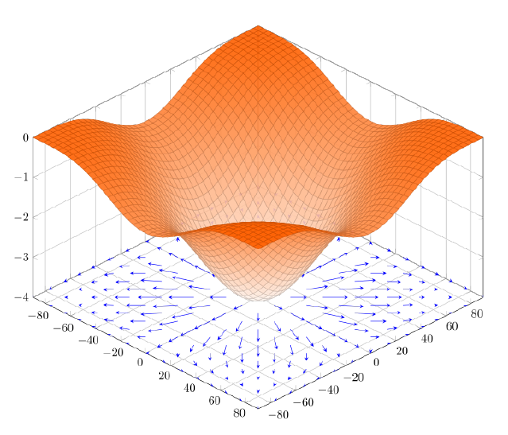

We can represent it as a surface because for each point on the plane I
associate a number,so for all the points I have a set of numbers that I
can see as a plane.

The gradient is the two dimensional vector of partial derivatives, I can
draw it in the domain with the tiny arrows. As you can see there is no
arrow in the global minimum because the gradient it’s 0. (an arrow with
0 length).

Take home message: the gradient is a vector field as a set of arrows in
the domain, if you follow the direction you are going where the function
is increasing.

The **length** of the gradient vector encodes its steepness. We didn’t
define what is the length of a vector, let’s do it.

### Vector length

The **Euclidean distance** measures the length of a straight line
connecting two points:

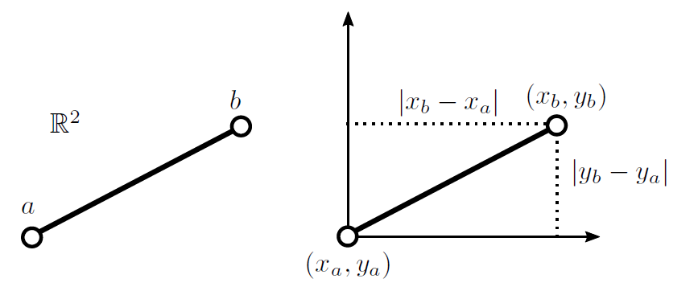

Apply Pythagoras’ theorem:
$d(a,b)\  = \ {(\ {|x_{b}\  - \ x_{a}|}^{2}\  + {\ |y_{b}\  - \ y_{a}|\ }^{2})}^{\frac{1}{2}}$

In matrix notation:

$$d(a,b)\  = \ \left\| a - b \right\|_{2}$$

where $a\  = \ \begin{pmatrix}
x_{a} \\
y_{a} \\
\end{pmatrix}\ and\ b = \ \begin{pmatrix}
x_{b} \\
y_{b} \\
\end{pmatrix}\ $

This is a new notation, because usually you are working with a lot of
dimensions, we can’t write it with Pythagoras’ theorem. So the $d(a,b)$
is a vector and the ${||\ \ldots\ ||}_{2}$ is the same as writing
$\left( \left| x_{b} - x_{a} \right|^{2} + \left| y_{b} - y_{a} \right|^{2} \right)^{\frac{1}{2}}$

### $L_{p}$ distance in $\mathbb{R}^{k}$

One can generalize to different power coefficients $p\  \geq \ 1$:

$$\left\| x - y \right\|_{2}\  = \ {(\ {|x_{1}\  - \ y_{1}|}^{2}\  + {\ |x_{2}\  - \ y_{2}|\ }^{2})}^{\frac{1}{2}}$$

$$\left\| x - y \right\|_{p} = \ {(\ {|x_{1}\  - \ y_{1}|}^{p}\  + {\ |y_{2}\  - \ y_{2}|\ }^{p})}^{\frac{1}{p}}$$

The distance is positive, symmetric, and not negative, from one point to
another. If the distance is 0 it’s the same point. Also there is the
triangle inequality propriety means that the distance from me and you
and for you to him and triangle equality.

We can also generalize from $\mathbb{R}^{2}$ to $\mathbb{R}^{k}$:

$$\left\| x - y \right\|_{p}\  = \ \left( \sum_{i = 1}^{k}\left| x_{i}\  - \ y_{i} \right|^{p} \right)^{\frac{1}{p}}$$

This definition give us the $\mathbf{L}_{\mathbf{p}}$ **distance**
between vectors in $\mathbb{R}^{k}$.

The **length** (or **norm**) of a vector is simply its distance from the
origin:

$$\left\| x\  - \ 0 \right\|\  = \ \left\| x \right\|_{2}\  = \ \sqrt{\sum_{i = 1}^{k}\left| x_{i} \right|^{2}}\  = \ \sqrt{x^{T}\ x}\ $$

## Linear regression: finding a solution

$$\min_{a,b\  \in \mathbb{R}}\sum_{i = 1}^{n}{(y_{i} - \ ax_{i} - b)}^{2}$$

This is convex in a and b.

I can apply the gradient to the function:

$$\theta^{*} = arg\underset{\theta\  \in \mathbb{R}^{2}}{min\ }l(\theta)$$

Where $l\ :\ \mathbb{R}^{2}\mathbb{\  \rightarrow \ R}$ is defined as:

$$l(a,b)\  = \ \sum_{i = 1}^{n}{(y_{i} - \ ax_{i} - b)}^{2}$$

A solution is found by setting $\nabla_{\theta}l(\theta) = 0$:

$$\nabla_{\theta}\ \sum_{i = 1}^{n}\left( y_{i} - ax_{i} - b \right)^{2}$$

$$= \ \sum_{i = 1}^{n}{\nabla_{\theta}\left( y_{i} - ax_{i} - b \right)}^{2}\ $$

$$= \sum_{i = 1}^{n}\nabla_{\theta}\left( y_{i}^{2} + a^{2}x_{i}^{2} + b^{2} - 2ax_{i}y_{i} - 2by_{i} + 2abx_{i} \right)$$

$$= *\ \sum_{i = 1}^{n}\begin{pmatrix}
2ax_{i}^{2}\  - \ 2x_{i}y_{i}\  + \ 2bx_{i} \\
2b\  - \ 2y_{i}\  + \ 2ax_{i} \\
\end{pmatrix}\ $$

$$= \ **\begin{pmatrix}
\sum_{i = 1}^{n}{2ax_{i}^{2}\  - \ 2x_{i}y_{i}\  + \ 2bx_{i}} \\
\sum_{i = 1}^{n}{2b\  - \ 2y_{i}\  + \ 2ax_{i}} \\
\end{pmatrix}\  = \ \begin{pmatrix}
0 \\
0 \\
\end{pmatrix}$$

\*The derivative in respect to and b.

\*\*We get two linear equations in the two unknows $a,b$

### Linear regression: Matrix notation

The learning model of linear regression is linear in the parameters
(while it is not linear in x, due to the bias).

Therefore, in matrix notation the equation $y_{i} = \ ax_{i}\  + b$
read:

$$\begin{pmatrix}
y_{1} \\
y_{2} \\
 \vdots \\
y_{n} \\
\end{pmatrix}\  = \ \ \begin{pmatrix}
x_{1} & 1 \\
x_{2} & 1 \\
 \vdots & \vdots \\
x_{n} & 1 \\
\end{pmatrix}\begin{pmatrix}
a \\
b \\
\end{pmatrix}$$

$$y\ \ \ \ \ \ \ \ \ \ \ \ \ \ \ \ \ \ \ \ \ \ X\ \ \ \ \ \ \ \ \ \ \ \ \ \ \theta\ \ \ $$

This is a linear map in the parameters by the definition of matrices.

**Remark**: Deep learning frameworks frequently use the alternative
expression with the bias encoded separately:

$$\begin{pmatrix}
y_{1} \\
y_{2} \\
 \vdots \\
y_{n} \\
\end{pmatrix}\  = \ \ a\begin{pmatrix}
x_{1} \\
x_{2} \\
 \vdots \\
x_{n} \\
\end{pmatrix} + \ b$$

This expresses all the equations $y_{i}\  = \ ax_{i} + b$ at once and
makes the linearity a w.r.t a,b evident.

The MSE is simple:

$$l(\theta) = \ \left\| y - X\theta \right\|_{2}^{2}\ $$

$${= (y - X\theta)^{T}(y - X\theta)
}{= \ y^{T}y\  - \ 2y^{T}X\theta + \ \theta^{T}X^{T}X\theta}$$

Setting $\nabla_{\theta}l\  = \ 0$ we get:

$${- 2X^{T}y\  + \ 2X^{T}X\theta\  = \ 0
}{X^{T}X\theta = \ X^{T}y
}{\theta = \ \left( X^{T}X \right)^{- 1}X^{T}y}$$

We get a **closed form solution** to our problem.

There is also a recipe book that we can use to solve partial derivatives
directly, for example:

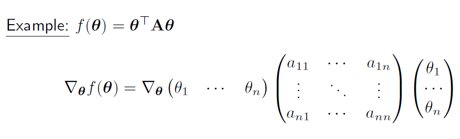

Where $A\  = \ X^{T}X$ in the previous example.

$f(\theta)$ is a real function that goes from
$f\ :\ \mathbb{R}^{n}\mathbb{\  \rightarrow \ R}$

We can rewrite that formula with this expression:

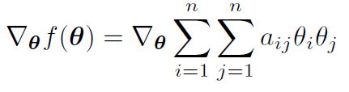

We have to compute the partial derivatives in respect to
$\theta_{1},\ \theta_{2},....\ \theta_{n}$, so I have to compute $n$
partial derivatives.  
So, we have to do:


In the first expression when $i$ is different from 1 and j is different
from 1, there is going to be a 0. We have a non-zero when we have $i$
equal to 1 **or** $j$ equal to 1. The same thing happens for the other
expressions, just replace the number that is going to be 2 etc.

So, we can rewrite the formula with only $j$ equal to 1 or $i$ equal to
1 in the first expression and for the others expression should be equal
to the number of theta:


We can rewrite it as this because we can use the same index for the
summation:


And finally this expression can be rewrite as:


If $A$ is symmetric (e.g., $A\  = \ X^{T}X$) then:

  
So we can use these two formulas to compute the partial derivatives, no
need to re-do all the steps, if you see in the previous expression for
the previous form we can apply this trick.

## Linear regression: Higher dimensions

Until now we have seen the case where:

$y_{i}\  = \ ax_{i}\  + \ b$ $for\ i\  = \ 1,....,n$

That is, each data point is one dimensional (just one number).

In the more general case, the data points $(x_{i},\ y_{i})$ are vectors
in $\mathbb{R}^{d}$:

$$y_{i}\  = \ Ax_{i}\  + \ b\ for\ i = \ 1,......,n$$

Instead of only one $y_{i}$ we have a vector of $y_{i}$, instead of a
number $x_{i}$ we have a vector of $x_{i}$.

So we have a d dimensional bias and a vector A that contains a lot of
parameters.


In particular:


So before we were discussing linear regression with only one dimension,
instead now we can work also with higher dimensions. Look that the zero
have to be the same dimension of the gradient. (it’s not really 0, it’s
the 0 vector).

## Wrap up


This is our first neural network, it has only one linear layer, the loss
is the MSE, we will use MSE all the time with also deep models. Later we
will compose new layers together, but if we add layers closed form
solutions doesn’t work anymore.

So, sometimes, the learning model is **linear,** and the loss is
**quadratic**. This case can be solved in closed form. The more data
points (xi; yi) we have, the better. In deep learning, linear models
usually appear as “pieces" within more complicated nonlinear models.

# Overfitting and going nonlinear

Having more data allows us to improve our predictions but can even 
invalidate some assumptions, e.g. in the following figure, having more 
data may reduce how well the linear model fits the data.


Therefore, we face some key questions:

- How to select the **right distribution** (model)? In deep neural
    network choosing the model means choosing the architecture of the
    network.

- **How much data** do we need? As much as possible data, we want to
    build scalable learning models, scalable meaning that they improve
    the prediction accuracy that more data come in. If you add data an
    you don’t have any improvement, then your model is not right.

- What if the correct distribution does not admit a simple expression?
    Let’s see

After the linear model, the simplest thing is something that follows a
**polynomial model**, and this is called **polynomial regression**,
expressed with the following equation:

$${y_{i}\  = \ b\  + \ \sum_{j = 1}^{k}{a_{j}x_{i}^{j}}\ for\ all\ data\ points\ i = 1,.....,n
}
$$


The number of **parameters** grows with the order. We have always number
of order+1 parameters.

**More data** are needed to make an informed decision on the order.

**Remark:** Despite the name, polynomial regression is still **linear in
the parameters**. It’s polynomial in respect to the data.

For this reason, instead of polynomial regression we should call it
**linear regression with polynomial features**.

$$y_{i}\  = \ a_{3}x_{i}^{3}\  + \ a_{2}x_{i}^{2}\  + \ a_{1}x_{i}\  + b\ for\ all\ i = 1,......,n$$

So, the polynomial regression can be expressed in matrix notation by
rewriting equation for every component of y as:


X is the feature matrix called **polynomial features**, we are not
learning them, they are just features and also y is given to us.

The same exact least-squares (closed form solution) as with linear
regression applies, with the requirement that $k\  < \ n$, so you need
at least **k + 1** data points, where k is the order of the polynomial.
(Because think to have only one data point, in that point pass infinite
lines, so you can’t really find the parameters because we do not have
enough information to solve for all the parameters).

## Polynomial fitting

How powerful is this model? Meaning, how many real functions f can it
represent, given the proper values for the parameters? The
Stone-Weierstrass theorem provides us with an answer.

An application of the the **Stone-Weierstrass theorem** tell us:

If $f$ is continuos on the interval $\lbrack a,b\rbrack$, then for every
$\epsilon > 0$ **there exist a polynomial p** such that
$\left| f(x) - p(x) \right| < \ \epsilon\ for\ all\ x$

So for any continuous function in some interval than is possible to
approximate it by some polynomial. So for any continuous function there
is a polynomial that approximate it to any desired accuracy. The
accuracy is captured by epsilon, so for every epsilon we always find a
polynomial p that approximate the function for all x. We don’t know the
polynomial but eventually if you try, you will find it.

It means that given any data distribution in any dimension I can do
polynomial regression, polynomial fitting and I am done. So why do we do
deep learning? I mean if we always do with polynomial regression is
possible the true function was another, for example.

But how to choose the degree of the polynomial? It is not a parameter to
be learned, but rather an hyperparameter, that encodes a prior we
establish, e.g. we expect the data to be distributed following a
cubic-like polynomial. Let's see what happens by trying to fit
polynomials of various degrees to the same data.


We can see that with a 1-degree polynomial we cannot represent the data
distribution well: we are **underfitting**.

With a 4-degree polynomial we get a very good representation, so we may
think that going higher we could get an even better representation.
Indeed, with a 15-degree polynomial we get a representation that fits
all points, so the MSE for this polynomial is smaller than the 4-degree
polynomial, although we can see immediately that the representation is
not something that we desire. Why is that? Because it is very unlikely
that the true function that has produced these data points looks like
this learned function. We are overfitting.

These two phenomena that we observe the figure above are found across
all deep learning, not just

polynomial regression models:

- **Underfitting**: not sufficiently fitting the data (large MSE) as
    it happens choosing degree one polynomial.

- **Overfitting**: we are learning the noise as it happens choosing
    degree fifteen polynomial. (very small MSE)

From the notion of overfitting, we see that adding complexity to a
learning model is not necessarily a good thing because it could lead to
overfitting and overfitting leads to bad generalization. So, there will
always be a trade-off between these two phenomena.

Generalization: let’s say that you have found a model that explains the
data, this means that as you gather new data, and you apply your model
the new data is also explained by your model. In fact, the first order
polynomial doesn’t generalize well, but the 4-degree polynomial yes.

For example:


If we have a point in the orange curve where there is the concave curve
then the predict is far way than the true point function, so it doesn’t
generalize well.

**Note**: Remember that we are inferring a function (an item from an
infinite-dimensional space) from a finite set of training samples,
therefore there necessarily will be regions of the domain not covered by
the samples, in which we have no clue of the behavior of the function
(this is where the priors step in). Nonetheless, we would like for the
learned function to approximate the true function well overall, not only
on the training data, i.e. to be as general as possible, even if this
means not fitting the training data perfectly.

There is a relatively easy way to detect whether we are doing
underfitting or overfitting:

1\. Separate the known data into two sets: the training set and the
validation set;

2\. Estimate the model parameters on the training set so as to minimize
the loss function on the training data;

3\. If the loss is large on the training set, then we are underfitting,
since the model is not able to represent well enough the training data;

4\. If the loss is small, then we may be overfitting. To check this, we
take the validation set and compute the loss function on these new data.

5\. If we get large loss on the validation set then we are overfitting,
since the model is very good at representing the training data, but
generalizes badly on unseen samples, hence the learned function cannot
be a good global approximation of the true function.

In summary, underfitting is whenever we have large training error and
large validation error, while overfitting is whenever we have small
training error and large validation error.

Usually we have 70% for the training set, 20% for the dev set, 10% for
the test set.

So, is polynomial regression all we need?

- Different loss than MSE. If we don’t have MSE, it’s not possible to
    use polynomial regression.

- Regularization. This is a tool to not make the model overfit.
    Regularization is hard to do in polynomial regression.

- Additional priors. If you have additional priors to the model
    polynomial regressors is not taking to account that, we don’t only
    want to inject training data.

- Intermediate features. Some models produce intermediate features
    which are very helpful to address certain tasks.

- Flexibility. Deep learning is more flexible.

- Regression (predict a value) vs. classification (predict a
    category). Polynomial regression predicts a value.

From now on, we embrace the idea that many natural phenomena of interest
are **nonlinear**.

## Regularization

### Regularization penalties

Sometimes our prior knowledge can be expressed in terms of an energy.
For example, in polynomial regression we may want to avoid large
parameters to counteract overfitting and thus control the complexity of
the learning model.

For this purpose, we can sum to our minimization problem the squared
Frobenius norm (a type of matrix norm that generalizes the L2 norm
defined for vectors to matrices, so it is often referred to as simply L2
norm) of the parameters.

In this case, the regularizer would be:


**Definition (Entry-wise norms).** These norms treat an mxn matrix as a
vector of size m\*n, and use one of the familiar vector norms. For
example, using the p-norm for vectors, p \>= 1, we get:


The special case p = 2 is the Frobenius norm, and p = 1 yields the
maximum norm.

In general, the regularizer is a function that depends on the
parameters, over which it enforces some soft constraint by producing a
scalar that is higher the more violated the constraint is.

A scalar $\lambda$ which trades off fidelity with respect to data with
fidelity with respect to the regularizer, so:

- $\lambda = 0$ means we just want to be as good as possible on the
    data (I trust the data), while

- $\lambda = \  + \infty$ means that we do not care about the data, we
    are just asking for very small value for parameters.

The minimization problem thus becomes:


The data term is the MSE, the trade-off is the scalar and the
regularizer is the squared $L_{2}$ norm of the coefficients of the
parameters. There is an F in the regularizer because it’s the Frobeniuos
norm that works with matrixes. All of these 3 terms should be minimized.

I want to minimize the usual parameters for the data (data term) but
also want bigger parameters being small (trade-off \* regularizer).

We can use lambda to tune the model and make an improved model. (as
always we should get a lambda that is between 0 and plus infinite, this
is an **hyperparameter**)

This method is called **regularization penalties** because we penalize
bigger parameters in the model by making them small.

This method works because seeing the graphic on the Degree 15 polynomial
we see that these big concave/convex curves are due to high parameters.

Adding a quadratic penalty ( the regularizer that you saw) to the loss
is also known as weight decay, ridge or **Tikhonov** regularization.
(Penalize $L_{2}$norm of the parameters)

More in general:


Note: All $L_{p}$norms are convex.

Controlling parameter growth is generally know as **shrinkage** and
weight decay is not the only way to do so: for instance the L1 norm
gives rise to lasso regularization, that has the following expression:


and induces sparsity, since every parameter will receive an equal \push"
towards zero, regardless of their magnitude. On the other hand the ridge
regularization induces a “push" that will be proportional to the actual
magnitude of the parameter, so larger parameters will go faster to zero
than smaller parameters, resembling an exponential decay (hence the
name). With L1 regularization, when a parameter is zero it will stay at
zero, therefore achieving sparsity i.e. the model has some irrelevant
parameters, and the matrix representing them is sparse.

Why does all of that happen? We have not yet seen how the training
actually modifies the parameters to minimize the loss function, but we
can anticipate that it has to do with gradients.

In general, p-norms are a good choice for regularizers, since thery are
always convex. We have seen that $l_{\theta}$ is convex, and the sum of
two convex functions is still convex. This is very important since it
means that we can hope to find a closed-form expression for the global
optimum to the minimization problem:


Note that any p-norm will not be linear in $\theta$ because there is at
least the absolute value.

Other regularizers induce other desired properties on the parameters. In
general, regularization allows us to impose some expected behavior from
our learning model, it allows to control the complexity of the model and
by controlling the complexity it actually allows us to reduce the need
for lots of data because this is imposing some kind of behavior. Note
that regularizers are not always defined as penalties included in the
loss functions.

**Definition (Regularization)** Any modification that is intended to
reduce the generalization error but not the training error.

Other forms include the choice of a representation, early stopping and
dropout.

## Classification

What if we want to predict a category instead of a value?


Possible solution: Do post-processing (e.g thresholding) to convert
linear regression to a binary output. It doesn’t really work because if
you threshold you get a new function that is discontinuous and it
doesn’t really work with MSE. So this solution is not necessarily an
optimum one.

Instead: Modify the loss to minimize over **categorical values
directly.**

## Logistic regression

New loss:

$$l_{\theta}\left( x_{i},y_{i} \right)\  = \ \sum_{i = 1}^{n}\left( y_{i}\  - \ \sigma(ax_{i} + \ b)\  \right)^{2}\ \ \ \ \ \ \ \ \ \ \ \ \ \ \ \ \ \ \ \ \ \ \ \ \ \ \ \ \ \ \ \ \ \ \ \ non\ convex\ $$

\* linear

Here, $\sigma$ is the nonlinear **logistic sigmoid**:

$$\sigma(x)\  = \ \frac{1}{1 + e^{- x}}$$

The steepness of the line can be changed by applying a scalar $\lambda$
to $e^{- \lambda x}$

$\sigma$ has a **saturation effect** as it maps
$\mathbb{R\ } \longmapsto \ (0,1)$

$\sigma\left( ax_{i} + b \right)$ is called the linear block in deep
neural networks, $\sigma$ is the activation function and we will also
other possibilities that we can use instead of the sigmoid function, we
will see later.

The problem is that this is not convex, I want it convex so:


If the output of $\sigma$ is 1, and the correct answer is 1, I have log
of 0 that is 0 cost, if the output of $\sigma$ is 0 and the answer is 1
I have $+ \infty$ cost (log of 0 is $- \infty$, with the – at start of
the expression $+ \infty$ ), same thing will happen in the second
expression if the output $\sigma$ is 1 and the y is 0 then I have
$+ \infty$ cost, if its 0 I have 0 cost.

We can rewrite the formula as:


New convex loss:


Since the loss is convex, the first order conditions apply:

$$\nabla_{\theta}l_{\theta} = 0$$


We know see how we compute the gradient of the loss function because we
will need later for backpropagation.

Consider the gradient of each term in the summation:


We can also divide the terms:


$y_{i}$ and $(1 - y_{i})$ are scalars and I can bring them out, the
gradient of course is respect of a and b.


Let’s focus on the first gradient, I must compute the gradient in
respect of a and in respect of b, let’s compute the gradient in respect
of a.


If you see a compare to a composition of functions, so in order to
compute the derivative in respect of a we have to apply the chain rule
to each partial derivative:

Let’s start in the last term:


The derivative of $ax_{i}\  + \ b$ is $x_{i}$:


The second term we must differentiate sigma in respect of
$ax_{i}\  + \ b$ (before we differentiate in respect of a only), so:


Let’s plug the definition of the sigma:


Let’s differentiate in respect of $ax_{i}\  + \ b$:


Let’s move to the first term, but let’s rewrite the second term with
this:


Let’s add 1 and -1 in the second member of the second term:


Let’s rewrite the term like this:


As you can see this is $\sigma$:


Now the first term:


The derivative of the logarithm is 1/argument so:


So we have done:


You have to do the same stuff for the parameter b, so in general for all
parameters, we have also to do the other gradient term we defined.
Imagine this for millions of parameters, it’s a pain, so with
backpropagation we can skip a lot of passages. Backpropagation will do
this for us:


This expression as you can see is nonlinear because we have sigma in it.

Thus:

$\nabla_{\theta}l_{\theta} = 0$ is not a linear system that we can solve
easily.

$\nabla_{\theta}l_{\theta} = 0$ is a transcendental equation
$\Rightarrow$ There is no analytical solution.

So we can’t really find a solution.


Deep learning is about **nonlinear optimization** (when we deal with
gradient descent, backpropagation, stochastic gradient descent, Adam
optimizer, non conjugate gradient, training a deep neural network, all
we do is nonlinear optimization)

# Gradient descent

When dealing with regression, we have seen that not all data
distributions are of linear nature, very few actually, and therefore
this nonlinearity must be represented by our models. More in general, it
is very frequent having to deal with a loss function with a gradient in
which the model parameters enter in a nonlinear way, like we have seen
for logistic regression. We have seen how we have optimality guarantees
for a closed-form solution (obtained by setting the gradient to 0) only
for convex functions. Although a nonlinear function is not necessarily a
non-convex function (for instance quadrics are not), most are. What this
means is that we have no closed-form solutions available, but instead
must resort to nonlinear optimization.

Nonlinear optimization is a very broad research area, of which we will
only consider the branch that is concerned with first-order methods,
i.e. methods that to optimize a function involve the first-order
derivatives (in our case it is the gradient) of that function. On the
other hand, a second-order method would also involve the use of the
second-order derivatives of the function. The most basic of these
optimization is known as Gradient descent.

## Intuition

Gradient descent is a **first-order** iterative minimization algorithm.

It is iterative since it involves a series of iterated computations to
find the local minimum of a function, given some initial conditions.  
Notice the word local, meaning that we effectively lose any global
optimality guarantee when entering the domain of non-convex functions.
These functions have multiple local minima, and GD will converge to one
of these points; which one exactly depends on the initial conditions.

The intuition behind GD is pretty straight-forward: starting from some
point in the domain of the function, computing the gradient of the
function at that point will tell us the direction of steepest increase
(or ascent) of the function itself. Since we want to minimize the
function, we take a “step" in the opposite direction (putting a minus in
the formula), the direction of steepest decrease (or descent, hence the
name of the algorithm), moving to a new point. In this new point, we
repeat the process, and we do so for a certain number of steps, or until
some termination condition is met (often referred to as convergence
criterion).

Ideally, the convergence criterion would be having a perfectly null
gradient, meaning that we cannot move (in a linear way) downwards"
anymore; we have reached a stationary point, and we have effectively
reached a (local) minimum of the function1. In practice for numerical
precision issues this means setting a tolerance threshold under which we
can say with confidence that we are in a stationary point.

Example: $l_{\theta}\ :\ \mathbb{R}^{2}\mathbb{\  \rightarrow \ R}$ ( We
have only two parameters $\theta_{1}$, $\theta_{2}$, so for each point
in the domain we have the value of the loss function )


We are only considering two parameters because it’s easy to show it.

We want to find the minimum in that plot, that is near the blue bump you
see in the figure, that’s our aim.

How can you do? You start with some point on the 2d domain, you compute
the value of the loss at that point and you want to go down hill (you
compute the gradient of the loss at this point, that it will go where
the function increase, so we add a minus to go to the opposite
direction) and you repeat the process until you find the minimum. How
much should we “move" (i.e. change the parameters) in that direction?
This is the step size, that can be thought as a hyperparameter. So in
the end, having chosen a suitable step size we can make our step in that
direction, moving to a new point that will be a new set of values for
the model parameters. From this point in the parameter space we will
compute again the loss function and iterate the process until the
convergence criterion is met, tracing a sort of path (see the figure
above) that ends in a local minimum

**Overall idea**: Move where the function decreases the most.

1. Start from some point $\theta^{(0)}\  \in \ \mathbb{R}^{2}$

$$\theta^{(t + 1)} = \ \theta^{(t)}\  - \ \alpha\nabla l_{\theta^{(t)}}\ $$

2. Stop when we meet some conditions that represent the minimum:  
    - When the gradient is 0  
    - Too many iteration

Let’s see now a different view to see this algorithm:

$$x^{(t + 1)} = \ x^{(t)}\  - \ \alpha\nabla f(x^{(t)})$$


As you can see, we also plot some surfaces at the bottom, this colour
curves means that, if you see the curves have some colour, and all the
points along these curves with the same colour have the same value they
have the same value of f, that’s the cause we call it isocurve or a
level set of the function (isocurva, insieme di livello della funzione).
We are plotting a few isocurves corresponding to this function f.


We talk about this isocurve because we have a better representation than
the one used before.

Gradient descent operates in this domain in the sense that any point x
at iteration t is a point on the space. If you have only two parameters,
x is two dimensional, that is a point on that graphic. The gradient of
the function, will be a direction, a two dimensional vector that points
where the function increases the most.

So we can imagine gradient descent that we start in some points and when
we compute the gradient we have the direction where to go and it
promises that you go where the function decrease because we put the -.
Gradient descent then will do a trajectory until the minimum.

Note that they didn’t plot all the isocurves, just a part of it, if you
see the other plot with the surfaces we are looking at the yellow
surface.

We will like to do a trajectory with gradient descent that goes to the
middle of the blue isocurve where the value of the loss is 0.5.

Now let’s draw all the directions on each point (that is not useful
because usually we only start at only one point and do the trajectory
but I am showing for explanation):


Each arrow is the gradient in different points, they change nice and
smoothly, they follow some trend, they change very little, this is what
we call continuous gradient, continuous means that if you move on the
domain by epsilon there is a corresponding delta in the gradient and a
continuous gradient is a thing that we want.

The second thing is that all the vectors shown are orthogonal to the
isocurves, at each point the arrow you see that is orthogonal to the
isocurves.

The length of the gradient changes on the domain because the length of
the gradient encodes how fast the function is increasing: there are
points near the yellow isocurve that I except that there are long
arrows, instead in the blue isocurves I except that the gradient is
smaller and smaller because in the end when we reach the minimum the
gradient is 0. (we see that the arrow are small)

Here we are seeing the arrows of a negative gradient.

This work also with 3 or more parameters, for example in third
dimension:


As we said, the gradient is **orthogonal (perpendicular)** to level
curves / level surfaces.


Demonstration:

We have not yet provided a formal justification of the claim that the
gradient of a function at a point, which is the vector of the partial
derivatives, is in direction of the steepest increase of the function at
that point. We therefore briefly introduce the concept of **directional
derivative**, an extension of the “usual" derivatives in the simple
one-dimensional domain $\mathbb{R}$. While on the real axis there is
only one direction, in $\mathbb{R}^{n}$, starting from n = 2 upwards,
there is no fixed direction to evaluate the derivative of a function.

The directional derivative $\frac{df}{dv}$ generalizes the concept of
partial derivative $\frac{\partial f}{\partial x}$ which assumes that
the direction in which we take the derivative is one where only one of
the variables can change, while the others are fixed (one of the
canonical axes). This assumption is lost when taking the derivative in a
general direction v. In practice, this means that (potentially) all the
variables of the function change in that direction according to some
law. For example, suppose we have the polynomial function:


and we want to take the directional derivative


then the independent variables x,y are not independent anymore, but are
bound to the line of slope
$\frac{y}{x}\  = \ \frac{\sqrt{2}}{2}\ \frac{2}{\sqrt{2}}\  = \ 1$(note
that to be a “pure" direction, the vector must be a unit vector),
therefore we can parametrize them with a new independent variable t such
that $x(t)\  = \ y(t)\  = \ \frac{\sqrt{2}}{2}t$

Now taking the directional derivative boils down to a substitution and a
simple derivative in $\mathbb{R}$:


How does the notion of directional derivative lead us to the gradient
being in the direction of steepest increase?

The gradient is a vector and the partials derivates are two in this
case, so it’s taking the derivative in two directions. We don’t know the
direction because there are infinite directions, so let’s plot without
any arrow:


I choose a direction:


So I am looking at the function f on this arbitrary direction, so I can
compute the derivative in that direction and let’s call it a directional
derivative.

Usually I write it as you see in the graphic: $\frac{df}{dv}(x)$

So in general I am computing the partial derivatives in respect of x and
in respect of y direction

The isocurves of a function are the the curves (or hyper-surfaces) on
which the value of a function does not change. This means that taking
the directional derivative of the function, in a point on the curve and
along a direction v tangent to the curve, this directional derivative
will be zero, since locally the function is not changing in that
direction (although it will, globally, since this is only a local linear
approximation of the behavior of the function). To compute the
directional derivative you can do the inner product between the gradient
and the direction v, it gives you the directional derivative, then, it
can be shown that $< \nabla\ f,\ v\  > \  = \ 0$, which means that the
gradient is orthogonal to the level curve, and it can be further shown
that it is oriented towards level curves of higher values (instead of
lower values).

This is summarized in this figure:


## Differentiability

$$x^{(t + 1)} = \ x^{(t)}\  - \ \alpha\nabla f(x^{(t)})$$

We need the gradient to be **differentiable** at all points. To be
differentiable doesn’t mean only that you can compute the gradient:

$f$ has partial (or even directional derivatives) derivatives
$\nRightarrow$ $f$ is differentiable

But also must be a continuous gradient:

$$f\ has\ continuos\ gradient\  \Longrightarrow \ f\ is\ differentiable$$

So the gradient is differentiable if and only if you can compute the
partial derivatives (the gradient exist) and is a continuous gradient.
You can say that you have a continuous gradient when you don’t have
discontinuity, it means that there are no jumps in the gradient (like
taking a random arrow and it points out in the zero gradient, that’s
what discontinuity means). In general, the loss function is not always
differentiable, like take the maximum, take the absolute value etc,
these doesn’t have a continuous gradient, so these are not
differentiable operations. So why do we use gradient descent in deep
learning? In general we don’t use it or we replace that operations with
something similar that is differentiable.

## Stationary point

A **stationary point** is such that:


So $x^{(t)}$ is a stationary point and is when the gradient descent
“gets stuck” at stationary points. This could be a problem if you are
looking for a global optimum, because the algorithm can stuck to a local
optimum or anywhere the gradient is zero.

A stationary point can be also called a critical point of the function
f.

- Stationary point $\nRightarrow$ it’s not always a local
    minimum/maximum but it can be also a saddle point (punto di sella),
    you can see that in the previous graphic where the surface is
    plotted and you can see like a saddle surface.


So why are we caring about this gradient descent if we can get stuck in
these points that are not useful for our task?

- In deep learning we don’t care about the global minimum, because
    often you will be overfitting

- Stationary point $\nRightarrow$ local minimum $\nRightarrow$ global
    minimum

- Which stationary point depends on the initialization (how you
    initialize the weights you are trying to optimize/learn).


## Learning rate

$$x^{(t + 1)} = \ x^{(t)}\  - \ \alpha\nabla f(x^{(t)})$$

This parameter is always positive (otherwise we would maximize the loss
function, by moving in the direction of the gradient) and is called
learning rate.

The parameter $\alpha\  > \ 0$ is also called learning rate in ML. It’s
also defined as the “step length”.

**Remark:** The length of a step is not simply $\alpha$, but
$\alpha\left\| \nabla f \right\|$, that’s the step size.

- Too small: slow convergence speed.

- Too big: risk of **overshooting**

- Optimal values can be found via line search algorithms. If $f$ is
    convex and you are looking in the negative gradient direction, and
    when you do the first step you have a slice of the function and you
    can solve it to look for the minimum of the learning rate for the
    current iteration. You can do this at each step of the gradient
    descent.


### Decay and momentum

More frequently is done that you choose a big $\alpha$ and then decrease
it as you proceed.  
The learning rate can be **adaptive** or follow a **schedule**.

- Decrease $\alpha$ according to a **decay** parameter $p$ (follow a
    schedule).  
    Examples.  
    Decrease $\alpha$ exponentially (third formula):

$\alpha^{(0)}$ is where you start, for t = 0 you have $\alpha^{(0)}$, as
t increase you get exponentially smaller $\alpha$ values. The speed of
decrease is governed and controlled by $p$.  
The first formula:  
$p$ can go to any range of values, $t$ can go from 0 up to $p$.  
This is a line going from $\alpha^{(0)}$ to $\alpha^{(p)}$. If we choose
$\alpha^{(p)}$ to be small than $\alpha^{(0)}$ then it’s a line going
down otherwise is going to be another direction, it depends on ro.

in which $\rho$ is a decay parameter. This is motivated by the idea that
initially we need large steps to swiftly progress in the general
direction of the minimum. Later on, once we get closer and closer to the
point, we need smaller steps to reach convergence. Of course, the decay
parameter can enter the update law for $\alpha$ in many ways: balancing
a linear interpolation over time between an initial value
$\alpha^{(0)}$and a final value $\alpha^{(\rho)}$,or monotonically
decreasing $\alpha$ over time, in a linear way or even an exponential
way. There is no “best recipe" here, one approach may (or may not) work
better than another depending on the specific setting under
consideration.

### Momentum

Another approach takes inspiration from physics, since after all we have
used the analogy of “moving" in the parameter space so far. Moving
involves velocity, and bodies with mass possess momentum, that is
conserved over time (by the principle of conservation of momentum) and
keeps them in motion, unless an external force (like friction, taking
away momentum, or a force, causing an acceleration effect and hence
adding more momentum) steps in to modify it. If we imagine our moving
estimate of the best parameters for the model during gradient descent to
be a point particle, with unitary mass, its momentum p = mv coincides
with its velocity v. In the case of simple gradient descent we have


so each step the velocity is simply given by the “acceleration" that the
gradient imposes on the body at that point. However, each step the body
discards the velocity imposed by the previous gradient, and takes as new
velocity the new gradient at the new point. Phisically, past
accelerations are accumulated since the velocity does not reset back to
zero at each “next step", like it is happening here. Therefore, we add
in our conservation of momentum idea, to have an effect of accumulating
past gradients, but with gradients computed in previous steps having
less and less importance, much like friction (with coefficient
$\lambda$) takes away momentum for a body in motion on a surface.


Previously, the size of the step was simply the norm of the gradient
multiplied by the learning rate. Now, the size of the step depends on
how large and how aligned a sequence of gradients are. Also, the larger
$\lambda$ (with 0 \< $\lambda$ \< 1) is relative to $\alpha$, the more
previous gradients affect the current direction. The step size is
largest when many successive gradients point in exactly the same
direction. If the momentum algorithm always observes the same gradient
$\nabla f$, then it will accelerate in the direction of $- \nabla f$,
until reaching a terminal velocity (like a body in free fall motion
reaching terminal velocity due to the drag imposed by air resistance)
where the size of each step is


It is thus helpful to think of the momentum hyperparameter $\lambda$ in
terms of $\frac{1}{1 - \lambda}$ . For example, Lambda = 0.9 corresponds
to multiplying the maximum speed by 10 relative to the standard gradient
descent algorithm.

But why exactly should momentum help the algorithm? we can see that with
large enough lambda, we have an acceleration effect that helps the
convergence speed.

- Accumulate past gradients and keep moving in their direction:

> $v^{(t + 1)}\  = \ \lambda v^{(t)}\  - \ \alpha\nabla f(x^{(t)})$
> **momentum**

$$\mathbf{x}^{\mathbf{(t + 1)}}\mathbf{\  = \ }\mathbf{x}^{\mathbf{(t)}}\mathbf{\  + \ }\mathbf{v}^{\mathbf{(t + 1)}}$$

> $\lambda$ is the momentum parameter, when $\lambda$ is 0 we have the
> standard gradient descent. If $\lambda$ is greater than we have:

$$\mathbf{x}^{\mathbf{(t + 1)}}\mathbf{\  = \ }\mathbf{x}^{\mathbf{(t)}}\mathbf{\  + \ }\lambda v^{(t)}\  - \ \alpha\nabla f(x^{(t + 1)})$$

> v can be interpret as velocity and we choose an initial value of v ( a
> vector of zero), so at the first iteration we get the standard
> gradient descent:

$$x^{(0)}\  = \ 0\  - \ \alpha\nabla f(x^{(0)})$$

In the next iteration we get:

$$x^{(1)} = - \lambda\alpha\nabla f\left( x^{(0)} \right) - \alpha\nabla f(x^{(1)})$$

We have 2 gradients and we are not moving orthogonally in the isocurves.
The maximum step length we get If the previous gradient and the current
gradient are colinear (they point in the same direction, they are
parallel vectors), then we git a big step. But instead if they are
parallel and point in opposite directions, we get a very small length
step. If there are colinear gradients is where we get the big advantage.
So in general momentum is promoting to have colinear gradients.

We are not happy to find local minimum because especially the small ones
they are just due to noise in the data, it’s not really something that
you want to fit.

Step length $\alpha$ depends on how aligned is the sequence of gradients
(how much colinear they are):

$$\frac{1}{1 - \lambda}\alpha\left\| \nabla f \right\|$$

If $\lambda$ is 0, then no momentum (standard gradient descent), if we
put 0.9 we get 10 times the gradient descent.


As you can see in the graphic, the momentum directions are not always
orthogonal on the level curves. Instead, the gradient descent only moves
orthogonal to the level curves. Acceleration effect for big $\lambda$
escape from local minima.

<https://distill.pub/2017/momentum/>

Let us try to unroll gradient descent:


Error there, I should start with i=0

With momentum:


The more general form (just think the gradient descent that the
coefficient is 1:


So in gradient descent the $\gamma$ is 1, momentum is the one shown, and
others like Adam etc have different coefficients. The $\gamma$ is just a
scalar, it scales the gradient.


This is used when we want to scale the coordinates in a custom way,
because with the previous approach we scale all the coordinates with the
same value (each dimension of the gradient). This approach with the
diagonal matrix generalize algorithms like Adam, AdaGrad etc.

Why do we like Gradient Descent?

Because can be applied to nonconvex problems, without optimality
guarantees.

To gain **generalazition**, the following consideration is crucial:

We are rarely interested in the **global** optimum

Even for **convex** problem like:

- Linear regression (**X** can be huge and must be
    inverted/factorized)

- Logistic regression (no closed form solution)

We get more **efficient** and **numerically stable** solutions.

In the general DL setting:

Each parameter gets updated to **decrease the loss**:

$$\theta_{i}\  ⟻ \ \theta_{i}\  - \ \alpha\ \frac{\partial l}{\partial\theta_{i}}\ $$

The gradient tells us how to change the parameters.

- $\theta$ stores the neural network parameters, possibly **millions**

- The loss may be **non-convex** and **non-differentiable**

- Be aware of computational aspects

## Stochastic gradient descent

Recall that the loss is usually defined over n training examples:

$$l_{\theta}(\{ x_{i},\ y_{i}\})\  = \ \frac{1}{n}\sum_{i = 1}^{n}{(y_{i}\  - \ f_{\theta}(x_{i}))}^{2}\ $$

Which requires computing the gradient for each term in the summation:

$${\nabla l}_{\theta}(\{ x_{i},\ y_{i}\})\  = \ \frac{1}{n}\sum_{i = 1}^{n}{{\nabla l}_{\theta}(\{ x_{i},\ y_{i}\})\ }$$

As we have samples, we have to compute millions of examples gradients.

Two **bottlenecks** make gradient descent impractical:

- Number of examples

- Number of parameters

### Mini-batches

$${\nabla l}_{\theta}(\{ x_{i},\ y_{i}\})\  = \ \frac{1}{n}\sum_{i = 1}^{n}{{\nabla l}_{\theta}(\{ x_{i},\ y_{i}\})\ }$$

Compute ${\nabla l}_{\theta}$ for a small representative subset of m
\<\< n examples:

$${\nabla l}_{\theta}(\{ x_{i},\ y_{i}\})\  = \ \frac{1}{m}\sum_{i = 1}^{m}{{\nabla l}_{\theta}(\{ x_{i},\ y_{i}\})\ }$$

The mini batch should be representative for the dataset, for example if
you have a classification problem with three classes, you should take
these three classes representative samples in a balance way.

Example: MNIST dataset

n = 60000, m = 10 =\> 6000 x speedup

Also, as momentum you will not orthogonal to the level set curves, also
is not constantly decreasing because we are not following the negative
gradient. The loss can increase or decrease, because you take these few
samples. If you have in a batch more samples, of course you get a better
gradient but with cost of efficiency. The mini batches can also overlap,
that’s a choice.

The algorithm is as follows:

- Initialate $\theta$

<!-- -->

- Pick a mini-batch B

- Update with the downhill step (use momentum if desired:  
    $\theta\  \leftarrow \ \theta\  - \ \alpha\nabla l_{\theta}((\{ x_{i},\ y_{i}\})\ $

- Go back to step 2

When steps (2)-(4) cover the entire training set T we have an **epoch**.
Like gradient descent, the algorithm proceeds for many epochs.

**Remark:** The update cost is **constant** regardless of the size of
the training set, because it depends only in the size of the batches.


As you can see the trajectory doesn’t go orthogonal to the level set
curves.

SGD does not stop at the minimum.

Oscillations are due to the noise induced by the random sampling.


We see that SGD has indeed slower asymptotic convergence, but it has
been argued that for machine learning tasks faster convergence
presumably corresponds to overfitting, and therefore it is not worthwile
to seek convergence faster than O(1/p). Furthermore, SGD does not depend
on the number of examples, implying better generalization. Going back to
the convergence speed point of view, the asymptotic analysis obscures
many advantages that stochastic gradient descent has after a small
number of steps. With large datasets, the ability of SGD to make rapid
initial progress while evaluating the gradient for only very few
examples outweighs its slow asymptotic convergence.

Here we list some final practical considerations about SGD:


# Multi-layer perceptron and back-propagation

## A glimpse into neural networks

In deep learning, we deal with **highly parametrized models** called
**deep neural networks**:

## Deep composition

The simplest example of a nonlinear parametric model:

$$\sigma \circ f(x)$$

If $\sigma$ is the logistic function, we have the **logistic
regression** model.

Consider multiple layers of logistic regression models:

$$(\sigma \circ f)\  \circ (\sigma \circ f) \circ \ (\sigma \circ f)\  \circ (\sigma \circ f)(x)$$

We call $(\sigma \circ f)$ a layer.

The composition function is associative, so we don’t have to put those
parentheses, but in deep learning is like that: whenever there is a
layer, then it’s the composition of a nonlinear function $\sigma$ with
the linear map $f$. The idea of a multi-layer perceptron is simply to
compose multiple layers of this form.


We can read it from right where our input is x and from the left we have
the output. The photo of the network that you see above, you read It
from left to right.

The first layer that take the input is called input layer, the last
layer is called output layer.


More in general, we can consider other **activation functions** than
logistic sigmoid:

$\sigma(x)\  = \ \frac{1}{1 + e^{- x}}$ this function is continuous

$\sigma(x)\  = \ \max\{ 0,x\}$ discontinuous gradient (relu)

So when you choose an activation function you have to be aware for its
proprieties.

## Multi-layer perceptron

We call the composition with linear $f$ and nonlinear $\sigma$:


A **multi-layer perceptron** (MLP) or **deep feed-forward neural
network**. Deep because we have more than two layers.

From the linear regression and logistic regression models, we know that
the parameters are the weights that appear inside the linear map, so the
weights that appear inside the matrix are the parameters we are looking
for. $f$ is going to depend on parameters theta and they are not encoded
only in one f, they are distributed across all the multiple linear maps
that we have.

So, the parameters or weights of the MLP are scattered across the
layers.

Imagine compute all the gradients for each linear map, that’s the cause
we use backpropagation, but we will see it later.

Each layer outputs an intermediate **hidden representation**:

$$x_{l + 1}\  = \ \sigma_{l}(W_{l}x_{l})$$

Where we encode the weights at layer $l$ in the matrix $W_{l}$. $f$ is
linear so we can think of it as a matrix W and $l$ is the number of the
layer we are at. W are the parameters of that layer. x is some input
that we are processing. Then we apply $\sigma$ which is a nonlinear
function to all the elements of Wx. This application of $\sigma$, this
happens element wise to the result of Wx. This is what I mean with
$\sigma_{l}\left( W_{l}x_{l} \right)$. When I apply $\sigma$ I obtain a
transformation of the input x and I call it “x at layer l+1”. So I get
an input and I transform it. They are called hidden because they are
intermediate to the final result. We can also add the bias (for example
in the linear regression there is):

$$x_{l + 1}\  = \ \sigma_{l}(W_{l}x_{l}\  + \ b_{l})\ $$

Where we encode the weights at layer $l$ in the matrix $W_{l}$ and bias
$b_{l}$. We must also learn the bias. When there is written “Weights and
biases” that’s what are referring for “learning parameters”.

The activation function $\sigma$ usually has not a learnable parameter.

If you want a learnable activation function, we can put for example:

$$\sigma(x)\  = \ \frac{1}{1 + e^{- \lambda x}}$$

And I declare that lambda is something I want to learn, but this is not
frequently done.

Why do we call $W_{l}x_{l}\  + \ b_{l}$ linear layer? Because it’s
linear in respect to the parameters.

**Remark:** The bias can be included in the weight matrix by writing:

$$W\  \longmapsto \ (\ W\ \ b),\ x\  \longmapsto \begin{pmatrix}
x \\
1 \\
\end{pmatrix}$$

Because each $f$ is **linear in the parameters** just like in linear
regression.

## Hidden units

As we said the layers between input and output layers are called
**hidden** layers:

$$x_{l + 1}\  = \ \sigma_{l}(W_{l}x_{l})$$

Each row of the weight matrix is called a **neuron** or **hidden unit**:


We have two different interpretations:

- Each layer is a vector-to-vector function
    $\mathbb{R}^{p} \rightarrow \ \mathbb{R}^{q}$. This function Wx can
    be seen as a function that takes x ( a vector) and it gives another
    vector. This is a linear map.

- Each layer has q units acting **in parallel** (it means that they
    are independent each unit). Each unit acts as a scalar function
    $\mathbb{R}^{p}\mathbb{\  \rightarrow \ R}$. Each unit can be seen
    as a function that apply to x and it gives you a number.

## Single layer illustration

Examples:

For the first unit you obtain $y_{1}$:


For the last unit you obtain $y_{m}$:


Recap:


To visualize the computation we usually take the hidden input
representation x (possibly the input to the entire network), draw the
corresponding n nodes, then do the same for the output, drawing m nodes.
Now, for every output node, we see which input nodes intervened to give
raise to its value and draw the resulting edge. Each edge has a weight,
and this is the corresponding element in the matrix.

In general, all the inputs are connected to all the outputs, that is
also called a fully connected model:


Then, at each output $y_{n}$ they apply the activation function (in this
case is the relu function).

This representation is only one layer, but you can follow this pattern
for the others layers:


This model is called fully connected layers, for example CNN works in
another model.

## The output layer

The output layer determines the co-domain of the network:

$$y\  = \ (\sigma \circ f)\  \circ (\sigma \circ f) \circ \ (\sigma \circ f)\  \circ (\sigma \circ f)(x)$$

The last function we apply is the $\sigma$. Let’s imagine this is the
logistic sigmoid, that given an input it output a number between 0 and
1:

$$\mathbb{R}^{p} \rightarrow \ {(0,1)}^{q}$$

So, it will be useful for a classification task. I have a very deep
neural network with deep layers and as output I have a number between 0
and 1. However the $\sigma$ should not be the same in every layer, each
layer can have its $\sigma$.

In general, I want to have not only a classification task, but also a
regression, so I can add a linear layer at the output:

$$y\  = \ f \circ (\sigma \circ f)\  \circ (\sigma \circ f) \circ \ (\sigma \circ f)\  \circ (\sigma \circ f)(x)$$

Mapping:

$$\mathbb{R}^{p} \rightarrow \ \mathbb{R}^{q}$$

## Deep ReLU networks

Adding a linear layer at the output:

$$y\  = \ f \circ (\sigma \circ f)\  \circ (\sigma \circ f) \circ \ (\sigma \circ f)\  \circ (\sigma \circ f)(x)$$

Let’s consider that all of the $\sigma$ are ReLUs and I have only one
layer:

$$y\  = \ f\  \circ \ (\sigma \circ f)(x)$$

The fact that I have a linear layer, before ReLU means that I am looking
at linear combinations of ReLUs.

For a 2-layer network with activation $\sigma(x)\  = \ \max\{ 0,x\}$
(**rectifier**), we get a **piecewise-linear** function:


This is interesting because if your network is a linear composition of
ReLUs then the network which is a function that takes x and gives y,
that function is a piecewise-linear function. So if the function we are
trying to approximate is not a piecewise-linear function, then there is
no hope that we are going to use this network.

Examples for this model:


The blue and red edges are produced by the first and second layer.

In the first example, the x (input) is 2-dimensional and y is
one-dimensional, it’s a scalar value. To each coordinate of the plane it
associate just one number. In the first special case, if the $\sigma$ is
a ReLU, then this is how the neural network will look like. It’s a
composition of piecewise-linear functions. These is how the function
(network) will look like with a 2-dimensional input. There are blue and
red edges, the edges are due to the ReLU functions that are there.

If you remember we did the theorem of Stone–Weierstrass theorem that
tells us that if I have any continuous function in a range then there
exist a polynomial function that approximates the function to an
arbitrary accuracy. Like that theorem the aim of Deep ReLU networks is
instead of using polynomials we use the piece-wise linear functions. So
you can approximate each continuous function in a given range with a
piece-wise linear function.

## Universality

What class of functions can we represent with a MLP?

If $\sigma$ is sigmoidal, we have the following:

**Universal Approximation Theorem**

For any compact set $\Omega\  \subset \ \mathbb{R}^{p}$, the space
spanned by the functions $\phi(x) = \sigma(Wx + b)$ is dense in
$C(\Omega)$ for the uniform convergence. Thus, for any continuous
function $f$ and $\epsilon\  > \ 0$, there exists $q\  \in \mathbb{N}$
and weights s.t.:

$$\left| f(x) - \sum_{k = 1}^{q}{u_{k}\phi}(x) \right| \leq \ \epsilon\ \ \ \ \ \ \ \ \ for\ all\ x \in \Omega$$

What the theorem is saying is that the entire space of continous
functions can be spanned with a linear combination of the function
\_(Wx + b). Note that we are always using the same W and b, so we are
only taking linear combinations of one $\sigma(.)$, there is no
composition and thus the network in the theorem has just one hidden
layer. For large enough q, the training error can be made arbitrarily
small. UATs exist for other activations like ReLUs and locally bounded
non-polynomials. The problem with these theorems is that the proofs are
not constructive, and thus do not say how to compute the weights to
reach a desired accuracy. Some theorems also give bounds for the width q
(“number of neurons"), while some show universality for \> 1 layers
(deep networks). Nevertheless, in general, we deal with nonconvex
functions. Empirical results show that large q combined gradient descent
leads to very good approximations.

This theorem is telling us that if we have a deep neural network a
multi-layer perceptron with 1 layer so $\sigma(Wx + b)$ then I can find
weights $u_{k}$ such that when I do this linear combination I can
approximate any continuous function to the desired accuracy. It’s the
same as Stone–Weierstrass theorem and we are saying that we need just
one layer.

So why do we need multiple layers and we do deep neural networks if just
1 is enough?

The problem is that this theorem doesn’t tell you how many parameters
you need to learn and how to find the parameters, how many neurons and
so on.

The network in the theorem has just one hidden layer.

For large enough q, the training error can be made **arbitrary small**.

## Training

Given a MLP with training pairs {$x_{i},\ y_{i}\}$:


Training means we must define a loss function.

Consider the MSE loss:


Then I want to look for the thetas that minimize the loss function, this
is called **training**.

The MSE is not convex in this case, it’s convex if $g_{\theta}$ is
linear and in this case this is not.

In general, the loss is not convex w.r.t. $\theta$.

As we have seen, the following **special cases** are convex:

- One layer, no activation, MSE loss ( =\> linear regression)

- One layer, sigmoid activation, logistic loss ( =\> logistic
    regression)

We have also seen that training is usually performed using gradient
descent-like algorithms, that require the computation of gradients
$\nabla l_{\theta}$. For the basic MSE, this means

**Bottleneck**: Computation of gradient $\nabla l_{\theta}$

For the basic MSE, this means:


Computing the gradient of the loss means computing the gradient of each
term, so for each datapoint. The gradient is in respect to theta
meaning:


- Computing the gradient by hand is infeasible

- Finite differences requires O(#weights) evaluations of $l_{\theta}$

- Using the chain rule is sub-optimal

We want to automatize this **computational** step efficiently.

## Computational graphs

Consider a generic function $f\mathbb{:\ R \rightarrow R}$.  
A **computational graph** is a directed acyclic graph representing the
computation of $f(x)$ with **intermediate** variables.

Example:

$f(x)\  = \ \log x\  + \ \sqrt{\log x}$

You take x:


Identify the key operations, let’s create a new variable y that contains
$\log x$:


We need the square root operation, and we apply it to y:

Now we have just to sum up y and z:


If this was a multiplication and not the sum, I had to write instead of
+, \*. So the graph is the same for multiplication.

Second example:


Let’s identify $x^{2}$ that is used a lot:


The backpropagation task realizes on the fact that you can decompose
complex derivatives into smaller derivatives. Pytorch just build the
computational graph for you. In numpy for example it doesn’t build a
computational graph. Pytorch also tells you what operations can you use
as edges.

The evaluation of $f(x)$ corresponds to a **forward traversal** of the
graph:


So the function f(x) is represented in this graph, and once you have the
graph, if you input a value for x then you follow the graph to apply all
transformation of the edges at the end value f(x). Evaluating f(x) so
correspond to a forward pass/traversal pass of the graph.

This graph is constructed programmatically, for example:

$$z\  = \ sqrt(sum(square(x),1));$$

This is for R to R functions.

In general we can also apply for high dimensional input/output, the
graph may be more complex:


In our case the function that we care about is the loss function that we
are going to minimize. So in the output we have only the a scalar number
( the loss value) and in input the number of the parameters.

With the number of parameters I mean that the loss function is defined
in respect of the parameters and the size of theta is the number of the
parameters.

We are not gonna build these graphs, Pytorch will do it for us.

How do we compute gradients using the computational graphs?

Two ways:

- Forward mode, which is the simplest

## Automatic differentiation: Forward mode

$f(x)\  = \ \log x\  + \ \sqrt{\log x}$

We construct the computational graph:


If you want to compute the gradient means you have to compute the
derivative of $f$ in respect of x.

The idea of forward mode is that first you compute the derivative of all
the nodes in respect of x so: x in respect of x, y in respect of x, and
z in respect of x.


This is what we call automatic differentiation: forward mode. Basically,
if we go from the left to the right, so as we traverse this graph, we
compute all the partial derivatives that will be needed when we finally
reach the output.

Assumption: each partial derivative is a primitive accessible in
**closed form** and can be computed on the fly.


So to compute that derivative we have just to traverse this graph one
time. The problem is that if we have million parameters we have million
of inputs, we have to repeat for each parameter.

So, if the input is high-dimensional, i.e.
$f\ :\ \mathbb{R}^{p}\mathbb{\  \rightarrow \ R}$:


Since partial derivatives must be computed w.r.t each input dimension. P
is the set of parameters.

The forward mode compute all the partial derivatives
$\frac{\partial y}{\partial x},\ \frac{\partial y}{\partial x},\ ...$
with respect to the input x (parameters).

Straightforward application of the chain rule.

## Automatic differentiation: Reverse mode

**Reverse mode**: compute all the partial derivatives
$\frac{\partial f}{\partial z},....\ ,\frac{\partial f}{\partial x}$
with respect of the **inner nodes**.


In the reverse mode I am going to solve the partial derivatives of f in
respect of z, f in respect of y and f in respect of x. So, I am going to
traverse the graph from right (the output) to left.

An example:

$f(x)\  = \ \log x\  + \ \sqrt{\log x}$


The point of the course is not to memorize these things, but just the
philosophy of it.

Forward mode: compute the partial derivatives of all the nodes with
respect of the input

Reverse mode: compute the partial derivatives of the output with respect
to all the nodes.

Reverse mode requires computing the values of the **internal node**
first: we need the value of x (input), the square root of y too, it
means that first we have to do the forward pass too (because first we
have to compute the nodes values. It’s not the typical forward pass, but
just to have the values of the nodes.


So:

- **Forward pass** to evaluate all the interior nodes y,z, .. etc.
    This is not forward-mode autodiff, since we are only computing
    **functions values,** for example if y is log, we must compute it
    with the forward pass in the graph.


- **Backward pass** to compute the derivatives.


This is called **backpropagation**.

## Back-propagation

When training neural nets, we compute the gradient of a loss.

$$l:\ \mathbb{R}^{p}\mathbb{\  \rightarrow R}$$

where p \>\> 1 is the number of **weights**.  
Instead of simple derivatives we must compute **gradients** and
**Jacobians** (it depends on the dimensions you are working with).

The loss is some error measure with respect to the network. It’s true
that the most of operations that appear in the computational graph they
reflect the architecture of the network. I am going to assume that most
of the computational cost is the network.


Let’s call it by layers:


So layer 1, layer 2 etc, from the input $f_{1}$ to the output
$f_{t - 1}$

$\epsilon$ is the MSE, logistic error, or any loss function.

- Forward-mode autodiff:  
    you compute the gradient from the input to the output and you store
    the gradient multiply by the previous one and so on. J1 is the first
    gradient we compute and you store it and the you multiply with the
    second one because of the chain rule. This temporary result you
    store it and then you keep going until the output.  
    

- Reverse-mode autodiff:  
    Instead first you compute from the output and then you compute
    closer and closer to the input. You multiply the gradients because
    of the chain rule and you store the intermediate result until the
    end.  

    

Mathematically they are doing the same thing, but since the input can be
of millions dimension J1 can be a very huge matrix and this is
multiplied with other super huge matrix, and you store it in memory.
Instead, reverse mode if you start from the output that is
one-dimensional, so is gonna be a vector and you always multiply by some
matrix but it always stays a vector, because a vector multiply by a
matrix, it stays a vector. We have this advantage because every loss go
from $\mathbb{R}^{p}\mathbb{\  \rightarrow \ R}$


For deep learning so reverse mode is the best to go.

We call **back-propagation** the reverse mode automatic differentiation
applied to deep neural networks.  
Evaluating $\nabla l$ with backprop is as fast as evaluating $l$.

**Back-propagation is not just the chain rule.**

In fact, not even the costly forward mode is just the chain rule. There
are **intermediate variables**. Backprop is a **computational**
technique.

Also you can’t say backprop “through the network” because you are saying
this:


Evaluating $\nabla l$ with backprop is as fast as evaluating l. In fact,
the forward pass is exactly the evaluation of l via a forward traversal
of the graph, and we have seen that the complexity of the backward pass
for vector-to-scalar functions coincides with a simple traversal.

Back-propagation is not just the chain rule, as some mistakenly believe.
In fact, backpropagation uses the chain rule within some more
sophisticated pipeline, comprised of a forward pass with intermediate
variables stored to then compute a backward pass. It is more precise to
say that backprop is a computational technique.

- One does not backprop “through the network", but rather through the
    computational graph of the loss.

- The loss of a MLP will be non-convex in general, presenting multiple
    local minima; which of these is reached depends on the weight
    initialization. In practice, reaching the global optimum usually
    leads to overfitting, since it would mean that we are overfitting
    the function too closely to the data, accounting for the noise.

- The loss of a MLP will be non-differentiable in general; for
    example, the ReLU is not differentiable at zero. What happens is
    that software implementations usually return one of the one-sided
    derivatives. Nevertheless, numerical issues are always behind the
    corner.

- Lastly, keep in mind that effectively training a deep network is far
    from a solved problem.

# Convolutional neural networks

In the previous chapter we have presented the Multi-Layer Perceptron,
what most people refer to when speaking about a Neural Network in
general. These are deep networks, since they are made up of several
layers, and are feed-forward networks, since the data progresses through
the network from the input layer to the output layer in a
straight-forward way, undergoing transformations at each layer in the
process.

## Neural networks


All these layers have trainable parameters, that get adjusted via an
optimization algorithm like Stochastic Gradient Descent to minimize a
loss function. These parameters are the weights


including the biases. With this architecture, the network output is:


In principle, this architecture is as general as it gets: deep
feed-forward neural networks are provably universal, meaning that
provided enough units, they can approximate any function with any
desired accuracy. However, this comes with a price:

## The need for priors

A partial remedy for the problems above comes from the data itself: the
priors. A neural network is a blank sheet before it gets fed data to
\_t, it has no idea how this data is structured or should be structured.
Therefore, we look for “universal" priors, ideally task-independent to
some extent.

A key insight is that data often carries structural priors in terms of
repeating patterns, compositionality, locality, self-similarity, that we
want to exploit to make it easier for neural networks to accurately
represent the domain of interest and perform well at the task at hand.

Deep feed-forward networks are provably **universal**. (the theorem we
described Very simple deep neural networks can approximate any
continuous function).  
However:

- We can make them **arbitrarily complex**.

- The number of parameters can be huge. (we don’t have any feedback
    with how much parameters we are going to use, it requires
    engineering and this is a job)

- Very difficult to **optimize**. (optimize means find the
    generalization)

- Very difficult to achieve **generalization**. (overfitting etc)

We need additional **priors** as (partial) remedy to the above.

What priors are useful for us? We don’t want a prior useful only for one
problem, we want a universal prior. Convolutional neural networks
provide these universal priors. So, we want to look for “universal”
priors that are **task-independent** to some extent. Task-independent
priors must come with the **data**.

## Structure as a strong prior

**Key insight**: Data often carries structural priors in terms of
repeating patterns, compositionality, locality, …

The natural data has a structure if I show you this picture:


This doesn’t look like a natural object. There is no special structure
in this. But, I can exactly take the points you see in this image and
re-arrange them and obtain:


A nice natural photo I obtain. What is the main difference between these
two pictures? Statistically they have the same colour distribution (if
you look the colour histogram the are the same) so there will be
something different from them. A list of things that make this photo
natural:

- Few local patterns that repeat across the photo (the curves etc,
    small windows, small white squares that are in the wheel or in the
    building etc so they are translated, scaled, repeated etc).

For example, one task computer vision is to solve jigsaw puzzles:

This is a random arrangement of a natural photo:


And I should get:


There are many techniques solving this task, I mention one: usually
natural photos tend to be smooth. That pixels that appear in the first
photo seems that has a lot discontinuity. So they just take these pixels
and put together pieces that have the same colour.

These philosophies can be applied also to 3-dimension shape of protein:


The biological functions of a protein is given by its structure, they
talk about primary structure, secondary structure etc in molecular
studies.

Everything that has **a structure** can be learn, if our data has **a
structure** we can learn it.

TAKE ADAVANTAGE OF THE **STRUCTURE** OF THE DATA.

## Self-similarity

Data tends to be self-similar across the domain:


If for example we see the yellow boxes, we see that this portion is like
the forehead of the person and similar to the carpet, and for the others
is the same. Of course, they are not exact the same, can be more
rotated, more scaled, etc the portion, but actually they are similar.

We want to learn that these patterns is an informative feature to
classify images. For us, whenever I see these patterns I don’t want to
re-learn every time, so I have to save it.

Another example:


Imagine self-similarity is exploited before also in this problem called
“in painting”. An user masks out the eagle, how do you fill that imagine
if that is missing? You can fill in the missing pixels by looking for
similar patterns on the same image. The training set is only that image,
they define patches (portion of the image) they look for the similar
patches and they look for the patches on the image that better match for
the surroundings of the mask and they just replicate there. In photoshop
there is magic brush that does it.


We defined self-similarity and smoothness but in CNN they don’t use
smoothness.

## Translation invariant

Translation does not change the information content of an image,
therefore it is desirable to enforce translation invariance. What this
means is that if two pieces of data are identical up to a translation
(e.g., an object is shifted in an image), then we want our networks to
produce identical
outputs.

The cat is the cat, independent on where I see. If it is in the bottom
right, it’s the same if it’s only on top.

Basically, what we want to be able to learn these features independently
on the location in the image. We need an operation that is invariant to
the position in the image.

Let’s formalize it:

We want to formalize the fact that we can translate the pixels of the
cat to another position in the image:

We cannot move the pixels because the domain is fixed, so we cannot move
pixels. The only thing you can do is that you change colours of the
pixels, so we can change the colours pixels to do it (we left the
original position with white pixels).

An image is a function defined on the plane and the values of the
function are the colours. You define another function that is a new
image called as $T_{v}f$ defined as:

$$T_{v}f(x)\  = \ f(x\  - \ v)$$

The value at x of the new image is the same as the value x – v of the
old image. The philosophy of this function is that If you want to find
out the colour at this point x just look up the colour on the old image
in a different point. The translation happens here in the argument of
the function, it’s not a real translation (moving a point), because it’s
a translation in the sense what is the corresponding pixel you should
look at. The formula is saying that, v is the displacement vector that
you apply to the displacement, and you prove that $T_{v}$ is a linear
operator. $T_{v}$ is linear in respect of $f$, not in respect to x.
$T_{v}$ is an operator that we apply to functions, functions are
vectors, functions form a vector space, so $T_{v}$ is a linear map in
respect of the space of $f$. You must prove additivity and homogeneity
to show this. So, we have this operator called translation operator.

For instance, if we had an image, x would be the two-dimensional vector
of pixel coordinates, and f(x) would be a three-dimensional vector of
RGB values. So, we are defining an operator that transforms data f(x)
such that data at position x - v ends up ad position x.

Therefore, it’s desirable to enforce **translation invariance**:

$$C\left( T_{v}f \right) = C(f)\ \forall\ f,\ T_{v}\ \ $$

A **translation invariance** means that if you have a classifier takes
an image and say this is a cat, if I apply the translation operator it
says that is a cat. So C is the classifier, so the classifier of the
translated cat is equal to C of the non-translated cat, for any f and
for any Tv then we say that this classifier is **translation
invariance**.

## Deformation invariance

Other types of invariances are possible.  
Invariance to partiality and isometric deformations:


In many cases, invariance can be directly injected into the network.
Today we concentrate on **translation** invariance.

## Hierarchy and compositionality

Translational invariance is one of the most common and therefore most
desirable invariances. It’s desirable across multiple scales, leading to
compositionality. In a hierarchical way, we expect the data (we will
concentrate on images in this chapter) to be able to be decomposed in
local features at each scale, invariant of their location in the
image:

Right now in this patches with fixed size we are looking for
self-similarities, so we want to have this propriety of self-similarity
also if we increase or decrease the patch size. This is something we
want to achieve and exploit as a prior that’s why in the title I give
it’s said “Hierarchy”: we can change the scale and still observe the
same propriety, we are going to exploit it.

We except local features to be invariant to their location in the image:

$$z\left( T_{v}p \right) = z(p)\ \ \ \forall p,\ T_{v}\ $$

z is a function that gives me features given some pixel patch (where p
are image patches of variable size.), I want the features to be
invariant to the position of the patch in the image.

So, we said that this self-similarity happens on scale, if you increase
or decrease the patches, you will find portion of the image that are
similar.

The second thing, the features must be invariant to the location in the
image, and this is express in the last equation you see (the second
thing).


At very small scale we have these features (scale 1), edges with
different orientation. If we increase the scale we start looking at some
meaningful (eyes, for example we want to know that is an eye
independently from where it is). A CNN will provide us this kind of
hierarchical features.

So, we said that, data is often composed of **hierarchical, local,
shift-invariant patterns**.  
CNNs directly exploit this fact as a **prior**.

## Convolution

We have seen that data is often composed of hierarchical, local,
shift-invariant patterns, and we want to exploit that as a prior. A
particular class of neural networks, called Convolutional Neural
Networks (CNNs) exploit this fact directly, through the distinctive
operation that it applies to data: convolution.

Given two functions,
$f,\ g\ :\ \lbrack - \pi,\ \pi\mathbb{\rbrack\  \rightarrow \ R}$ their
**convolution** is a function:


Convolution is a function that you apply to two functions, instead of
taking the product, you obtain a new kind of operation let’s call it
convolution. It’s defined as follows:

The convolution between f and g, that are two real functions (gives
output a value) defined for example like this:


Gives as output a new function $(f\ *g)(x)$ and for each point x in this
function what is the value of that function? An integral. So if you want
to know all the values of that function you have to do a lot of
integrals: one integral per point x. One function stay the same $f(t)$
and the other $g(x - t)$ get flipped horizontally and you do the
point-wise product.


As you see as we shift, we increase, and we get a better integral value
to also go down later (see the colours for the integral value(area)). We
stop when there is no more overlap between the functions(integral is 0).

If you don’t flip the function so you do g(t), you obtain the
correlation operation.

There are frameworks for example pytorch they don’t flip it and they do
convolution, this is because in CNN g is something you have to learn.

## Convolution: commutativity

What if we g \* f ? If we obtain the same result as before it’s
commutative:


We are not going to prove it, but it looks like you obtain the same
integrals, but it’s not enough to prove it.

Let’s establish some terminology:


$g$ is called kernel, convolutional kernel, in deep learning we call the
kernel a filter and the result of the convolution is called a feature
map.

Convolution is **commutative**:


Let’s apply the change variable rule:

So this is:


We proved that is commutative.

## Convolution: shift-equivariance

Further, convolution is **shift-equivariant** ( or
**translation-equivariant**):


This is saying I can translate f according to the translation operator
we defined before and then convolve with g is the same as saying
convolve f with g and then translate.

This means that the order of operation of translation and convolve
doesn’t matter, we obtain always the same result. Convolve-translate,
translate-convolve it’s the same thing, it’s like saying they commute.
But we talk about commutative propriety when there is a linear
operation, we said that the translation is commutative, but what about
the convolution? If we prove that is linear we can say that they
commute.


In this process you can see that convolve-shift is the same as shift and
convolve. These are commutative diagrams, you can swap convolve with
shift and you obtain the same thing.

Translation-equivariance is a **defining propriety** of convolutions, in
the sense that any operator that is linear and is translation
equivariance then is a convolution. Imagine you want to bring CNN to
graphs then you need to define what is a convolution in the graph, so
you need to find something that is linear and is translation
equivariance, if you find this you define a convolution. (any linear
operator that is shift-equivariant, is a convolution).

## Convolution: Linearity

We can see convolution as the application of a linear operator G:


So, we define this operator G, that take as input a function $f$, a
function is a vector in a function space, so G hopefully is a linear
map. It’s defined as the convolution between f and g ( (f\*g)(x)). This
operator G will be only be good at computing convolution with g. Each
function need its convolution function. My claim is that G is linear we
have to prove additivity and homogeneity.

It’s easy to show:

Homogeneity:


Additivity: $G(f + h)(x)\  = \ G(f(x))\  + \ G(h(x))$


Let’s apply the definition of the sum of two functions:


The integral is a linear operation, in particular distributive propriety
holds:


So we prove additivity and homogeneity, so this operator is linear.

Translation equivariance can then be phrased as:

$G(Tf)\  = \ T(Gf)$

i.e., the convolution and translation operators **commute**.

If you want to define a translation invariant we remove the T and we
obtain:

$$G(Tf) = Gf$$

So this will be invariant to T.

So equivariance means that you see the transformation, with invariance
it’s blind. I mean that I don’t see the transformation because the
classifier for him it’s the same, instead with equivariance you see it.

## Discrete convolution

In the discrete setting, we deal with vectors $f$ and $g$. We have to
replace the integral with something discrete. Replace the integral with
the summation. In discrete settings we don’t have continuous functions,
we have a discrete representation of continuous functions instead.

We define the **convolution sum**:


You construct the vector f, at each element of the vector you have the
value of the function that point, if f it’s an image that would be the
colour of that imagine in that point. You apply the definition of
convolution, you have a second signal g, you flip it horizontally (-k).


Then you shift by n, and then you get the value of the convolution at n.


Let’s define what is padding, f and g are these two functions:


I want to compute the convolution between these two functions:

- I have to flip and shift the g, at the beginning whenever I shift I
    compute this point-wise product and I sum them up. At this point,
    the value of the convolution is 0 because there is no overlap.
    Something interesting happens when the last pin of g, overlap with
    the first pin of f


- I will get the same behaviour of the not discrete setting as I go I
    increase and then decrease:


And I obtain:


I am not showing the decrease on 0, but eventually it will reach 0 too.
To do this thing I just put my summation to be from $- infinite$ to
$+ infinite$. So in the discrete setting I am free to choose where to
start and where to finish. We can for example replace that we have to
start at 0, or next or previous points etc. I can also choose stop as
soon as they don’t overlap etc. This free of choice is what I call
**padding.**

Why do I call it padding?

Let’s have a look at f, it’s defined from 0 to an arbitrary point m, if
this is the domain of the definition, it doesn’t mean anything multiply
something that is outside of this domain/function (it’s not that f is
zero if we don’t have a pin). If you want to compute the convolution
outside the domain of f, you have to put some zeros on both sides of f.
Extending the domain of f with zero, it’s called zero-padding. The
zero-padding is not the only possibility, I can also padding with a
replica of the function (cyclic padding).

The specific discretization depends on the **boundary conditions**.

In the example above, f was **zero-padded** for the products to be well
defined for all shifts.

On 2D domains (e.g., RGB images
$f:\ \mathbb{R}^{2} \rightarrow \mathbb{R}^{3}$), for each channel:


Same principle as before, but now we fixed function f and for g we have
not only a shift horizontally but also vertically (m-k: horizontal
shift, n-l: vertical shift). In general if the domain of the function is
not $\mathbb{R}^{2}$ but $\mathbb{R}^{k}$ you have k directions of
shifting. Along each dimension you apply a shifting. We don’t have to do
it, pytorch will do that for us. When you do a convolution you can
decide for the filter how many dimensions or channels the filter has and
you compute the convolution for each channel separately (see notebook).


$f$ is the Mona Lisa, g is the filter, convolution means that you
compute the point products and sum up, then shift and you do this for
the entire image.

## Boundary conditions and stride

**No padding:** The convolutional kernel is directly applied within the
boundaries of the underlying function (an image in this example).


The shaded area is the kernel, the entire blue grid is the image, the
result of the convolution is the green grid. The result of the
convolution is a smaller image. It’s clear that the dimension of the
output is related to the kernel size and for the padding.

**Full zero padding**: The domain is enlarged and padded with zeroes.
The convolution kernel is applied within the (now larger) boundaries.


The result of the convolution is a larger image.

What if I want a feature map as the same size of the input of the image?

**Arbitrary zero-padding with stride:** The domain is enlarged and
padded with zeros, but not enough to capture the boundary pixels.
Further, each discrete step skips one pixel.


The result is the same as no stride followed by down sampling.

In general, the bigger the kernel size the more image information you
gather. Probably if you have a small filter, you will get small
features, and if you have a bigger filter you gain an high level of
features.

## CNN

Now, we have all we need to introduce CNNs. On the surface, CNNs are
just normal feed-forward neural networks in which in each layer, instead
of the linear operation of matrix multiplication with the weights and
biases, we have another linear operation: convolution.


This modified version of the network layer (unsurprisingly) takes the
name of convolutional layer. Such layers perform the following operation
on the incoming data:


in which the activation function is left unchanged, but the parameters
are no longer weight matrices but filter (or kernel) matrices. If the
data under consideration are images, then the incoming
 are feature maps computed by
the earlier convolutional layer, that still have the shape of images
(although maybe with different dimensions), and thus that can be again
convoluted in the current layer. Where is the advantage? Well for
starters, we have seen how the convolutional operator by itself
implements shift-equivariance, one of our desirable priors. Then, we
have a huge gain in computational complexity, since the number of
parameters per filter is constant with respect to the size of the input,
while instead in the standard MLP a fully-connected layer has a weight
matrix that must have dimensions matching the incoming and outcoming
shape of the data. This is possible since the same filter is applied to
the whole data (across the whole image), and hence we have weight
sharing. In fact, if we apply eq. (6.20) with the first term being the
earlier feature map and the second being the filter, we have:


in which I, j will span the filter (according to the boundary
condition), eventually spanning all its weights, therefore the same
weights will be used also to compute the other locations of the current
feature map.

This fact leads to weight sharing and efficient computation (since the
complexity of the sums above depend on the size of the filters, that do
not depend on the size of the input), but also to sparse interactions.
In fact, not every location of the earlier feature map will be used to
compute a single location of the current feature map, but only the ones
“covered" by the filter.


## CNN vs. MLP

We are replacing the large matrices of MLPs with small **local
filters**.


Instead of fully connected layers, we are introducing convolutional
filters and the parameters that we need to learn are the values of the
filters. You can have one, or more filters. If there are more filters
you want to capture different things.

If the size of the image changes it doesn’t necessarily mean that the
size of the convolutional filter changes, in this sense we say that we
have constant number of parameters per filter. Instead with MLP the size
of the fully connect layer depends on the size of the input (features).
So, O(1) parameters per filter; huge gain compared to the MLP.

Also, there is a special terminology for the idea that for a given
filter you apply across the entire image by the definition of
convolution, in deep learning you call it **weight sharing,** meaning
this portion of the image shares the same weights with other portions of
the image, because the weights are the convolutional filter. This is the
implementing the idea of self-similarity.

## Sparse interactions

**Fully connected** layer:


In the above image, in the bottom there the features of the input
(x1,x2,….x5), fully connected means that each input dimension affects
all the output dimension, vice versa each output dimension is affected
by all input dimension. How many weights do we have? The number of
weights are 5 \* 5 and so grows quadratically with the size of the input
and the output.

**Convolutional** layer:


This is how you will illustrate a convolutional layer. Each output is
affected or is due to the action of only a limited portion of the input.
In this example the convolutional kernel has size 3. It only covering
this 3 nodes. So only these three nodes contribute to the output value
of s3, the others node doesn’t take part. Vice versa:


Each input, or each pixel is involved in the computation of 3 output
dimensions.

Where is the trap, how much weights do we have?

We have only 3 that is the kernel size, so we for each input node we
have the filter that shares the weights.

## Pooling

At deep layers, filters interact with larger portions of the input.


Usually after convolution what you do is a pooling operation. Pooling
means some accumulation:

The use of pooling can be viewed as adding an infinitely strong prior
that the function the layer learns must be invariant to small
translations. This allows to capture non-local interactions via simple
building blocks that only describe sparse interactions. Furthermore, if
we pool over the outputs of separately parametrized convolutions
(different layers), the features can learn which transformations to
become invariant to. Pooling also serves as a subsampling operator,
reducing the size of the data and thus the computational and statistical
burden on the next layer.


So we divide the feature map of portions of the same size, and you
replace this image with an approximation of the original image. Max
pooling, means that we take always the max of these portions, avg
pooling means we take the average and so on.

This is useful because we want to make CNN hierarchical (small features
and high-level features). To do it we do a max pooling:


In the image above we have the feature map, you do max pooling, you lose
the little details, only the high-level features I obtain.

So, this allows to capture complicated non-local interactions via simple
building blocks that only describe sparse interactions.


## Learned features

Here can you see a real example, this is a classifier of images:


It’s constructed with convolutional layers and pooling layers.

To conclude that is a car it is important to recognize these low level
features, then you zoom out, you are discovering other features and you
go more on high-level. This is the application of convolution (feature
maps) to the intermediate features.

<https://openai.com/blog/microscope/>

# Regularization, batch norm and dropout

In this chapter we are going to see a few ways for regularizing the
predictions produced by our networks. A central problem in machine
learning is how to make an algorithm that will perform well not just on
the training data, but also on new inputs. Many strategies used in
machine learning are explicitly designed to reduce the generalization
error (i.e. test error), possibly at the expense of increased training
error. These strategies are known collectively as regularization.
Regularization does not have a strict definition, since these strategies
are very diverse in nature as we will see. A commonly accepted and loose
definition for regularization is the following:

“Any modification we make to a learning algorithm that is intended to
reduce its generalization

error but not its training error".

Most of the research in Deep Learning is, in one way or another, doing
regularization or providing new ways of regularizing deep networks.

## Regularization

Overfitting often happens with limited training data:

$$\#\ paramters\  > > \ \#\ training\ examples\ $$

Since usually we don't have enough data to be able to increase the
number of training examples, one of the objectives of regularization is
to reduce overfitting, in order to attain better generalization.

**Regularization** is a general mechanism to reduce overfitting and thus
improve **generalization.**

Another way to say this is that:

**General idea**: General idea One of the reasons of overfitting is the
excessive representational power of the model wrt to the training data:
the model is “too powerful" and is able to perfectly represent the
training data, making implicit assumptions about the data distribution
that are often false in the general setting, and so will lead to poor
generalization on unseen data that does not follow these assumptions.
Therefore, many regularization techniques are aimed at reducing the
number of free parameters (different from the number of weights) of a
model, to limit its representational power. This is done by constraining
the parameters of the model to behave in a specified way, limiting their
freedom. This limitation may take several forms. reduce the number of
**free parameters.**

Free parameters are not parameters we want to optimize for, if you
remember from polynomial regression we mentioned the case in which we
have a linear system and in the linear system we have more unknowns than
the equations, it doesn’t admit only one unique solution, meaning it can
have infinite solutions, the parameters in that equation are free to
change, free parameters are parameters that have freedom: that’s what I
am referring for free parameters.

Imagine I think this problem and I add a Thikonov penalizer (Thikonov
regualizer), meaning that I am looking for a solution that has the
smallest norm $L_{2}$ possible. This is not decreasing the number of
free parameters, but it’s decreasing the freedom of the free parameters
of values we have. (not only free parameters, but in general). In this
sense we say that regularization reduces the number of free parameters:
It constrains the free parameters.

In general to do that we:

- **Eliminate** network weights: you will take a smallest network
    (size of the network) and this has a regularization effect. This can
    be done by taking a trained network, looking at it's parameters and
    estimating the network sensitivity wrt to each individual weight,
    i.e. how much the output changes in response to a change in that
    weight. Parameters with little to no influence in the prediction can
    be eliminated. e.g. estimate network sensitivity w.r.t each weight.

- Weight **sharing** (i.e., \# weights \< \# connections) less weights
    than connections. Fully connected model vs CNN.

- Explicit **penalties** (Thikonov regularization we said now)

- **Implicit** regularization. Batch norm and dropout are the two
    types of implicit regularization, meaning that you don’t have only a
    penalty function that does the job, it’s a general way of
    implementing the network that induce regularization.

**Definition (Regularization)**: Any modification that is intended to
reduce the generalization error but not the training error.

## Weight penalties

We can add a weight penalty as a regularizer term to our loss,
introducing a trade-off between data fidelity and model complexity:


We add the Tikhonov regularization as a $L_{2}$ penalty. We impose the
$L_{2}$ penalty on the weights on the parameters of the network and the
effect is that the parameters tend to stay low or better we can say that
it promotes shrinkage of the parameters (they don’t tend to explode).

The regularizer induces a trade-off meaning that we have the $\lambda$
that if it’s 0 there is not regularization otherwise there is some
regularization, the bigger the lambda the bigger the bigger the weights
you impose in the regularization part. In literature you call the loss
the data term, because the examples enter in the loss and then we have
the regularizer so this introduces:

Data **fidelity** (you want to respect as much as possible the training
data) vs. model **complexity** (introducing regularization reduces the
complexity of the model).

Typical penalties:

- Tikhonov ($L_{2}$) regularization $\Longrightarrow$ promotes
    **shrinkage**

- Lasso ($L_{1})$ regularization $\Longrightarrow$ promotes
    **sparsity** (it also promotes shrinkage but also promotes sparsity,
    sparsity meaning that most of the parameters will be zero, few
    non-zero parameters) or **weight selection**.

- Bounded $L_{2}$ norm at each layer
    $\left| \left| \mathbf{W}^{\left( \mathbf{l} \right)} \right| \right|_{F}\  \leq \ c^{(l)}$
    . This is the Fobrinious L norm (F,that is equal to L2 but with
    matrices) and this is stated this\*.

You image that there are several more instead of $L_{1}$ and $L_{2}$,
you can use $L_{3},L_{4},\ ...\ L_{\infty}$. In Deep Learning some years
ago was used to apply Tikhnov regularization per level, meaning instead
of imposing shrinkage to all the weights of the network, you can select
some subset parameters of the network and shrinkage them, for example
the input layers, output layers parameters etc.\*

After training, the $L_{p}$ magnitude of each weight reflects its
importance, meaning that seeing each weight of the network what it does,
if you apply L regularization on the weights and you see a parameter
that tends to 0 you can assume that is not useful for the network.

## $L_{1}$vs $L_{2}$ penalties

Let’s start with an illustration:


Imagine that I trained a network with some loss and a Tikhonov penalty
($L_{2}$), so I will get the optimally weights shows in the figure
above: I plot these weights, ignore the function plotted, the bars are
the weights, but I am showing them as an histogram, so you read it that
around 0 the bar is quite small, that’s telling me that few parameters
are equal to 0, there are few parameters around 1.5, few parameters
around -1.5 etc, a lot of parameters around -0.5, so the height of the
bar tells me how many parameters have that value. This is what I get if
I apply a Tikhonov regularization.

On top of that histogram, I am also plotting the $L_{2}$ penalty itself,
the $L_{2}$ it’s giving the quadratic penalty for every value, so you
square that number. If a weight is equal to 1 the penalty is 1, if a
number is equal to 2 it penalize by 4, so if you make a bigger weight it
get penalize a lot, it’s discouraging big numbers this regularization.

If I have a number equal to 0.1 the penalty 0,01, so we can say that If
the number is less than 1 is encouraging the value to stay as it is, but
for numbers greater than 1 is discouraging them so they penalize them
quadraticly.

If you have a weight between 0 and 1 we will ever reach 0 during
minimization? Unlikely, because the regularizer does’t see as an harm.
Remember that we apply the regualizarization in the minimization process
of the loss. So in the end, as smaller they are, the training process
will not care about them. Numbers tends to stay low, but never at 0.

Now let’s consider $L_{1}$ regularization:


I am plotting the $L_{1}$penalty which is the absolute value and see
what happens. First of all, we realize that many parameters on $\theta$
are equal to 0, this plot is saying that most of the parameters are 0.
So we can now that $L_{1}$ promote **sparsity** (there are a lot of
zeros)**.** For big numbers you will see a bit of **shrinkage** like
before, so high numbers are always discouraged. The interesting thing is
that values that are close to 0 are not encouraged to stay as they are,
they are putting at 0. Why is that? For big number the penalty is like
for example in weight 1 the penalty is 1, but for values greater than 1
are discouraged but not as $L_{2}$, but you stil have shirankage. For
values smaller than 1 they are encouraged to be 0, because each weigt
for example if it’s 0.5 it’s gonna get penalize by 0.5 etc.

Recap:

$L_{2}$:

- Big reduction in $\left\| \theta \right\|_{2}$ if you scale down the
    values \> 1

- Almost no reduction in $\left\| \theta \right\|_{2}$ for values
    \< 1. Sparsity is discouraged!

$L_{1}$:

- All the values are treated the same in
    $\left\| \theta \right\|_{1}$, no matter if they are \> 1 or \< 1,
    everything is going to push to 0. Any value can be set to zero,
    leading to **sparse solutions**.

A second interpretation:

<https://github.com/ievron/RegularizationAnimation/>

## Detecting overfitting: early stopping

Early stopping is a regularization technique that stops training as soon
as performance on a validation set decreases.

Overfitting can be recognized by looking at the **validation error**.
When training large models with sufficient representational capacity to
overfit the task, we often observe that training error decreases
steadily over time, but validation error begins to rise again:


Imagine you monitor the loss value as it decreases in training time
across time. Of course, the training loss will go down by definition of
gradient descent, imagine that at training time instead of plotting the
loss for the training data, you plot the loss for some validation data,
so the network is not training on that validation set, it’s training on
other data but still you plot what happens for the validation set. You
have not guarantees that the plot is going down every time. So this is
what the figure illustrates, I am plotting the loss on the validation
data, we call it validation error, at the beginning you see that the
error goes down together with the training error, the training error
will keep go down, but the validation error as you can see it stops
going down and it goes up, this is a very typically scenario. Imagine
when the validation stops going down and the training keeps going down,
this is where the overfitting starting to happen because the training
process is doing all that is possible to make things work on the
training data, it doesn’t care about the distribution or care about
unseen data etc. That is the point when you start overfitting.

You see several curves in the plot, each curve is a different network,
the difference between this network is the capacity, so how many
parameters they have. As you can see few parameters tends to overfitting
anyway.

We saw in polynomial regression that if you have few parameters it will
help to not overfit, but it deep learning also small network can
overfit. Also, as you can see big networks tends to lower the validation
error, but you have to stop early. So there is also a technique to stop
early, a quick recap on what we said:

- Small networks can also overfit.

- Large networks have best performance **if they stop early**.

- **Early stopping**: Stop training as soon as performance on a
    validation set decreases.

You train in some training set, you monitor on a validation set, now
that you have your trained model you test on testing set.

## Many parameters $\neq$ overfitting

Typical overfitting with polynomial regression:


As we said in polynomial regression that is true, increasing the order
of the parameters will lead you to overfitting.

But more MLP parameters not always lead to overfitting:


Good fit over all the different data regions:


As you can see the first graph is showing an underfitting model, but
it’s fit good in the first part region, in the rest no. I increase to 4
hidden units and I obtain a good fitting for all regions. I increase the
number of units and I obtain a good fitting in all regions, just to
point out that many parameters != overfitting.

Overfitting is **local** and can vary significantly in deferent regions:


If we find that we have overfitting in localized area, maybe we can add
more examples to counterattack it.

## Double descent

Looking at the figure under, we recognize the same U-shape seen before
(risk can be used instead of error), but notice the subtle difference:
before the plot of the validation error was done as a function of time,
while instead this is as a function of number of network parameters
called capacity. The fact that the two plots share similarly shaped
curves empirically suggests that the number of parameters and the
training time play a similar role on the validation error.

U-shaped curve **as a function of \# network parameter**:


Training risk = training error

Test risk = validation error

From the plot we can see how the training error is always decreasing as
one increases the number of parameters in the network, since the network
becomes more and more powerful, meaning it has a larger capacity, i.e.
the set functions that the network can represent well is larger.
Eventually, the capacity is so large that there exists a function that
perfectly describes the data, so the training error goes to zero. We are
overfitting. The sweet spot represents the optimal capacity of the
model, meaning it contains a function that describes both the training
data and the validation data well enough.

Note. Early stopping does not directly influence the decision of the
optimal capacity of a model, since it regularizes the training (so we
have the training time on the x-axis in previous plots).

Now in the x axes is the size of the network. As you start increasing
the capacity of the network maybe it will start memorizing the data, at
some point you have the overfitting. Plot twist: if you increase again
the capacity it will go down. (that’s why the title double descending)


In figure above we see how as one keeps increasing the size of the
network, it has been observed that the validation error will eventually
start decreasing again, exhibiting what is referred to as double descent
curve or double U-shaped curve. The point where this happens is called
interpolation threshold, and it is where we have a perfect fit on the
training data (training loss is 0). Although the capacity of H is
already large enough for the training to bring the training error at 0.
Further increasing the size of the network and keeping training will not
increase the training error, but nonetheless the weights will keep
changing a little bit, but also decreasing the validation error. This
phenomenon has been observed but why it happens is not very clear yet.
One explanation could be that by increasing the number of parameters,
such that H will be a larger set of function classes and thus will
contain more candidate functions, eventually H will become so large that
one would find a function perfectly compatible with the training data,
but that also fits the validation data perfectly.

The message here is that increasing the capacity of the network you are
enlarging the set of functions that the network can approximate well,
eventually as you keep increasing the set of functions there will be a
set that includes the correct function that explains your data, so at
that point you find that function and the arrow goes down again.

“By considering **larger function classes**, which contain more
candidate predictors compatible with the data, we are able to find
interpolating functions that have smaller norm and are thus “simpler”.
Thus, increasing function class capacity improves performance of
classifiers."

As we increase the capacity and we use GD we will find these models.

The surprising fact is that SGD is able to find such good models.

“Capacity of H” is in term of number of parameters.

## Epoch wise double descent

It has been observed that the double U-shape of the validation loss also
appears as a function of training time.


There is a regime where **training longer reverses overfitting**.


In fig above we can see how for each number of parameters, (taking a
\verical slice" in the plot) the training error decreases with time
(number of epochs). The same can be said if fixing the number of epochs
(taking a “horizontal slice in the plot") and considering it as a
function of model capacity (width parameter). As we expect, the training
error smoothly decreases as a function of both.

Let’s consider this graphic with vertical slices training error as a
function of epoch and time. We know that the training error as a
function of time will go down. In fact is going from yellow, pink blue.
As I increase the size of the network the training error is going down.


On the validation error, we can think as an horizontal slice. As a
function of size of the network, how the validation error will go? It’s
going from yellow (horizontal slice), to blue, to pink, to blue. This is
double descent.

On the other hand, it has been observed that the test error shows the
double U-shape not only as a function of model capacity, as we have
shown before, but also as a function of training time. This means that
there is a regime where training longer reverses overfitting.

Now let’s look the validation error as a function of training time, so
vertical slice, yellow blu, yellow blu, we have double descent against
training time, not as network capacity.

So:

- For a fixed number of epochs, the “usual" double descent.

- For a fixed number of parameters, we observe double descent **as a
    function of training time**.

## Early stopping

How early stopping acts as a regularizer So far we have stated that
early stopping is a regularization strategy, but we have supported this
claim only by showing learning curves where the validation set error has
a U-shaped curve. What is the actual mechanism by which early stopping
regularizes the model?

Early stopping is based on the “smoothness” heuristic:

Representational power grows with training time

- Initialize small weights

- Simple hypothesis are considered before complex hypothesis

- Training first explores models like what a smaller net of optimal
    size would have learned.

More formally, imagine taking t optimization steps (corresponding to t
training iterations) and with learning rate alpha. We can view the
product alpha \* t as a measure of effective capacity: the model can
represent all the functions that can be parametrized by parameters in a
sphere of volume proportional to alpha \* t in the parameter space.

It has been argued that early stopping has the effect of restricting the
optimization procedure to a relatively small volume of parameter space
in the neighbourhood of the initial parameter value. Therefore, assuming
the gradient is bounded, restricting both the number of iterations t and
the learning rate alpha limits the volume of parameter space reachable
from the initial weights.

In this sense, alpha\*t behaves as if it were the reciprocal of the
coefficient used for weight decay.

Indeed, it can be shown how - in the case of a simple linear model with
a quadratic error function and simple gradient descent - early stopping
is equivalent to L2 regularization. This heuristic seems to react quite
well what happens in practice, and thus early stopping is very easy to
implement: stop learning when the validation error increases again.

## Batch normalization

Batch normalization is a method of adaptive reparameterization,
motivated by the difficulty of training very deep models. Very deep
models involve the composition of several functions or layers. The
gradient tells how to update each parameter, under the assumption that
the other layers do not change. In practice, we update all of the layers
simultaneously.

Consider a layer of a multi-layer perceptron (MLP):

$$x^{(k)}\  = \ \sigma(W^{(k)}x^{(k - 1)})$$

Given input data you can compute the mean and the standard deviation
etc, then you move this data trough the network meaning that you
transform the images etc across multiple layers. They found that each
time you pass to each layer the mean and the standard deviation etc
changes, they shift to other values. That’s excepted, but they claim
that this shift that changes the statistics called “Internal covariate
shift” harm the training process because they say that the network has
to adapt on these statistics and make the training slow.

**Internal covariate shift:** The input distribution changes at each
layer, and the layers need to continuously adapt to the new
distribution.

It becomes a problem because the layers need to continuously adapt to
the new distribution. This leads to slower training of the network than
it could be if the input distribution did not change, since in that case
the network would not have to account for this change. Batch
normalization is designed to try and fix the input distribution at each
layer. This is done by normalizing the input features at a layer k by
the statistics (mean and variance) computed on the entire training set
after it has passed through the network and reached the k-th layer.

They propose that at each layer you normalize the data (mean zero,
standard deviation 1)


where both x and X (all the training set) are parametrized by W because
both of them have passed through the network until the layer k.In
particular, backprop will need the partial derivates:


How can you obtain mean=0 and variance=1 ?

For each dimension of x, transform:


where mean and variance are computed over the training set. After the
transformation, we get mean = 0 and var = 1.

The problem is that you can’t return back to the original value of the
network $x_{i}$ so they added two learnable weights:


These allow to represent the identity $x_{i}\  \longmapsto \ x_{i}$, if
that was the optimal thing to do in the original network.

In this way the network has the opportunity to learn $\gamma_{i}$ should
be the standard deviation and $\beta_{i}$ the mean. If the network this
opportunity has the possibility to learn the identity map. So this is
batch normalization, we add two learnable parameters. (two weights per
dimension of your sample)

## Batch norm: using mini-batches

Avoid analysing the entire training set at each parameter update.

We add a $+ \ \epsilon$ to avoid division by zero.

The batch norm transformation makes each training example interact with
the **other examples** in each mini batch.

## Batch normalization: Using mini batches

Typically, batch norm is applied right before the nonlinearity:


The **bias** can be removed since it is ruled out by the mean
subtraction.

At **test** time, mini batches are not legitimate (you have only one
sample). Mean and variance are those estimated during training and used
for inference. So they use the mean and the variance calculated during
training time.

Benefits:

- The stochastic uncertainty (meaning that you take a random batch) of
    the batch statistics acts as a **regularizer** (because it will be
    robust to small changes of the data)that can benefit generalization.
    They do a comparison with and without batch norm and they find that
    generalize better.

- Batch norm leads to more **stable gradients**, thus **faster
    training** can be achieved with higher learning rates.

## Normalization variants

Normalizing along the batch dimension can lead to inconsistency:

- Bad transfer across different data distributions.

- Reducing the mini batch size (because If you have few points the
    statistics is not really helpful) increase error.

Several variants:


The blue column this is one datapoint. (one image). This image has 6
channels. (ARGBI), you have many datapoints:


Each channel has It’s own mean and it’s own standard deviation. This
what batch norm does. Now you can say let’s normalize over other
dimensions.


Layer norm, you normalize across the layers, instance norm (each channel
has it’s own mean), group norm etc.

## Ensemble deep learning?

Assume you have unlimited computational power.

Train an **ensemble** of deep nets and average their predictions.

Ensemble predictions (e.g. bayesian networks, random forests) are known
to generalize better than the individual models.

Most successful methods in Kaggle are ensemble methods.

However, for deep nets this would come at a **high computational cost**.

We are going to use this same idea.

## Dropout

Dropout provides a computationally inexpensive but powerful method of
regularizing a broad family of models. To a first approximation, dropout
can be thought of as a method of making bagging practical for ensembles
of very many large neural networks. Assume you have unlimited
computational power. It would be possible to generate thousands of deep
networks, train all of them on the same data and then take the average
prediction as final prediction. In machine learning this way of
proceeding is called ensemble machine learning. Ensemble predictions
(e.g. bayesian networks, random forests) are known to generalize better
than the individual models. Given a multi-layer perceptron network, we
could generate an ensemble of deep neural networks by randomly removing
some of the nodes. This will result in a different network and therefore
will represent a different function. Dropout can be considered an
ensemble method for deep learning, which parametrizes each model in the
ensemble by dropping random units (i.e. nodes with their input/output
connections) of the “main" network.


The output of these 2 MLP are 1-dimensional (it outputs a scalar). As
you can see I sum up the $w_{i}$(the arrow) with $x_{i}$ and it’s the
output.

**Main idea**: Parametrize each model in the ensemble by **dropping**
random units (i.e., nodes with their input/output connections), you can
also remove some connections:


Removing the unit means that I set the feature to be 0, so I will do
$0\ *\ w_{i} = 0$ meaning that I remove also the arrows.

Why ensemble learning? I can do this a lot of times and I have different
networks and I can average the results.

Crucially, all networks **share** the same parameters because yes, you
have a lot of networks but the weights must be the same as we originally
optimized, so only putting at 0 the features/remove units change. So
ensemble learning with weight sharing.

Dropout has two distinguishing features:

- It does bagging: for a family of models, each model is trained on a
    subset of the data (e.g.

mini-batches).

- It does weight sharing, which is atypical in ensemble methods.

Seems complicated having the same network weights and create a lot of
different networks:

$n\ nodes\  \Longrightarrow \ 2^{n}\ $ possible ways to sample them.

This is way too costly.

- **Training**: All the networks must be trained.

- **Test**: All the predictions must be averaged.

Make it feasible by **keeping one single network**:

Can be seen as **sampling** a network w.r.t. a probability distribution.
So in the end you start with the original network and in each node you
have a probability that the unit can be removed (“dropout”).

- **Training**: Generate a new sampling each time new training data is
    presented (e.g. **at each mini-batch** in SGD). So, in general
    during training you are producing these random networks, when you
    stop working to a network and pass to the next network? Each time
    you enter in a new mini batch you enter in a new network. The
    individual models are **not** trained to convergence because at each
    mini batch the network is done, so not each model is trained until
    the end.  
    The **ensemble** is trained to convergence (e.g. with early
    stopping). It’s like that at each optimization step you change
    network. Each time you see a mini-batch you change network, it will
    be very unstable the training. So, the training will be slow.

- **Test**: The trained weights from each model in the ensemble must
    be **averaged** somehow.


So at training time: if the node is present with probability 0, is not
present in the network, if it’s present with probability 1 it’s always
present (of course there are also between values). How do you use the
proabiity?

At test time: when you run data through the network you should transform
the data according to the weights that you learn. Before applying the
weights you are multiply by the probability that was attached there. If
p is 0 you don’t consider the node, if p is 0.1 you don’t want to give
much important to those weights because they shouldn’t be present, so
they get down.

So, If a unit is retained with probability p during training (chosen by
hand, even **per layer**), its outgoing weights are multiplied by p.

## Dropout as an ensemble method

Dropout has two key features:

- It does **bagging**, i.e. each model is trained on random data
    meaning that sees a mini batch

- It does **weight sharing**, which is atypical in ensemble methods.


I have my dataset, divided by mini-batches, the mini-batches can also
overlap. You get different models. Each model have the same weights:


At each training step, the weight update is applied to all members of
the ensemble simultaneously.

## Proprieties

In a standard neural network, weights are optimized **jointly**.

**Co-adaptation**: Small errors in a unit are absorbed by another unit.
If you have errors, they are diffuse through the entire network.

Some properties of dropout as a regularizer:

- Reduces co-adaptation by making units unreliable (reduces the fact
    that some weights rely upon the others). This improves
    **generalization** to unseen data and reduces overfitting.

- Side-effect: **sparse** representations are learned.

- Performs closely to **exact** model averaging over all $2^{n}$
    models.

- ...and much better if no **weight sharing** is done in the exact
    model.

- **Longer** training times, since parameter updates are now noisier.

- Typical choices: 20% of the input units and 50% of the hidden units.
    In general P=0.5 and p=0.2 for the input

Each colour is a different network.

# Deep generative models

## Generative models

A generative model is a statistical model of a distribution of some
data, namely of the probabilistic process that produced the data.

Generative models learn a distribution from some given training samples
and therefore are able to generate new samples from the learnt
distribution. The quality of the generation will depend on how well the
learnt distribution approximates the real one.

Deep generative models are the combination of generative models and deep
neural networks.

Overall idea:  
Learn a **distribution** from some given training samples and generate
new samples from the same distribution.

So, the idea is that given some images of cats (training samples) and we
want to learn a distribution that allow us to explain those images as a
sampling of that distribution. It’s a distribution on the set of the
images, once we have the distribution then we can sample from it images
that we never seen before.

These images are generated by a deep generative model trained on human
faces.

What does it mean to learn a **distribution**?

We are looking to the space of images, for example images of 320x240:


We can pick a random image from this space:


What will you see? Probably nothing because it’s an image with that
size.


If you try again it’s very easy getting meaningless images:


At some point you might be lucky and you start see something that has
sense:


For sure this image belongs to the space of all possible images of that
fixed size, you keep sampling and you find out a region of this space
where interesting thigs show up:


Let’s pick another sample that is close to that point:

What does it mean that we want to learn a distribution? We want to learn
these regions of the space of images that well represents natural images
that we see at training time. If we are able to construct these
distributions, then we are able to sample from this distribution so then
we can generate new images that make sense.

More formally, a distribution we can write it down as a scalar function
p defined over the space of $\mathbb{R}^{320x240}$. So, the function
$p:x\  \longmapsto (0,1)$ takes the point x and gives the likelihood to
observe it:


All the points outside the distribution (outside red region) we call
them out of distribution samples, they are very unlikely to be observe
If we train on images of human faces. The most likely samples are within
that red region. We are going to learn the distribution; we are not
going to write the distribution.

We are going to start with the simplest possible non trivial model we
can think of.

## Dimensionality reduction

Dimensionality reduction is the name for a class of techniques and
models that transform data from a high-dimensional space into a
low-dimensional space, so that the low-dimensional representation
(hopefully) retains most of the meaningful properties of the original
data.

For this to be possible, a model must learn how to generate data from a
lower-dimensional distribution that is as close as possible to the input
higher-dimensional distribution; therefore, it can be regarded as a
generative model.

Formally the task of dimensionality reduction is defined as follows.  
Given n datapoints stored as columns of a matrix
$X\  \in \ \mathbb{R}^{dxn}$ we want a similar representation of the
matrix X with smaller dimension:


Where $\widetilde{X}\  \in \mathbb{R}^{kxn}$ with k \<\< d.

Dimensionality reduction finds many uses, such as:

- Visualization: visualizing higher dimensional data (e.g. 3D, with d
    = 3) in the plane (k = 2).

- Denoising and outlier detection: these can be seen as useless
    additional information.

## Principal component analysis (PCA)

Principal component analysis is a technique of (linear) dimensionality
reduction. Given some points in a d-dimensional space, we are interested
in identifying the direction(s) where data changes the most, to neglect
the ones where data changes the least. The motivation is, if most
datapoints from a distribution share very similar coordinates along a
direction (are very close), then neglecting this direction when
representing the distribution should not result in a great loss of
information content. In particular, we want to find the k\<=d orthogonal
directions with the most variance. These will form the basis (hence the
reason we prefer the set of directions to be orthogonal) of a
k-dimensional subspace of the original d-dimensional space of the data,
in which we will project the datapoints.

Regard our data as n points in $\mathbb{R}^{d}$:


Overall idea:

- Find $k\  \leq d$ orthogonal directions with the most directions

- **Project** all the data points onto these directions.

We want to discover these directions, these directions we are going call
principal components, so they allow us to explain the data using less
dimension and they are orthogonal:


Let’s consider only the long principal component, if we are given the
principal component then we can take each of these blue dots and we can
project them on top of the principal component (as you can see in the
red projection) and then we get one coefficient that represents that
point along this component, so we can use that single number to
represent this data point. In this sense we obtain a lower dimensional
representation for the data, because instead of using two numbers
representing this data point, we are using one number (the projection of
this datapoint to the principal component). Imagine we are in a more
dimensional space we will get n principal components to reduce the
dimensions. The representation will not be exact because by projecting
into the principal component we will lose some information, but we can
choose the principal component in a way that the projection has the
small possible residual error. In this example the principal components
are given, but we must find them.

More formally In matrix notation:

We have our n datapoints, so each row is a data point and the columns
are the dimensions of the datapoint:


We are going to project these points onto these w principal components:


You see that the projection is implemented by the inner product (each
point per each direction). We have k principal components in which k is
smaller than n or at most equal to n.

Once we compute the projection we have the lower dimensional
representation of our original datapoints. We always have n rows and as
columns the dimension of the principal components. Once again w is
unknow. We must learn it.

We can write it as if k = d (means that we have as many orthogonal
principal components as we have dimension in the data, so no
dimensionality reduction):

$$X^{T}W = \ Z^{T}$$

We can re-obtain the original datapoint X by multiplying the coefficient
projection by the orthogonal components in this way:

$$X = WZ$$

Each datapoint is a linear combination of the orthogonal components,
with the coefficient obtained by projection. The principal components
has to be orthogonal (In PCA they are always orthogonal, so no problem).

Se $k < d$:

$$X \cong WZ$$

We are throwing out some information, so when we reconstruct the
original datapoint, we don’t get the exact datapoint.

We add some terminology:

$$X^{T}W = \ Z^{T}\ \ \ \ \ \ \ projection$$

$$X \cong WZ\ \ \ \ reconstruction$$

Again the W are not given, so we can look for the W that minimize the
reconstruction residual error. Look for the k orthogonal directions that
minimize the reconstruction error.

As we said:

We call the columns of W **principal components**.

They are unknown and must be computed.

We seek the **direction** w (a column of W) that:

- Minimizes the **projection**/reconstruction error.

- So this is equally saying that we, maximizes the **variance** of the
    projected data

This is a nice illustration to understand this:


As you can see here the projection/reconstruction error is not
minimized.

Also there:


If you try infinite directions, the one that is the best is:


Also as you can see, the previous graphics the red dots are all
together, instead the best direction the red dots are spread out onto
the principal component, so in this sense we say that we are looking to
maximize the variance of these red dots (projected data).

Minimizing the orthogonal projection error is the same as maximizing the variance of the projected data.

This is an optimization problem.

Assume the data points X are **centred** at zero. For a given w, the
projection of all n points onto w is $X^{T}w$.

The **variance** to maximize is $\left\| X^{T}\ w \right\|_{2}^{2}$ that
is equal to:


I can compute $XX^{T}$, because it’s a matrix I can compute if you give
me the data, and this is a symmetric matrix because if I compute the
transpose of $XX^{T}$ I obtain the same matrix. We call it **covariance
matrix.**


We want to solve:


For C being a symmetric matrix this is an eigenvalue problem for matrix
C, so this problem is maximize by the principal eigenvalue of C , the
maximum eigenvalue of C and the maximizer w is the corresponding
eigenvector, the principal eigenvector of C.

The solution is w = principal **eigenvector** of C (**Courant minmax
principle**), and the value $w^{T}Cw$ is the corresponding
**eigenvalue**.

To look the for the other principal components we can apply the same
thing, so look for the next eigenvector of C.

## PCA is not linear regression

With linear regression we measure the error along the **y coordinate**:


With PCA we measure the error orthogonal to the **principal direction:**


Given the **W** satisfying, for the observations **X**:

$$X^{T}W = \ Z^{T}\ \ \ \ \ \ \ projection$$

$$X \cong WZ\ \ \ \ reconstruction$$

We can generate new data just by sampling
$z_{new}\  \in \ \mathbb{R}^{k}$ and computing:

$$x_{new} = Wz_{new}$$


$\frac{1}{2}$ is like taking the average of z1 + z2. But it’s not always the case,
we can also get a garbage image. We must do something more powerful. PCA
is linear, so we are going to add something non-linear that are
generative models.

## Codes

Consider again the relations:

$$W^{T}x = z\ \ \ \ \ \ \ \ projection$$

$$x\  \approx Wz\ \ reconstruction$$

From a different perspective, PCA gives us a **parametric model,** in
the sense that each datapoint x can be explained by a few parameters
contained in the vectors. For example, if I have 3 PCA components, I
have 3 parameters to tweak to get a new facial expression, in this sense
I call it a parametric model.

I am going to call:

We call x the datapoint and z we call it code. In PCA the encoding is
linear (multiply the data point by a linear map you get the code) and
the decoding is linear (multiply the code by a linear map you get a
datapoint):

- Each data point x is transformed into a low-dimensional **code**
    $z \in R^{k}$, where the dimension k \< d is fixed.

- The **encoding** and **decoding** procedures are linear, since the matrix multiplications satisfy the propriety of the linear transformations: $L(u + v) = L(u) + L(v)  \land L(a v) = a L(v)$.

How to generalize this idea?

So passing from the code to the data point is a linear map, specifically
a parametric map in which the parameters are the values of matrix W. For
this reason PCA is considered the simplest parametric model since the
operation of encoding and decoding are both linear, and we can see this
as linear generative model. A more powerful but complex approach would
be to model the encoding and decoding steps as deep neural networks,
which grant more control and can be used to enforce the generation of
meaningful data, avoiding the generation of gibberish. These, as we
know, employ nonlinear transformations instead of linear ones.

How to generalize this idea?

## Autoencoders (AE)

Autoencoders replace the linear encoding step and the linear decoding
step with two deep neural networks, that by the universal approximation
theorem are (theoretically) able to approximate any function, thus
generalizing the idea of PCA as a parametric model.

We can construct powerful parametric models using deep nets.


Imagine you are using the standard MLP but we are doing two different
things:

- The first one, is that we gradually reduce the dimensionality of the
    intermediate layers until we reach some bottleneck and then we
    gradually increase them back to the original dimension.

- The second thing is that we are not solving any particular task
    (classification/generation), we are just trying to reconstruct in
    the output the input.

Notice how the architecture of autoencoders has a bottleneck at the
middle. The encoder function E(x) will produce a code z that is lower
dimensional, and that will be the input of the decoder function D(z).
The bottleneck is explicitly designed to make autoencoders unable to
learn to copy perfectly, i.e.

$$D(E(x)) = \ x$$

In fact, we are not really interested in the final output of the
autoencoder, but in the middle representation z, also called latent code
for x. Since the model is able to copy only approximately, it is forced
to prioritize which aspects of the input should be copied. This means
that autoencoders often learn useful properties of the data.

We are trying to construct an MLP that behaves as much as possible as
the identity. We are doing something simple in a very complicated way.

What is that non-linear map with the bottleneck that behaves as the
identity? Also, of course we don’t just want an MLP that works as the
identity for one data point. We have all possible images of cats, we
want this network to reconstruct the cats accurately as possible in the
output. That’s the intuitive idea. As much as you have a bottleneck and
a reconstruction task you can call this an autoencoder. If you have
exactly the same model (you have something with a bottleneck) and then
instead of x in the output you have something else it’s not an
autoencoder anymore. An autoencoder is something that tries to
reconstruct the input in the output, if you change the loss is not an
autoencoder, you can call it an encoder-decoder model.


The first block until the bottleneck we call it and encoder, the second
block is a decoder. We have this intermediate feature representation (we
always have intermediate representations because each time we reach a
layer it outputs a transformation of the input called hidden
representation) in the middle that has a special name called latent
code. The latent code is the output of the last layer in the encoder.

We have a link to PCA because the encoder can see as (W^T) then we have
the orthogonal projection z and if D is (W) we have the reconstruction
step of PCA. We can look at PCA as a linear version of an autoencoder.
Note that with PCA we have the same weights for the encoder and for the
decoder (transpose).

For a given dataset $\{ x_{i}\}$, we require the encoder E and decoder
(or **generator**) D to minimize the **reconstruction loss**:


It’s asking for each datapoint, if we take the datapoint we encode it
and we decode it back, we want to be as close as possible to the
datapoint. The choice of the metric it depends on the data, if you are
looking at waves you can use L1, if you are looking at 3D Point Clouds
that are free to rotate you can’t just choose L2 because it be pain on
the rotation, volumetric data another metric etc.

Encoder and Decoder are parametric in the sense that are two neural
networks, “looking for the thetas that minimize the reconstruction
error”.

As we said, If the **layers** are linear, the codes zi span the same
space as PCA.

- The **bottleneck** prevents trivial solutions, in the sense that if
    the size of the latent code is equal to or larger than the dimension
    of the dataspace, then the encoder can just copy the x data into d
    dimension of the datapoint (cheating).

- The task is not important here: it is always reconstruction. Once
    the AE is trained, we are interested in the structure of the latent
    space and in using E, D for new tasks.

If the task is only to reconstruct, how we are going to use it? Once you
have trained, you can use the decoder as a generative model, you sample
z from the latent space and then you decode and get a new datapoint,
that’s the part we are going to use it. There are other ways, but what
we look are generative models (using the decoder). What does it mean
sample from the latent space? Sample uniformly or there is a
distribution or something? With this deterministic autoencoder there is
no probability involve, so you can only sample uniformly. The next model
we are going to see are variational autoencoder that we learn the
distribution instead of sample uniformly.

This autoencoder is an example of unsupervised learning, we don’t need
to label data, we learn to reconstruct it, regardless of what it
represent. The label is the data itself, some people call it
self-supervised learning.

## Manifold hypothesis

How can such a mapping produce samples that resemble the observed data?
It must be that there is some lower-dimensional structure (manifold) on
which the data are constrained, and this structure is embedded in the
higher-dimensional space. Imagine text on a piece of paper: it naturally
lives in the plane. However, if the paper is folded, we do not have a
plane any longer, so we must represent this text in the 3D space.
Nonetheless the text cannot leave the paper, it is constrained to lie
onto it, but the paper (structure) is now curved and must be described
(embedded) in a higher-dimensional space. The decoder performs a mapping
from a low-dimensional latent space to a high-dimensional embedding
space. When we train an autoencoder we are learning a parametric model
of a latent space, i.e. the underlying, lower-dimensional structure of
the data. We have already seen this concept: the manifold hypothesis.
Given some data, e.g. images of the Eiffel tower, we can represent the
data as set of points x in some high-dimensional space; however, the
manifold hypothesis states that the way they are positioned in this
high-dimensional space will not be random, but will have a structure,
forming a “hyper-surface", or more precisely, a manifold. This structure
encodes some information that all the datapoints have in common,
therefore not every component of the points x are independent, but
instead there are constraints that ensure that the points stay on the
structure. The datapoints have fewer degrees of freedom than the
dimensionality of the space.

If we know the geometry of such structure, i.e. if we know these
constraints, we can drop all the components whose value will be
determined by other components and constraints, i.e. we can describe the
different datapoints in a much smaller-dimensional space. However, the
structure is in general not an Euclidean space (unless the structure is
trivially an hyper-plane), but instead a surface, more in general a
curved space or formally a manifold. Recall that we defined vector
spaces in the Euclidean domain, so in general we cannot represent
datapoints in the embedding space as vectors, and also keep the
underlying structure: the sum of two vectors representing datapoints
lying on the manifold will be a vector that does not lie on the
manifold, just like naively summing two images of the Eiffiel tower will
not result in an image of the Eiffiel tower.

The decoder performs a mapping from a low-dimensional **latent space**
to a high-dimensional dataspace. For each code z, I am going to call the
corresponding x an **embedding** of z into this data space of x.

Now, with autoencoder, z is a vector space by construction (the latent
code it’s Euclidean)

What about the data space? If I am going to look all the possible images
of airplanes as a subset of all possible images in the universe, they
tend to lie on some structure (they are not randomly scattered in the
data space) a this structure is called a manifold (manifold hypothesis).

The hypothesis is that the data space is not flat but it’s curve (has a
curvature). So, The data embedding space is curved (manifold
hypothesis).

## Manifolds

How can we deal with manifolds, but still keep the Euclidean formalism
that was so useful to us? Formally, an n-dimensional manifold, or
n-manifold for short, is a topological space (a space with the
additional concept of neighbourhood) with the property that each point
is locally homoeomorphic to Euclidean space $\mathbb{R}^{n}$.

“Locally homoeomorphic to Euclidean space" means that every point has a
neighbourhood homoeomorphic to a neighbourhood in Euclidean space, that
is simply a n-ball, i.e. an hypersphere of a certain radius $\delta$.
Two neighbourhoods are “homoeomorphic" if there exists a homeomorphism
between them, i.e. a smooth and invertible mapping from the points of
the first to the points of the second. Notice that this means that
points that are “close" on the manifold must be “close" also on the
corresponding Euclidean space.  
Informally, this means that at each point on the manifold, that is a
curved space, we can locally think to lie on a flat, Euclidean space
instead. The more we zoom out from the point, the more this
approximation loses accuracy, but this is enough for us to define
locally a Euclidean vector space. For instance, we live on the surface
of Earth, a curved space, but locally we have the illusion of living on
a at space, so Euclidean distance makes sense to us, even though it is
not globally correct (and in fact this must be accounted for when
charting intercontinental courses, e.g. to go from A to B it may be
shorter to go north from A to C and then south again to B instead of
going straight from A to B).

The study of local properties of curves and surfaces is the realm of
differential geometry. The overall idea is that we can model
mathematically a surface as a collection of neighborhoods (colored
regions in fig 8.5) and we require that the union of these regions
should cover the entire surface and that each region can be mapped in a
well-behaved way to a subset of $\mathbb{R}^{2}$(Note that if we have a
high dimensional surface the subset would be in some other dimension not
necessarily two).


A differentiable manifold can be described using these maps, called
coordinate charts. It is not generally possible to describe a manifold
with just one chart, because the global structure of the manifold is
different from the simple (Euclidean) structure of the charts. For
example, no single at map can represent the entire Earth without
separation of adjacent features across the map's boundaries (although
Russia and Alaska are adjacent, they appear separated on the map).
Instead, we need several charts, collected in what is called an atlas.

Manifolds are unions of **charts:**


The intuition is that let’s take a sphere, the sphere can be represented
as the union of different hemispheres, if you take this portion,
portion, this portion you unite them and cover the entire sphere. We use
this terminology in differential geometry. Each hemisphere is a
**chart.**

## 2D manifolds (surfaces)


Let’s concentrate on one chart, so we have the sphere we have only the
chart that covers this region you see in the right.

The chart can be represented, not as a surface itself, but as a map from
the plane (geographic paper) to a three dimension:

Chart it’s the map:


with the property of being:

- invertible (we can go from a point on the surface to one in the
    plane and back);

- continuous (closely points must be mapped by $\phi$ to closely
    points).

If such mapping is also differentiable then we say that $\phi$ is a
diffeomorphism; if it is infinitely differentiable it is also said to be
smooth.

From Sidney for example, in the 2D plane we have a corresponding point
on the curved surface etc. The distance from two points in the 2D chart
is the same as the 3D surface? You don’t expect it. We cannot expect the
preservation of the metrics (isometry), we don’t except the angles be
preserved. We preserve only that fact that the map is continuous meaning
that if I take nearby points on the 2d map they must go nearby point on
the 3d surface, meaning that I cannot have like Sidney that is distant
from Adelaide but close to Rome (if it’s the cause it’s discontinued).

The map should be invertible we want that from 2D we can con to 3D and
vice versa.

These are the requirements to define a manifold.

So, we require $\phi$ to be **smooth** (meaning that it’s not just
continuous but also differentiable with continuous derivative and the
inverse map should be continuous) and **invertible**. (These kinds of
maps are called diffeomorphism).

The chart is not just the geographical map, but it’s the **mapping**
that goes from R^2 to R^3.

- The geographical map is the **parametric space** (the latent space
    in autoencoders) and is Euclidean (because it’s a subset of
    Euclidean Space, in this example R^2).

- The codomain (the image of $\phi$) is called the **embedding** and
    is a surface.

This is a very nice example and this manifold it’s a 2D manifold. Why is
2D(2-dimensional) and not 3D(3-dimensional)? Because the **dimension of
the manifold** is given by the **parametric space** and it’s R^2 so it’s
2-dimensional. So any surface that we seen in 3D universe it’s a 2D
manifold.

Of course, you can have a d-dimensional manifold.

## K-Manifolds

Manifolds can be **k**-dimensional, meaning that we have charts:


Side note:

Bad news:


The decoder of an autoencoder learns a mapping:


from a low-dimensional Euclidean space, the latent space
$\mathbb{R}^{k}$ spanned by the codes z, to a higher-dimensional
embedding space, the data space $\mathbb{R}^{d}$ spanned by the observed
datapoints x. Such a mapping is differentiable, since it is defined by a
neural network, and (in principle) is invertible via encoder E.
Therefore, under the manifold hypothesis, the destination space is
actually a manifold M and the mapping that the decoder is learning is a
valid (parametric, via the network weights) chart for the manifold.


However, we do not know in advance the dimension of M, i.e. the
dimension of the Euclidean space $\mathbb{R}^{k}$ to which it is locally
homoeomorphic, therefore when designing autoencoders one should employ a
trial and error strategy to decide the dimension k of the latent space,
and see which choice yields the best results.

Recap:

If you look at the decoder of an autoencoder, we can look at the latent
space as the parametric space, we can look at D as our chart and then
the dataspace (x) it’s the surface.

In this model we have only one chart (we don’t have the unions of
charts), so we are only able to cover one portion of the true data
manifold.

I just wanted to point out we can look decoders as charts, from the
latent space to the data manifold.

End side note.

We can also say that the charts are not **unique**. You can describe the
sphere as the union of arbitrary many charts (with crazy shapes).


The manifold will be the same. So in this way there is not only one
latent space that model the data space.

However, all latent spaces encode the same geometric information.

## Manifolds and generative model

As
we said we can interpret D as a chart from a latent space to the data
space, but we said that if we need an analogy with differential
geometry, we need D to be invertible. Is D is invertible? We have the
encoder, that is the inverse of D.

So we said that The decoder
$D:\mathbb{R}^{k} \rightarrow \ \mathbb{R}^{d}$ is a chart from the
latent space spanned by the codes z to the data space of the inputs x.

It is differentiable. It is invertible via the encoder E.  
  
PCA puts the data on a linear (flat, Euclidean space) manifold since D
simply performs a linear combination of orthogonal vectors (z).

## Limitations of autoencoders

Often, we need to “hack" autoencoders a little bit to make them work
well. In fact, ideally, we would like, once an autoencoder is trained,
for the decoder to have learnt globally the chart for the data manifold.
However, what often happens in practice is that they overfit the data,
leading to charts that perfectly map the codes from the latent space
corresponding to training data to the the manifold, but when fed with
unseen codes, they produce results that are clearly not on the manifold.
For instance, a certain vector z1 might be the code for the image x1 of
the digit 1, another vector z2 might be the code for another image x2 of
the digit 2, but when taking as code the mean of the two (z1+z2)/2 a
decoder might produce garbage image, while from the smoothness
requirement on the chart we would expect something that has to do with
the digits 1 and 2.

There are many possible variations, acting as extra regularization to
enforce smoothness in the chart (often referred to the latent space
itself, i.e. a smooth representation of the latent space).

For instance:

- **Denoising autoencoders**: set random values of the input to zero
    and require that the reconstructed

data is exactly equal to the input, so we are adding some noise to the
input. By doing this we obtain an autoencoder which can ignore that
noise and it is forced to capture the correlation between the inputs.

- **Contractive autoencoders**: the idea is that we want the
    autoencoder to be robust to small variations and this is done by
    penalizing the gradient of latent code wrt the input.

Other autoencoders can be obtained adding constraint on the latent codes
(e.g. sparsity), optimizing for the dimensions, etc.


Let’s assume we choose the latent space at priori at it’s 2d, we assume
that the dimension is 2. For each dot (latent space) we can plot the
corresponding image. Look what it’s happening, the two dimension of the
latent space capture semantic proprieties of the images. This obtain it
for free. The autoencoder discover the factor of variation of this data,
from this data the autoencoder discovered that rotation of the wrist and
the fingers extension are two factors of variation.  
Here you can see it’s not possible to put a latent space isolated from
the others or put some latent space near to each other.

I want to enforce these two proprieties and in doing this I want to
construct a probability distribution on the latent space (such that I
can sample to that distribution): VAE.

## Variational autoencoders (VAE)

One fundamental limitation of autoencoders is their lack of guarantee
about the regularity of the latent space. Indeed, we could be tempted to
think that, if the latent space is regular enough(well “organized" by
the encoder during the training process), we could take a point randomly
from that latent space and decode it to get a new content, acting as a
generator. However, it is pretty difficult (if not impossible) to
ensure, a priori, that the encoder will organize the latent space in a
smart way compatible with the generative process we just described. It
could learn arbitrary functions, mapping similar inputs to arbitrarily
distant regions of the latent space, without coupling.  
This weakness is addressed by Variational Autoencoders, or VAE in short.
A VAE does not learn a mapping from the data space to the latent space
and its \inverse", but explicitly constructs the parameters of a
probability distribution in the latent space, from which the latent
codes are sampled.

Autoencoders can map similar inputs to far regions of the latent space.
A **variational** autoencoders constructs a probability distribution on
the latent space.

- The data is seen as a **sampling** of the learned distribution

- The distribution is fixed and decided **a priori** (e.g Guassian)
    (can be also learnable)


I want an encoder and a decoder that explains the data as a sampling of
a big gaussian for example. This is a link to a manifold hypothesis in
the sense that we want the mapping to be as smooth as possible: if you
keep all the points close together than will get a smooth mapping to the
dataspace.

## Entropy and divergence

The information carried by an event(“the sun is raising tomorrow”) x can
be quantified as:

$$I(x) = \  - \log{p(x)}$$

Let’s assume it’s close to 1 that probability (I know that is very
likely that there is the sun tomorrow, it’ summer!), so if we take the
log it’s 1 and log of 1 is 0 (so it tends to 0). So the information is 0
(I knew that there is the sun tomorrow).

If the sun is exploding the probability that the sun is raising tomorrow
is 0, so the information gain is $+ \infty$. That’s a lot of
information.

Imagine I have a bunch of events I want to measure the average
information:


And it’s called **entropy.**

Given two distributions p and q, **the Kullback-Leibler divergence**:

measures their dissimilarity in terms of their entropy. How much they
differ in terms of average information? That’s what this formula is
explaining:


After they choose to do a new formula representing the same thing:


The KL divergence is not a distance between probabilities because it’s
not symmetric (if you change the roles of p and q, the result it’s
different)

## Variational inference

In our scenario: x is given a data point, and z is the latent code. We
want to build not an encoder that given x we obtain z, but we want to
construct a probabilistic encoder that from x gives a probability
distribution on the space of all possible z. For example I give an image
of a cat and it outputs a probability distribution with a peak somewhere
and that would tell me this image of a cat is given by this latent code
where is the peak, the others latent codes are mostly likely discarded.

We define a parametric **probabilistic encoder** as the distribution,
the encoder is not a deterministic parametric function anymore, but is a
probabilistic parametric function, that models the parametric posterior
distribution of the latent code z, given the data x:


This probability distribution is parametric (for gaussian for example is
mu and variance)

This function is not deterministic since given the same input x twice,
its output will not be the same z, but rather it will be sampled from
the parametric distribution that it encodes. In fact, one often says
that the function “computes" the distribution.

Let’s compute , there is a formula:


is a high-dimensional **intractable** integral over the entire latent
space (in the universe, the latent space is defined by
$\mathbb{R}^{d}$). We can’t do that, it’s very costly. Since we cannot
exactly compute this term, it seems like we cannot compute eq. (8.28)
either. Indeed, the idea of variational autoencoders is to compute some
approximation of that posterior distribution:

So instead, we compute:


I don’t really want to learn a probabilistic encoder completely from
scratch but I want to fix the parametric form of the encoder, in
particular my probabilistic encoder will be a neural network so I will
add the layers etc, so I want to fix the parametric form (I simply it by
a lot, instead of learning on all possible probabilistic encoders) and
then I want to look for the parameters of the network that approximate
as much possible the true probabilistic encoder.

What does it mean this formula?:

Where $q_{\phi}\left( z \middle| x \right)$ is again a parametric
probability distribution, with a fixed form, and will depend on the
parameters $\phi$ of the neural network implementing the encoder. Since
we are looking for an approximation to p, we are going to ask that q and
p are similar in the KL sense , i.e. they have the same information
content


The definition:


Let’s do some calculus:


We did this step by replacing 

Then:


Now the product in a log can be split in sum of two logs:


The log of 1/p(x) is -logp(x):


We cab split this into two parts(do the product):


In the last summation term, there is the summation of z but we have a
independent term, we can bring it out:


So the probability of that term is z because it’s defined on all the z,
remember given x is a probability distribution over the z.


In optimization if I am minimizing -f(x) I am maximize f(x):


Key observation of the paper:

This term:


Is a lower bound of this term:


This term ^ it’s also the thing that we can’t compute.

The other term is a lower bound, so they said if I have to maximize a
lower bound – something, I can only maximize the lower bound. They are
not equivalent things, but in the end they say they need only to
maximize the lower bound.


The lower bound they called it the ELBO:


is called **the Evidence variational Lower BOund**. And it’s \<= logp(x)
as we said It’s a lower bound.

So in the end we need only to maximize the ELBO:


The likelihood it’s the reconstruction loss and we add some new term
(the KL) that is asking that the encoder given a datapoint it outputs a
probability distribution on the latent space, and this probability
distribution must look like $p_{\theta}(z)$.

In this expression, also the other part of the architecture, the decoder
shows up. In fact, the first term can be thought of as the goodness of
the decoder, since it is the likelihood of a datapoint given a latent
code z sampled by the distribution modeled by the encoder
$q_{\phi}\left( z \middle| x \right)$ On the other hand, the KL
divergence term is what distinguishes VAEs from regular autoencoders. It
ensures that the probabilistic encoder follows the distribution
$p_{\theta}(z)$. Wait, but $\theta$ are the parameters of the posterior,
so what is $p_{\theta}(z)$.? In principle, it is the parametric prior
over the latent codes z, i.e. the distribution of the latent space. In
practice, it is not parametric, since we have said in the beginning that
we would have fixed the latent space distribution, and here is where we
fix it.

Usually, one chooses to have the prior over the latent space to be a
(multivariate) Gaussian with no free parameters, so we remove $\theta$:


If we fix $p_{\theta}(z)$ to be a gaussian with mean 0 an variance I am
asking for the encoder for each datapoint to always map it to a gaussian
with mean 0 and sigma 1. It seems useless, because all the datapoint
have the same distribution, how I am going to distinguish them? How can
I move smoothly to get new images? But don’t forget we have the
reconstruction loss (likelihood). What you have to understand now that
for the KL term it add the thing that each datapoint x it’s encoded as a
probability distribution that goes like $p_{\theta}(z)$ and
$p_{\theta}(z)$ (it’s given by us, for example Guassian).

The reconstruction loss can be replaced with the reconstruction loss
defined before.


Here we have our variational autoencoder. We have the probabilistic
encoder output z given x and we have also $p_{\theta}(x|z)$
(probabilistic decoder), if I give you a latent code give me a
probability distribution to all the data space.

The prior over the latent variables is Gaussian and has **no free
parameters**:


The **probabilistic encoder** (it’s probabilistic in the sense that it
must output a probability distribution, the encoder given a datapoint it
will output a mean and a variance, if you want a latent code you have to
sample this distribution) also generates a Gaussian distribution:


So the probabilistic encoder gives us a gaussian with mean mu and
variance sigma.

So this:


Is asking:


alt="Immagine che contiene testo Descrizione generata automaticamente" />

But it will not be able to always enforce this because there is the
reconstruction loss that works against this requirement.

So we said that:

- The encoder outputs a probability distribution

- If you want a latent code you have to sample from the distribution.

In other words, each time you put the input to the encoder it outputs a
mean and variance of a gaussian distribution and if you want a latent
code you sample from this distribution.

Where mu and sigma are functions of the input x and the network
parameters phi. The probabilistic encoder outputs mu and sigma not z.
Using Gaussians, the KL term has a closed form.


In practice what happens:


You get this points in the latent space (two dimensional), it already
has nice behaviour. All the blue dots are cats, dogs yellow etc, they
tend to stay together thanks to the reconstruction loss (they have
similar features).

If we get all those points only with the KLD loss:

It’s a sampling of a gaussian. It’s not something we like. If we want to
generate a cat, where do I sample, it doesn’t help me. With both:


It tries to explain it has a big gaussian. Why is it nice? Because you
will remove the distance between classes, you can see there better:


Key point:

- Deterministic autoencoder doesn’t keep everything together, while
    the variational try to compact them.

- In the VAE


We have this latent space, where we take two point x1 and x2, we have
like 6 and 7 handwritten image.

Now I consider the linear path from these two samples in the latent
space, If I sample the path and I decode the samples, It’s very unlikely
that I get the training samples.


If I decode these images I will get something like:


These are x1 and x2, and the path is

More in general:


With the AE Deterministic:


As you can see the latent spaces are not so defined, they have a lot of
notice, and some intermediate paths has no meaning.

Another example (work of the teacher):


We constructed a VAE for deformable 3D shapes, we didn’t have the
intermediate poses, somebody only give the the first and the last. So
with VAE with obtained these intermediate stuffs. It’s not done by only
the vae but adding something extra on the loss or you need to change
path on the latent space (linear path is not always the right idea).


These representations are the latent codes, you can do the algebraic
thing on the latent codes.

You can do the algebraic equations also on other fields like molecules
(always try to exploit the latent codes):


# Guest lecture


There is a theoretical computer science result which gave a quite
satisfactory answers to these questions (part of). Ant his is PAC
learning and it stands for Probably approximately correct learning:


Basically this theorem:

The setting: you have the samples x from some domain S and you want to
learn this function f that’s going to be the labels, and try to find
another hypothesis (another function h(X)) that should match the
codomain of f. Basically, If the learner manage to get this h, which is
going to match this f on a small amount of points, then you have a
statistically confident, so it’s very likely that this is h will make
predictions of new x of the same domain.

In the end these theorem answers all questions but not the how do we go
about finding it? There is the need of scientists.

## AI as Automatic Science

- **Reduce**: the set of admissible hypotheses. The theory of PAC
    learning, given it.

- **Search:** the best hypothesis. In NN you have only input and
    output, there is no search of the hypothesis.

- **Connect:** it to the real world

With Symbolic AI(1960-2000) you only did the first two key terms, but
there was a problem to connect it to the real world. Then Deep Learning
(2010-2020), they connect it to the real world. (classify dogs and
cats). In deep learning you are also trying to reduce your hypothesis
space with regularizer but still you are starting with a huge hypothesis
space because your hypothesis is the collection of the trained
parameters. There is also no search in deep learning. Today trend
(2020-?) TRANSFORMERS! They use also the search key term. Now there is
also a huge trend to solve visual problems (DALL-E).

I am going to show 3 works that use these key terms:


## Connect

NON ME VA PIù

# Geometric deep learning

Geometric deep learning (GDL) is an umbrella term for emerging
techniques attempting to generalize (structured) deep neural models to
non-Euclidean domains, such as graphs and meshes.

Every task we have seen so far relied on the Euclidean domain. However,
many scientific fields study data with an underlying structure that is a
non-Euclidean space: think of social networks represented as graphs, or
meshed surfaces in computer graphics

**Geometric deep learning vs manifold learning**

Notice that this setting is different from manifold learning, in which
we seek for a manifold that justifies a given set of data. In fact, this
data can still be represented as vectors in a (possibly
high-dimensional) embedding space, and seeking a manifold is just a way
for us to learn more accurate mappings (charts) from the latent space to
the data space, subset of the embedding space.

On the other hand, this is not possible for data that intrinsically
lives in a non-Euclidean domain such as a graph, because the information
is encoded both as data on the domain (features of a certain user in a
social network), but also in the domain structure (connections between
users) itself, while in a Euclidean domain we care only about the
information encoded by the data, since the domain has a shared,
grid-like, at structure for every possible type of data (e.g. images or
audio signals).


Figure 9.1: On the left, we have only data, i.e. the intensity values
for the three channels for every pixel, that can be expressed as a
vector-to-vector function. On the right, we have only the structure, but
that still encodes relevant information, even without the data. We want
to capture both.

So in this new settings we are not trying to learn a manifold, we
already know the geometry of the manifold, or of the graph, the problem
is that a great deal of the information of the data comes from this
known, but hard to represent, geometric structure.

Another critical aspect to consider in geometric deep learning is the
dynamic nature of the domains, so for example to make prediction on a
social network we don't need to have all the information of how the
graph changes over time (new social connections), instead for surfaces
probably the information that we care about is encoded in how the object
transforms.

Computer vision has been one of the first applications of rudimentary
GDL. Let's see some proposed solutions to problems dealing with meshes.
What is a mesh? In practice, when we deal with manifolds, we deal with
discrete representations of them. One possible way to represent a
surface is using a graph (we have a sampling of the vertices and then we
connect neighboring vertices using edges). However, a surface has no
“holes" between its vertices, but instead the edges are “filled", with a
face. So, when we know that we are dealing with a surface that
represents a real object, like a horse, we use a structure called mesh
which is a collection of polygonal faces where we have vertices, edges
and also we have faces. We want to have some constraints on the faces,
and these constraints make up what is called manifold mesh.


3D ShapeNets Another idea is representing a 3D object using
voxelization, i.e. represent it as a collection of small 3D cubes, named
voxel, the 3D counterpart of the 2D pixel. In this setting we can define
a standard 3D convolution. Note that we are not looking at the surface
but at the interior of the surface.


Using 3D shape nets, just like in 2D neural network, we can learn hidden
features, which we call 3D primitives, that are organized in a
hierarchical fashion as we go deeper and deeper into the network,
recognizing semantically valid features at the deepest level.


Here you can see an image, and this can be seen as a function/signal
defined on a portion of $\mathbb{R}^{2}$($\mathbb{R}^{2}$ is the
Euclidean space). Now if we consider all the images having the same size
the domain will be the same, what changes is the signal over the domain,
we don’t care too much in the domain.

The same thing happenes of audio signals, in which now the domain it’s a
portion of the real now. Different audio signals of the same length will
have the same domain, and what we care about is the amplitude.

In this setting the domain it’s not informative at all, but it’s not
always the case:


For example, we can consider graphs in which the domain is a defined
propriety of the data. Two different graphs have different connectivity.
3D Shapes, representing as a polygonal mesh. We can’t use deep learning
tools with this data because for example when we do convolution we
leverage the Euclidean structure for the domain, we don’t know how to
shift. But seems like we can do it because there are a lot of
applications:


We will focus on the two prototypical non-Euclidean objects:


## Domain structure vs Data on domain

This graph we are observing that we have two kind of information:
structure of the domain, the data over the structure. For instance we
have humans that are vectors that has age etc attributes and then we
have the connectivity of the graph which explains who is friends of who.
As we said:


Here again we can see:


Here in 2d we are concerning only about the data, not into the domain
because if we fix the domain, then the rest of images have the same
domain. What we care about in 2d are the signals (the 3d vector set of
tuples). In 3D we only care about the structure, for instance if you
have a mesh you only care about the structure (if you have a mesh often
there is no signal over t). If you want to do the convolution, if you
don’t have the signals it’s a problem doing convolution.

Another difference with Euclidean data is that non-Euclidean sometimes
have the same domain fixed sometimes it can change:


For instance if we are consider a graph of fake news, we have a snapshot
of the social network, so the domain is fixed (no new edges). But if we
have 3D shapes, and we want to classify poses, you can see that there
are different manifolds, the domain is different.

## 3D Shapenets

One idea to deal with this kind of data is a volumetric representation.

- **Volumetric representation** ( shape = binary voxels on 3D grid):

What do I mean about volumetric representation? Imagine you want to
build your shape with lego bricks, one leg brick is what is called a
voxel and this is just the 3D counterpart of pixels, you basically embed
the shape into a 3d grid, if you do this:


We can apply the convolution (3D convolution, it’s 3D because you have
another dimension to shift the kernel) in the same way that we did.

You can see here the example of a CNN:


## Challenges of geometric deep learning


Imagine that you have deformable objects, what happens if you shift the
kernel? What we want to do it’s the intrinsic thing, but in the end what
it happens it’s the extrinsic thing. This is because the filter it’s
working on the embeding space of the shape, not in the shape itself.

This is another way to see it:


## Local ambiguity

This is another problem, unlike images, there is no canonical ordering
of the domain points.


## Non-Euclidean convolution


In the case of Non-Euclidean shape it’s not straightforward apply
convolution because you don’t have really a global coordinate system and
even harder it is to consider graphs which convolution doesn’t make
sense.

So in the end the challenges of geometric deep learning is to apply
convolutional operations into graphs and meshes.

# Self-attention and transformers

## Sequential data

Example: numeric 1D sequential data (time series). We collect the data
as times go on, this is what we mean by sequential data. It’s a sequence
of time overtime.


Might be great if we can predict the data of this task. Prototypical
task: predict the next numbers in the sequence.

Example: Brownian motion of a particle in 3D space


It’s a simulation over a particle in 3D. Imagine a molecule of water
inside in some solution dentsity. This is the motion. You want to
predict the next position in space of this particle. This is just not
only a number but are 3 numbers (3D).

Example: 3D shape motions


Here we have a 3D scan of person walking (so the data it’s a 3D object,
not only 3 number as the previous example). Maybe we want to predict the
next movement in the sequence or maybe we want to classify the sequence
(this action is running?). So, we are not always asking for the next
prediction but also classification.

Prototypical task: **classify** the entire sequence (e.g., “running").

Example: Text (**symbolic**)

“the little brown fox"

Can be seen as:

- the, little, brown, fox (sequence of words)

- t, h, e, , l, i, t, t, l, e, , b, r, o, w, n, , f, o, x (sequence of
    letters)

Typical task for example is translation, imagine we want to translate
this sentence into another sequence.

Prototypical task: text **translation** (e.g. “茶色の小狐").

This can be seen as a sequence to sequence problem, give input a
sequence you get as output a sequence.

We will talk about this sequence-to-sequence model.

By the way can we apply the methods we saw during this course to this
kind of data? We will see it.

## Sequence-to-sequence model

Key property:

The **same weights** apply to sequences of **different lengths**. What
do we mean?

Imagine this very simple model:


We have some input sequence, the sequence develops overtime from left to
right, then we have a multi-layer percepton (fully connected model) and
the output is another sequence. This is a sequence-to-sequence model.

A problem is that: imagine you train this model on sequences of fixed
length like 10 words. At test time I give you a sequence greater than
10, what happens? You cannot apply this model on longer sequences or a
shorter sequence. This is not a sequence-to-sequence model, because we
want to this happens. So in the end if we have a MLP we fix the
structure then we can’t really fit different sequences. So this is not a
sequence-to-sequence model.

We want:

- The **same weights** apply to sequences of **different lengths**.

- If the output is another sequence, it's a **sequence-to-sequence**
    model.

Now we show a true sequence to sequence model:


Now image you have the same exact input as before and output, but now
instead of considering one big MLP, we might consider if the input
sequence is long k, we can consider k distinct MLP. Each individual MLP
takes one token from the sequence and output one token from the
sequence. There is one MLP per token, per word in a sentence, per 3D
coordinate etc. Of course, if we trained this model then we can see at
test time sequences with different length than training time, because we
apply an MLP for each word, 3D coordinate, token etc. You can add a
constraint also that the MLP that you apply it’s the same for each token
(the MLP has the same weights), so in this sense we say that the MLP has
shared weights. You can also obtain a sequence-to-sequence model in
other ways, that’s an example I shared to you.

## Casual vs non-causal layers

S2S layers admit input and output with different lengths. Consider this
model:


This is a sequence-to-sequence model, so assume in the space between the
input and output space there is a sequence to sequence layer and imagine
for a given output token for example y3 the prediction of this output is
given by the previous tokens in the input (x1,x2,x3 contribute to output
y3 but not the subsequent ones). Whenever this is the case, whenever a
given output is only determined by past inputs we call it a casual
layer. On the other hand:


If all the input tokens contribute to determine the output given a
token, this is not a casual layer.

We can also say that casual layers are not able to look in the future,
because if you want to determine an output token you have to look
previous tokens inputs present-past.

## Autoregressive modelling

Given an unlabeled dataset of sequences, take a subsequence and train to
predict the **next character**:


Consider the following task: given as input a word “hello!”, we have 6
tokens (Each letter) and now for each character in this word we must
predict the next character. This is the task, this is an autoregressive
model. Seems simple because you can output the next token of the input,
but if you impose that there are casual layers, then you can’t look in
the future, you can’t take the next character and copy it to the output
in this way. This problem is not only for data, but also in other type
of data, this problem we call it autoregressive modelling. This is an
unsupervised problem, it’s like an autoencoder if you think about it.

So in the end, since **causal** layers are used, the model cannot
“cheat" by looking ahead in the sequence, this is the key message for
this model.

So what does it mean that given an input character we predict the next
character?. We don’t output a character but we output a probability
distribution over the set of all possible characters we will have a peak
in some character and that’s going to be our prediction. How are you
going to build this?

We construct a seed in which you start writing a sentence like “hello my
name is F” and this is a sequence of tokens, the output of the model is
going to be a distribution over the set of all the characters and now
can we sample to this distribution, if we sample the distribution we get
the next character in the sequence and now given this updated sequence
we can give it as input to the model and then we can sample again to the
output distribution and we proceed.

So, we said that:

The model outputs, for each token, a probability distribution over the
set of symbols (e.g. over the letters of the alphabet).

Once trained, one can generate sequences by sequential sampling:

Input: seed \[s1, s2, s3,…\]

Output: distribution p(c \| s1, s2, s3, ….)

- Sample the output distribution

- Append the sampled symbol to the seed

- Iterate


Tokens are words, I give as input I like to eat hot to the
autoregressive model and we get as output a distribution and if we
sample it, 8/10 we will get the word dogs and if we keep sampling we get
pancakes.

## Sequence-to-sequence layers

How do we actually design a S2S layer?

Many possible choices.


RNN layer: you can look back in the past as much as you like, no
conceptual limitations how much past you can look and the other
propriety is that you must process the input tokens in a sequence one at
time in a serial way. Instead we can use also a convolutional layer:


You have the size of the kernel and you can do parallel computation and
you cannot look back how much you want. We don’t like the sequential
processing and convolutional layers; we want only the green proprieties.
It’s hard to combine both, let’s see what we can do.

## Self-attention

Can we have both, parallel computation and long dependencies?

Consider a linear model from input to output:


With j I am pointing out one token of the sequence.  
Imagine we can linearly combine the input tokens to get each output
token. The weights are $w_{ij}$

However, the $w_{ij}$ are not trainable weights.

Instead, for a given position i, compute the correlations over all j:


$x_{i}$ and $x_{j}$ are two tokens of the input sequence

and transform them so that each $w_{ij} > 0$ and
:


This is called also the softmax.

In matrix notation:


Matrix W is diagonally dominant, since typically
${w'}_{ii} \geq {w'}_{ij}$.

Example:


How do we compute y3 ? We take x3 and then the inner product between x3
and all the other x’s.. so the inner production between x1, x2,
x3,x4,x5,x6 and then we apply the softmax normalization. After you do
the normalization, you get the linear combinations coefficients, you can
multiply each x with the corresponding coefficient. So yes we are
looking in the future and this is not a causal layer.

Self-attention is just a transformation. There are no trainable
parameters. However, the input may be the result of a learned
transformation.


You should notice doesn’t really make use of the sequential information

Moreover, no temporal information is used. Sequences are seen as
**sets** and not as something given by time, because if you change the
input you get the corresponding output.

If you change the input, then the output change accordingly this we call
it equivariance. Convolution was translation equivariant, meaning that
there you can convolve and translate or translate and convolve you
obtain the same result. Here you can permute and compute self-attention
and vice versa. So we can say that is permutation-equivariant.

Self-attention is **permutation-equivariant**:


If you want something to be sequential you will ad a causal layer.

Example on how you is it in practice:


You have inputs, you have an embedding layer and you have a simple
self-attention layer (no trainable parameters) then you have the output
sequence then you have pooling that gives you one final answer. Can it
be an MLP? No because if we plugin an MLP then we lose the seq2seq
modelling ( because we can’t then feed different lengths sequence). You
can take the average of the output tokens, you can take the maximum etc.
Any set-to-value operations.

Imagine if this model predicts if it’s positive or negative sentiment,
what will output? More in the positive side. Imagine you have your naïve
model that finds the world restaurant and terrible, it will classify it
negative. That’s the cause they find this idea so to make a correlation
between not and terrible.

The word “not" directly affects “terrible" i.e., the dot product
${x_{aot}}^{T}$ and $x_{terrible}$ should be large.

If you don’t do this, you are not doing self-attention then you can’t
capture the correlation between these words.

Recap:


We have some input sequence, we concentrate on one output token for
example the third one in this example, how do we determine y3 ? we take
the corresponding input we do the inner product with the other inputs,
normalize with the softmax and then linearly combine and you get the
output. You do this for each output token.

Now let’s make this learnable:

## Key, value, query

Each input vector plays three roles:


We can now introduce **trainable** weights and biases:


where q = Qx + b (and similarly for k and v).

Q and b are learnable. So we made 3 Q and 3 b.

We can refer as simple self-attention with a model that has no learnable
weights, instead we call this self-attention.

## Causal self-attention

If we need an **auto-regressive** model, we must avoid looking ahead.

We do this by only summing over the **previous** tokens in the sequence:


In matrix notation, we simply set:


This is also known as **masking**.

Other **priors** can be encoded by enforcing a structure on W. Meaning
that we can put at 0 some correlation between a verb and an adjective.

## Position information

In some applications, the sequential structure is informative. i.e.,
permutation-equivariance is not always desired.

- Position embedding

Learn a vector embedding for each position, sum it to the token

- Position encoding

Define position embeddings a priori using some mathematical rule

- Relative positions

Embed/encode the relative rather than the absolute
positions

V1 is an embedding of a word, 1 is the embedding of the first etc..

An example in the real word can be a sentence with two same words. If we
use a self-attention model they output the same output token, instead if
we encode some positional arguments, it’s different.

## Transformers

A **transforme**r is any model that primarily uses self-attention to
propagate information across the basic tokens (e.g. vectors in a
sequence, pixels in a grid, nodes in a graph, etc.).

**Main idea:**

Define a generic transformer block, and compose it several times.


## Encoder-decoder model


# Adversarial training

Adversarial machine learning is an umbrella term that refers to a class
of methods that, with different motivations, seek to fool models by
supplying deceptive input. This can be done to test the robustness of a
model, to probe the level of understanding the network has of the
underlying task, by looking at the error rate on examples that are
intentionally constructed to be difficult to process by the model,
called adversarial examples. These examples are generated by using an
optimization procedure to search for an input x’ near a data point x
such that the model output is very different at x’. In many cases, x’
can be so similar to x that a human observer cannot tell the difference
between the original example and the adversarial example, but the
network can make highly different predictions. On the other hand, one
can perform adversarial training, that involves two models being trained
in competition with each other, i.e. as adversaries. This is the topic
on which we will focus.

## Generative adversarial networks (GANs)

Generative adversarial network (GAN) is a class of machine learning
frameworks that aim at generating realistic data by adversarial
training.

We have seen a few lectures ago how to construct a generative model and
in particular we have seen a VAE and we have seen that we take the
decoder of AE to generate new data, in particular we construct a
probability distribution on a latent space, we sample from the
distribution and then we decode the sample and we generate new data. So,
we said that This decoder acts as a generator, since we can sample a
random latent code from the probability distribution defined over the
latent space, supply it to the decoder that will decode it into a new
(generated) sample in data space.

Now imagine you want to quantify how good is the generated sample, how
real is it? How good is it? One thing we can do is that, we can compare
the generated sample to some real sample. For example, this is a
generator of photos of cats, then we can take a real photo a real cat we
can look at them and say this is fake and this is real. Instead of
writing an algorithm or be ourselves to discriminate real and generate
samples, we can train a discriminator (classifier, delta) and it’s
trained to distinguish real from fake.

Synthesize data points from a given **generator** (e.g. a VAE decoder),
and sample real data from the **actual** data distribution:


Given instances of fake and real data, a generative model is “good" when
you cannot **distinguish** between the two.

Let us train a **discriminator** $\bigtriangleup$ with parameters
$\mathbf{\delta}$, whose output is the **probability** that the given
data is real.

By doing that we obtain two objectives:

- We can train a generator to be very good at generating data that
    looks real, the generator it’s trying to fool the discriminator.

- We train the discriminator to be as good as possible to distinguish
    real from fake.

We want to train these two models simultaneously. They are adversaries.

Both are implemented as deep neural networks, the generator parametrized
by some parameters $\gamma$, and the discriminator by some parameters
$\delta$. The task on which they are jointly trained, although with
different objectives, is binary classification. In fact, the
discriminator will output a probability value for each sample, that will
be used to classify the samples as one of two classes: real or fake.


So the generator will try to be better and better to produce fake money
and the discriminator must get better and better and distinguish fake
money from real money. So these two are competing, so in this sense we
say that this model is adversarial, we have a generator that must
improve a lot and the discriminator must improve a lot and they are
competing all the time. This is the overall intuition how a GAN work, we
are trying two models.

Is this idea mathematically grounded?

Let’s introduce some terminology:

- I am going to call x a real sample from the real unknow distribution
    ( real photo of a cat, for example)

- $x^{'} = D_{y}(z)$: **generated** sample, good if
    $p_{g}\left( x^{'} \right) \approx p_{data}(x)$ (e.g. a fake photo
    of a cat). x’ could be the decoding of some latent code z, D is the
    decoder and y are the parameters of the decoder.

Suppose that the distribution of the real data is $p_{data}(x)$, while
the generated data follows a distribution $p_{g}\left( x^{'} \right)$.
We say that the generator is performing well if it is If we have the
probability distribution of the generated data
$p_{g}\left( x^{'} \right)$ if it is very similar to the probability
distribution of the real data $p_{data}(x)$, then we can say that our
generator is very good, it’s really approximating the true distribution
of the data. ($p_{g}\left( x^{'} \right) \approx p_{data}(x)$). But it’s
very difficult to achieve, with VAE we kind of tried makes this happens
but not really because with VAE eventually we are just trying to explain
all with a big Gaussian distribution, it’s really hard that the real
data distribution it’s a gaussian, but with GANs we try and approximate
the true underlying distribution of the real data. Let’s how we do it.

A good discriminator should yield
$\bigtriangleup_{\delta}(x)\  \approx 1$ (if I take as input the real
image to the discriminator it outputs 1) on the **real** instances and
$\bigtriangleup_{\delta}(x)\  \approx 0$ (if I take as input the fake
generated image to the discriminator it outputs 0) on the **fake**
instances.


Once I have this discriminator, I want to quantify how good it is at
discriminating, I want to define a score for the discriminator. We want
the discriminator if we evaluate it on the real data, we want large
numbers, so 1. People that made GANs used this formula:

$$\mathbb{E}_{x}\log \bigtriangleup_{\delta}(x)\ $$

E is the excepted value (Instead of taking the sum of all x, you can
think about E to be the averege), the log enhances big numbers, to be
bigger, because it’s monotonic. So this is the score a score of the
discriminator on the real data. But we want also the discriminator to
behave well on the fake data, we don’t want a discriminator that always
shoots 1, will be good for real, but not for fake.

$$\mathbb{E}_{z\sim N}\log{(1 - \bigtriangleup}_{\delta}(x'))\ $$

How we quantify if is going well with the fake data? We want instead
${1 - \bigtriangleup}_{\delta}(x')$ to be a big number, this means that
$\bigtriangleup_{\delta}(x')$ should be 0 for the fake samples, so we
want this number ${1 - \bigtriangleup}_{\delta}(x')$ to be close as
possible to 1. We also take the excepted value over the generated
samples.

Recap:

Let's try to understand what is happening. Recall that the discriminator
$\bigtriangleup_{\delta}$ acts as a binary classifier, so it outputs a
scalar in \[0,1\] that is the probability that a sample is real.

- $\mathbb{E}_{x} \bigtriangleup_{\delta}(x)$ is the average
    prediction that the discriminator makes on real data. We want our
    discriminator to recognize these samples as real, so we want this
    value to be as close to 1 as possible.

- $\mathbb{E}_{z}( \bigtriangleup_{\delta}(D_{\gamma}(z)))\ $is the
    average prediction that the classifier makes on data generated by
    the decoder D, when supplied with latent codes z. We want the
    classifier to recognize these samples as fake, so we want this value
    to be as close to 0 as possible, or, equivalently, we want
    $\mathbb{E}_{z}({1\  - \bigtriangleup}_{\delta}(D_{\gamma}(z)))\ $to
    be as close to 1 as possible, so that overall we have a maximization
    problem.

We have a score for the real data and a score for the fake data:


The overall score we can sum up these two scores. Let’s simplify the
notation, instead of writing $z\ \sim\ N$, I write $\mathbb{E}_{z}$, and
instead of x’ I put $D_{y}(z)$ to enhance the fact that there is a
generative model producing x’


Imagine a given generator and fixed, we want to find a good
discriminator that maximizes the scores, we want to look parameters
$\delta$ that maximize this:


We train a classifier to distinguish between generated and real data and
I am looking for the best discriminator that maximizes this overall
score. I am looking so for the optimal discriminator, in the other hand
we want also to train a generator that fools the
discriminator(classificatory) as much as possible, so it is the interest
in the generator to minimize this score. We have two competing
objectives, a very complicated optimization problem.

In contrast, the generator should make this value as small as possible:


This is a bi-level optimization problem, meaning that given a generator
you freeze it, you fix it, and then you try to maximize for the optimal
discriminator. Once you have it, you freeze the discriminator then you
try to minimize for the optimal generator. You can alternate for these
two things.

The generator competes against the **adversarial** discriminator and
tries to minimize its **success rate** of the discriminator. So, you
minimize over the parameters of the generator, and you maximize over the
parameters of the discriminator.

Assume you have two distributions, $x\ \sim\ p_{g}$ for the generated
data, and $x\ \sim\ p_{data}$ for the real data.

In the following we will assume that the generated data follows a
distribution $x\ \sim\ p_{g}$, where $p_{g}$ is parametrized by $\gamma$
(the parameters of the generator), and that the real data follows a
distribution $x\ \sim\ p_{g}$

Let's consider the discriminator: it has to maximize its score, let's
call it J(\*), given a generator G, over which has no control, so it is
a variable for the
score:

So the excepted value can be seen as the integral per point per the
distribution of that point.

Now we are going to operate point wise, meaning instead of maximizing
the entire integral, I am going to consider one x. How can you maximize
the score for just one datapoint? If we can derive an expression, we can
plug it to the integral.

For any given x, we want to maximize
$\bigtriangleup_{\delta}(x)\  = \ a;$ (the score of the discriminator: a
can be 0 or 1 more specifically a continuous value) let's rename for
simplicity $p_{data}(x)\  = \ p$ and $p_{g}(x)\  = \ q$ ,we get to:


So we are maximizing for the discriminator, so the unknow are the a, the
rest is known (it’s fixed). This is a concave function, if you want to
minimize a convex function, we can take the gradient and set it to zero
and then solver for the minimizer. If you want the maximize a concave
function we can take the gradient, set it to zero and solve for the
maximiser.

So let’s compute the gradient of that above expression and set it to
zero and solve for the maximiser a.

This is maximized when the derivative w.r.t. a is zero:


We have that the maximum score achieved by the optimal discriminator is
p/(p+q).

We thus have a closed-form solution for the optimal discriminator:


Plugging it back into the main functional:


Let’s simplify this expression:

Let's now define a new distribution, that behaves like a “midpoint
distribution” between $p_{d}$and $p_{g}$, i.e. it is defined point-wise
as $\frac{1}{2}\rho_{data} + \ \frac{1}{2}\rho_{g}$. We get:


So, you can have a mental picture of this, you have a distribution over
the real data $p_{data}$ and a distribution over the fake data $p_{g}$
and then you have some intermediate distribution $\rho$ which is the
average of these two distributions $p_{data}$ and $p_{g}$. This score is
taking the distance in terms of KL divergence between real to
intermediate plus the distance between intermediate and fake, just
summing up these two divergence. This is summing up.

This formula is called **Jensen-Shannon divergence**.

Now, this is the expression of the score of the optimal discriminator,
given a generator G. Recall, the generator wants to to minimize the
discriminator score, therefore the optimal GAN **generator** is found by
minimizing:


Now what we have found is that minimizing for the optimal generator, is
minimizing the Jensen-Shannon divergence between real data distribution
and the fake data distribution. This divergence has a nice propriety:

Property:
$p_{data}\  = \ p_{g\ } \Leftrightarrow JS(p_{data}||\ p_{g})\  = \ 0$

This is a good news for us because if you minimize the Jensen Shannon
diverge meaning that we make it as close to 0 as possible, it means we
are looking for exactly the true real distribution. So the distribution
of the generative model that we are training for it’s going to
approximate the real data distribution. It’s something that VAE is not
doing that, now we have this propriety. I am not saying it’s easy to do,
but saying that the formulation of the generative adversarial network is
attempting to approximate to the real data distribution. In practice,
what can you do is that you have the training sample, from the training
examples you can approximate some distribution, and then you are making
that generative model to approximate that distribution that you observe
from the training data.

Within the GAN paradigm, the globally optimal generator has a data
distribution exactly equal to the **real** distribution of the data.

## Adversarial training

Training the generator on data produced by an adversary is an example of
a more general concept called **adversarial training**.

The generated data samples used for training are **adversarial
examples**.

Adversarial examples can be used **maliciously**.

## Adversarial attacks

The idea of GANs is that we are training the generator on data that is
produced by an adversary. This is an example of a more general concept
called adversarial training, in which the data samples that are used for
training are called adversarial examples. They are not just useful for
training more accurate models, but they can also be used maliciously, to
fool a model with the sole purpose of making it fail.  
The existence of adversarial examples for a model, meaning examples over
which the model fails when it is not expected to do so, can be an
indicator of poor robustness of the model: if we can find such
adversarial examples it means that our trained model is not very robust.

Imagine you have an autonomous car and is able to recognize road signs,
and then you perturbate a stop sign in such a way that the car doesn’t
it recognize it as a stop but as “speed limit 50mph”. What you have done
is that you are doing an adversarial attack on the sign classifier of
the car. The classifier is in the car and will classify signs, so you
attack the classifier.


This is a true adversarial attack that somebody came up with. You can
see that there is an attack, this is not a stop sign, so someone is
messing with the data. Can we construct an adversarial attack that we
cannot perceive, something that makes the classifier mistaken and we
don’t recognize it?

We don’t want to create incidents and we want to defend about these
types of attacks.

An example of non-perceive adversarial attack is that:


No they are not the same, the image is modify a little bit that you
can’t see it.


Someone applied a perturbation in the original image.

The perturbation can be explicitly **optimized** for. (I can look for a
perturbation that fool the classifier)

**Perception** Let's now see how to construct undetectable adversarial
examples. An attack is said to be undetectable if it can not be
perceived as such. However this is only a loose definition, and we need
a metric or measure that quantifies how good we are at perceiving stuff.

This measure should:

- capture the noticeability of the attack, i.e. how much the attack is
    noticeable by a perceiver;

- be minimizable, so we can explicitly construct undetectable
    adversarial examples: if we define the “optimal" adversarial example
    to be the one that makes this measure as small as possible, then the
    adversarial example will be as little noticeable as possible.

Adversarial attacks can cause a system to take unwanted actions.

This is not at training time or something like that, this is done taking
a state-of-the-art model, change one example and feed into the model, we
are not access to the weights.

How to construct **undetectable** adversarial examples?

## Types of attacks

Distinction based on the amount of information available to the
attacker:

- **Black-box** attack: Can only query the target model. (You can only
    execute the model maybe in binary format). We are given a trained
    deep neural network but we do not know anything about the network,
    we can just give input samples to the network and observe the
    output.

- **Gray-box** attack:

Access to partial information (training data, only the features,
architecture, etc.).

- **White-box** attack:  
    Complete access to the network (architecture, parameters, given the
    mode you can backpropagate to the model etc. but you are not allowed
    to change the parameters or something). You are **not allowed** to
    touch the network weights.

We will see white box attacks because it has been shown that it is
possible to train a substitute model, with black box access to the
target model that we would like to attack, such that the substitute
gives the same input-output pairs. Then we can study attacks the
substitute model with a white box approach and then transfer the attack
to the original black box target.

**Note.** When we attack a neural network or learning based model in
general, we cannot change its parameters. This is not the purpose of the
attack: instead, what we want to do is, given a trained network, we want
to find a properly crafted sample, possibly undetectable, that the
trained network will misclassify. There is no training involved in
attacks since there is no modifying the network parameters. If that was
the case, we could trivially mess with them and make it compute garbage.

## Targeted attacks

When performing targeted attacks, we are given a classifier C and some
input sample x and a target class t, meaning the class towards which we
want to misclassify. For example, we might want a self-driving car to
misclassify a stop sign as a speed limit sign, and in this case this
would be a targeted attack, in which the target is the class \`speed
limit sign'.

A targeted attack is given by some input image and a target class, you
want to perturbate the input such as is classified by the target class.

So, given an input sample x, a classifier C, and a **target** class t,
consider:


The input image of the school bus we call it x and we are looking for
another image x’ that is as close as possible to the original imagine,
in some norm for example L2 norm, but is such that is classified as t.
If I can minimize this problem, I can get an image that will be
classified as t.

Relax the difficult constraint to a penalty term:


where L is the cross-entropy loss. This penalty function gives us small
value if the adversarial example x’ is classified as t.

- c \> 0 is a trade-off parameter that is chosen as small as possible;
    it can be found via **line search**.

- If c = 0 how the adversarial example look like if c is equal to 0?
    x’ will be x, you don’t have the adversarial example.

- If c is very big it will be just some image of class t, it could be
    also a random noise, it will not look like the input x, because c is
    very big the x will be ignored. It’s easy to find random pixels that
    is classified as t. It’s not easy to find that is like x (the
    original image).

- If c is small but not 0 becomes interesting

So, we want to find a good balance between the two terms, like it is
always the case when there is a trade-off. In this case, one approach is
choosing the right value for c via line search algorithms.

Here we are optimizing for the new sample x’, from a new image x’ from
x. Instead of optimizing for x’, A more general approach has been
proposed. Instead of using the L2 norm as a distance between adversarial
sample and original sample, we can use a more generic notion of distance
that depends on the specific problem, and we can explicitly talk about
the perturbation $\delta$:

So, a more general approach is given by:


So, I am optimizing for $\delta$ (perturbation) such that when I sum
them to the input image I get some small distance to the original
distance. d could be a L2 distance etc, you can choose it, JS if you are
perturbing distributions etc. And as before we want that the classifier
of the perturbated image will output class t.

To make this problem easier to solve we can do this:

Instead of C which is a classifier, let’s consider a function f that
instead of equality an constraint, let’s consider and inequality
constraint. Why did they propose it? Because now you can move it as a
penalty and you what this as small as possible, we are minimizing over
this penalty because it’s asking \<=0


Several definitions are possible for such a function f.

Then, as the previous approach we can turn the constraint into a
penalty:


But $f$ it must involve at least the target class t and the classifier,
or we are don’t really do anything.

Possible instance of the problem above:

Instead of the distance between the input and the adversarial example,
we take the Lp norm of the perturbation, so the perturbated Lp norm
should be small as possible. Now let’s look at this F. We can see that t
is our target class and our F it’s a neural network I should called it
the big C, so given a sample it gives you a binary vector that gives us
which class is that sample.


In which:

- The first term is the distance function. It is just the Lp norm of
    the perturbation $\delta$. If the perturbation has small norm, then
    the original and adversarial samples will necessarily be close.

The second term is a possible definition of the function f, actually one
that has been shown to work well in practice. Let's see the various
terms one by one:

$F:\ x\  \rightarrow {\lbrack 0,1\rbrack}^{x}$ is the neural network
that takes as input a value x and outputs a probability distribution
over the k classes.

So ${F(x + \delta)}_{t}$ is the value of the (predicted) probability of
the adversarial sample to be of class t.

$\max\{{F(x + \delta)}_{i}\ :\ i\  \neq \ t\}$ is the value of the
probability of the “strongest class" (the one the network F has more
confidence predicting) that is not our target class.

The ${()}^{+}$ notation is just a shorthand notation for
${(.)}^{+} = \ max(.;\ 0).$

This penalty is then trying to look for the perturbation $\delta$ such
that when we give $x + \ \delta$ to the network, then the probability of
class t is the biggest while the probability of all other classes,
considered one by one in order of “confidence", is suppressed.

So, we can see that the last term ${F(x + \delta)}_{t}$ means that given
the adversarial example this is what is the score of the network, how
much does the network think that this adversarial example has class t,
if the network think that the adversarial example has class t it gives
score 1. We have freedom only to choose $\delta$, so the perturbations.
We are looking for the perturbation that makes the classifier think that
the adversarial example has class t. This is what is written in
${F(x + \delta)}_{t}$. The term c
($\max\{{F(x + \delta)}_{i}\ :\ i\  \neq \ t\}$) we have a score saying
how much would the network think that the adversarial example has class
i, where i all are the other classes except for the target. How much the
network is confident that the adversarial network has class t it’s there
${F(x + \delta)}_{t}$ (it has 1 if it’s ore likely confident) and how
much the network is confident that the adversarial example has class not
t it’s there c ($\max\{{F(x + \delta)}_{i}\ :\ i\  \neq \ t\}$). As we
see we want to minimize the difference between these two confidents,
meaning that you want this number as negative as possible, meaning that
${F(x + \delta)}_{t}$ should be bigger than c
($\max\{{F(x + \delta)}_{i}\ :\ i\  \neq \ t\}$). This means that the
minimization is pointing out to increase the confidence that the
adversarial example has class t and decrease the confidence that the
adversarial example has a class different than t. This is done by
looking at different perturbations. Instead of the max you can take the
softmax, in this way the gradient doesn’t break. The + means that has
soon as this value becomes negative it becomes zero.

where $F\ :\ x\  \mapsto \ {\lbrack 0,1\rbrack}^{k}$ is the full neural
network yielding a **probability distribution** over all k classes for a
given input x, and ${(a)}^{+} = \ \max(a,0)$.


## Untargeted attack

We perform an untargeted attack when we just want a sample to be
misclassified with no preference for the target class. Given some input
example I want the network to misclassify not as a target class but
anything else.

This can be done very efficiently. Suppose we are given an input x with
a ground-truth label l. The network was trained by minimizing the
cross-entropy loss L(.;.), and to misclassify x it means to increase the
loss L(x,l). Then, we can define our adversarial example as

If there is no specific target toward which to misclassify, consider the
closed-form expression for a given input x with ground-truth label
$l_{gt}$:

which adds a **perturbation** maximizing the cost.

This expression is like gradient ascent step and has sense because:

L is the cross entropy, meaning that if you are in the minimization
process (you put in the equation x - .. ) that sample is classified as
the label l. Instead of minimizing, you try to maximize (x + .. ), you
take the step in the opposite direction, you get away to the correct
label. You can keep doing that until the adversarial example is
classified as another label.

The intuition is that you are going in the opposite direction where the
classifier go, but we will look now in more deeper. You stop as soon as
the classifier says that that example has another label (you assume that
the original input sample it’s classified well)

For better control on the perturbation, one can apply the iterates with
clip:


To prevent the attack from becoming too noticeable, we add a clipping
operationl. After each perturbation step, we want to make sure that the
resulting sample did not go too far away from the original sample. In
particular, the clip operation projects the sample back into an
$\epsilon$ -neighborhood of the original sample x. The **clip**
operation projects back into an $\epsilon$-neighborhood from x.

Let’s go as I said deeper:


This sign function is doing nothing special, if you have a gradient of
the cross-entropy loss, the gradient would have several values, the sign
is just replacing all the number as 1 but maintain the sign. We weight
everything by alpha. (so everything will be 0.001).

When you iterate:


They do an additional transformation to the produced example, this
transformation is called clip. They did that because going in the
opposite direction you can produce a lot of noise.

This method is designed to be **fast**, since 1 iteration $\approx$ 1
backprop step.

If we are able to produce adversarial examples then we can use them to
train our model, improving the robustness of the attacked learning
model. However, it has been shown that for an arbitrary classifier, no
matter how robust we try to make it, there will always exist in theory
small adversarial perturbations that make the classifier fail. This
means that there is a maximal achievable robustness.You can defend on
those attacks by adding these adversarial perturbations in the training
set.

## Example: Targeted attack for adversarial training

Using adversarial examples as **training** data improves the
**robustness** of the attacked learning model:


Before image it’s the adversarial example that was outputted to the
target class chosen, adding perturbations to the before image I will get
a new training data that I can put to the training data. If now I attack
the before image, I will get the original class.

But however we improve robustness, classifiers are always vulnerable!

## Universal perturbations


You can find one unique perturbation that is the same for all of them (
a collection of image) and misclassify all of them.

## Non-Euclidean domains

Adversarial training can also be conducted on **geometric** domains.


- The notion of **perceptible** is different than with images.

- Can alter the **domain** (e.g. the graph connections) rather than
    just

- the features (e.g. the values stored at the nodes).

Buy likes/followers etc want to fool the classifier that you are an
influencer or something like that. So it has sense adversarial attacks
on non-Euclidean domain.

## Universal perturbations on 3D data


We used latent codes to represent these shapes and it worked.

Adversarial training can also be phrased on non-Euclidean domains like
surfaces, graphs, point clouds and other non-Euclidean structures. When
we deal with this kind of geometric domains the notion of what is
noticeable is di_erent than what we had with images, and requires a
careful de_nintion. Also, when de_ning an attack we can take into
consideration the domain itself, beside the data de_ned over it. For
example, we could add or remove edges or, if we were dealing with a
point cloud, we could add or move points in space. There is a whole
branch of adversarial machine learning that deals with adversarial
defense: methods and techniques to shield learning models from
adversarial attacks. Adversarial training is one such method.
